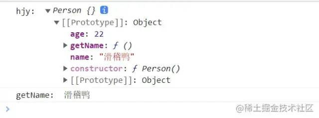
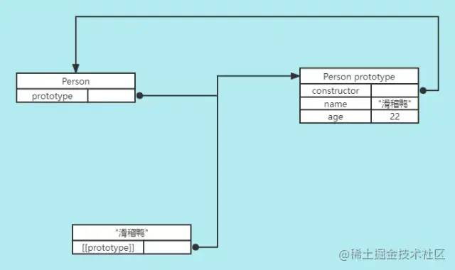
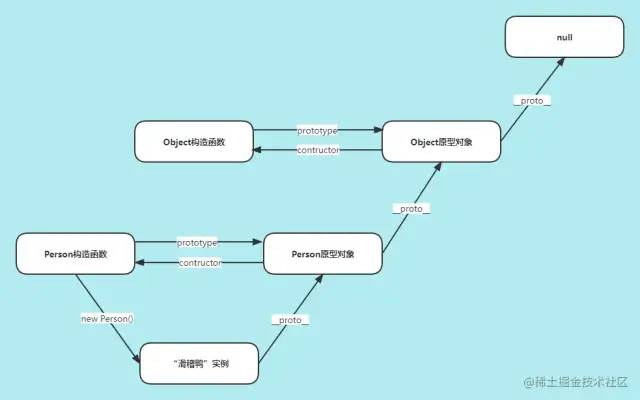
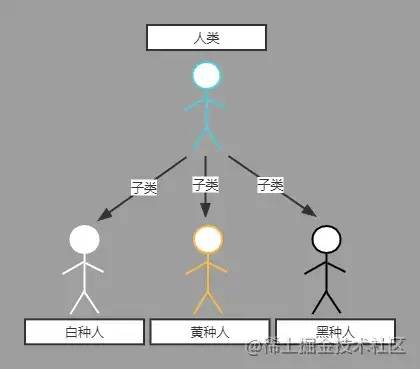
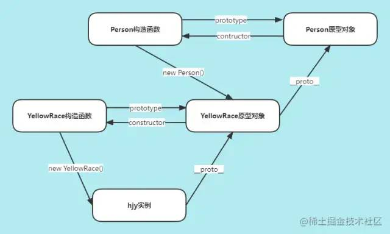
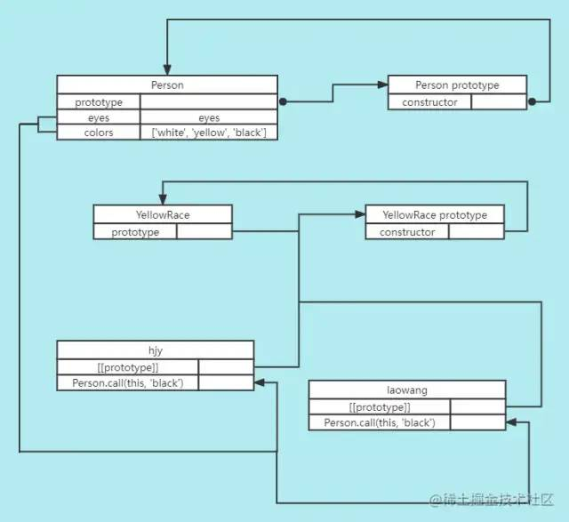
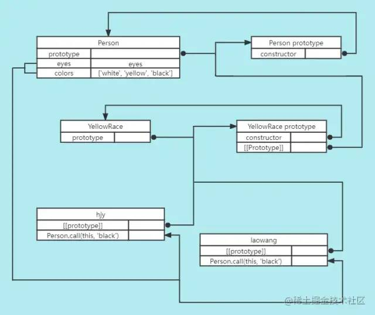
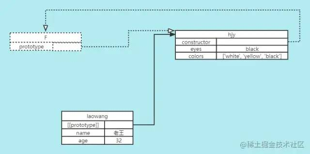

- [前言](#前言)
- [何为原型](#何为原型)
- [原型链](#原型链)
- [理解继承](#理解继承)
- [js中的继承（原型继承）](#js中的继承原型继承)
- [js六种继承方式](#js六种继承方式)
  - [原型链继承](#原型链继承)
  - [盗用构造函数](#盗用构造函数)
  - [组合继承](#组合继承)
  - [原型式继承](#原型式继承)
  - [寄生式继承](#寄生式继承)
  - [寄生式组合继承](#寄生式组合继承)
- [判断构造函数与实例关系](#判断构造函数与实例关系)
  - [instanceof](#instanceof)
  - [isPrototypeOf()](#isprototypeof)
- [new 关键字](#new-关键字)
- [结语](#结语)

## 前言 

在面向对象编程中，继承是非常实用也非常核心的功能，这一切都基于面向类语言中的类。然而，`javascript`和面向类的语言不同，它没有类作为蓝图，`javascript`中只有对象，但抽象继承思想又是如此重要，于是聪明绝顶的`javascript`开发者们就利用`javascript`原型链的特性实现了和类继承功能一样的继承方式。

## 何为原型 

要想弄清楚原型链，我们得先把原型搞清楚，原型可以理解为是一种设计模式。以下是《你不知道的javascript》对原型的描述：

> `javascript`中的对象有一个特殊的 `[[Prototype]]` 内置属性，其实就是对其他对象的引用。几乎所有的对象在创建时 \[\[Prototype\]\] 都会被赋予一个非空的值。

《javascript高级程序设计》这样描述原型：

> 每个函数都会创建一个`prototype`属性，这个属性是一个对象，包含应该由特定引用类型的实例共享的属性和方法。实际上，这个对象就是通过调用构造函数创建的对象的原型。使用原型对象的好处是，在它上面定义的属性和方法都可以被对象实例共享。原来在构造函数中直接赋给对象实例的值，可以直接赋值给它们的原型。

我们通过一段代码来理解这两段话：

```java
function Person() { }

// 在Person的原型对象上挂载属性和方法
Person.prototype.name = '滑稽鸭'
Person.prototype.age = 22
Person.prototype.getName = function () {
  return this.name
}

const hjy = new Person()

console.log('hjy: ',hjy)
console.log('getName: ',hjy.getName())
复制代码
```

这是上面这段代码在`chrome`控制台中显示的结果：

 image.png

可以看到，我们先是创建了一个空的构造函数`Person`，然后创建了一个`Person`的实例`hjy`，`hjy`本身是没有挂载任何属性和方法的，但是它有一个`[[Prototype]]`内置属性，这个属性是个对象，里面有`name、age`属性和`getName`函数，定睛一看，这玩意儿可不就是上面写的`Person.prototype`对象嘛。事实上，`Person.prototype`和`hjy`的`[[Prototype]]`都指向同一个对象，这个对象对于`Person`构造函数而言叫做原型对象，对于`hjy`实例而言叫做原型。下面一张图直观地展示上述代码中构造函数、实例、原型之间的关系：

 原型.png

因此，构造函数、原型和实例的关系是这样的：\_每个构造函数都有一个原型对象（实例的原型），原型有一个`constructor`属性指回构造函数，而实例有一个内部指针指向原型。\_ 在`chrome、firefox、safari`浏览器环境中这个指针就是`__proto__`，其他环境下没有访问`[[Prototype]]`的标准方式。

这其中还有更多细节建议大家阅读《javascript高级程序设计》

## 原型链 

在上述原型的基础上，如果`hjy`的原型是另一个类型的实例呢？于是`hjy`的原型本身又有一个内部指针指向另一个原型，相应的另一个原型也有一个指针指向另一个构造函数。这样，实例和原型之间形成了一条长长的链条，这就是原型链。

> 所有普通的`[[Prototype]]`都会指向内置的`Object.prototype`，而`Object`的`[[Prototype]]`指向`null`。也就是说所有的普通对象都源于`Object.prototype`，它包含`javascript`中许多通用的功能。

在原型链中，如果在对象上找不到需要的属性或者方法，引擎就会继续在`[[Prototype]]`指向的原型上查找，同理，如果在后者也没有找到需要的东西，引擎就会继续查找它的`[[Prototype]]`指向的原型。上图理解一下：

 原型链1.png

## 理解继承 

> 继承是面向对象编程的三大特征之一（封装、继承、多态）。多个类中存在相同的属性和行为时，将这些内容抽取到单独一个类中，那么多个类无需再定义这些属性和行为，只需要继承那个类即可。多个类可以称为子类，单独这个类称为父类或者超类，基类等。子类可以直接访问父类中的非私有的属性和行为。

以咱们人类为例，咱全地球人都是一个脑袋、双手双脚，很多基本特征都是一样的。但人类也可以细分种类，有黄种人、白种人、黑种人，咱们如果要定义这三种人，无需再说一个脑袋、双手双脚之类的共同特征，黄种人就是在人类的基础上将皮肤变为黄色，白种人皮肤为白色，黑种人为黑色，如果有其他特征就再新增即可，例如蓝眼睛、黄头发等等。

 renleiclass.png

如果用代码封装，咱们就可以将人类定义为基类或者超类，拥有脑袋、手、足等属性，说话、走路等行为。黄种人、白种人、黑种人为子类，自动复制父类的属性和行为到自身，然后在此基础上新增或者重写某些属性和行为，例如黄种人拥有黄皮肤、黑头发。这就是继承的思想。

## js中的继承（原型继承） 

在其他面向类语言中，继承意味着复制操作，子类是实实在在地将父类的属性和方法复制了过来，但`javascript`中的继承不是这样的。根据原型的特性，`js`中继承的本质是一种委托机制，对象可以将需要的属性和方法委托给原型，需要用的时候就去原型上拿，这样多个对象就可以共享一个原型上的属性和方法，这个过程中是没有复制操作的。

`javascript`中的继承主要还是依靠于原型链，原型处于原型链中时即可以是某个对象的原型也可以是另一个原型的实例，这样就能形成原型之间的继承关系。

然而，依托原型链的继承方式是有很多弊病的，我们需要辅以各种操作来消除这些缺点，在这个探索的过程中，出现了很多通过改造原型链继承而实现的继承方式。

## js六种继承方式 

### 原型链继承 

直接利用原型链特征实现的继承，让构造函数的`prototype`指向另一个构造函数的实例。

```java
function Person() {
  this.head = 1
  this.hand = 2
}

function YellowRace() { }
YellowRace.prototype = new Person()

const hjy = new YellowRace()

console.log(hjy.head) // 1
console.log(hjy.hand) // 2
复制代码
```

上述代码中的`Person构造函数`、`YellowRace构造函数`、`hjy实例`之间的关系如下图：

根据原型链的特性，当我们查找`hjy`实例的`head`和`hand`属性时，由于`hjy`本身并没有这两个属性，引擎就会去查找`hjy`的原型，还是没有，继续查找`hjy`原型的原型，也就是`Person原型对象`，结果就找到了。就这样，`YellowRace`和`Person`之间通过原型链实现了继承关系。

但这种继承是有问题的：

1.  创建 `hjy`实例时不能传参，也就是 `YellowRace`构造函数本身不接受参数。
2.  当原型上的属性是引用数据类型时，所有实例都会共享这个属性，即某个实例对这个属性重写会影响其他实例。

针对第二点，我们通过一段代码来看一下：

```java
function Person() {
  this.colors = ['white', 'yellow', 'black']
}

function YellowRace() { }
YellowRace.prototype = new Person()

const hjy = new YellowRace()
hjy.colors.push('green')
 console.log(hjy.colors) // ['white', 'yellow', 'black', 'green']

const laowang = new YellowRace()
console.log(laowang.colors) // ['white', 'yellow', 'black', 'green']
复制代码
```

可以看到，`hjy`只是想给自己的生活增添一点绿色，但是却被`laowang`给享受到了，这肯定不是我们想看到的结果。

为了解决不能传参以及引用类型属性共享的问题，一种叫盗用构造函数的实现继承的技术应运而生。

### 盗用构造函数 

盗用构造函数也叫作“对象伪装”或者“经典继承”，原理就是通过在子类中调用父类构造函数实现上下文的绑定。

```java
function Person(eyes) {
  this.eyes = eyes
  this.colors = ['white', 'yellow', 'black']
}

function YellowRace() {
  Person.call(this, 'black') // 调用构造函数并传参
}

const hjy = new YellowRace()
hjy.colors.push('green')
console.log(hjy.colors) // ['white', 'yellow', 'black', 'green']
console.log(hjy.eyes) // black

const laowang = new YellowRace()
console.log(laowang.colors) // ['white', 'yellow', 'black']
console.log(laowang.eyes) // black
复制代码
```

上述代码中，`YellowRace`在内部使用`call`调用构造函数，这样在创建`YellowRace`的实例时，`Person`就会在`YellowRace`实例的上下文中执行，于是每个`YellowRace`实例都会拥有自己的`colors`属性，而且这个过程是可以传递参数的，`Person.call()`接受的参数最终会赋给`YellowRace`的实例。它们之间的关系如下图所示：

 daoyonggouzao.png

虽然盗用构造函数解决了原型链继承的两大问题，但是它也有自己的缺点：

1.  必须在构造函数中定义方法，通过盗用构造函数继承的方法本质上都变成了实例自己的方法，不是公共的方法，因此失去了复用性。
2.  子类不能访问父类原型上定义的方法，因此所有类型只能使用构造函数模式，原因如上图所示， `YellowRace`构造函数、 `hjy`和 `laowang`实例都没有和 `Person`的原型对象产生联系。

针对第二点，我们看一段代码：

```java
function Person(eyes) {
  this.eyes = eyes
  this.getEyes = function () {
    return this.eyes
  }
}

Person.prototype.ReturnEyes = function () {
  return this.eyes
}

function YellowRace() {
  Person.call(this, 'black')
}

const hjy = new YellowRace()
console.log(hjy.getEyes()) // black
console.log(hjy.ReturnEyes()) // TypeError: hjy.ReturnEyes is not a function
复制代码
```

可以看到，`hjy`实例能继承`Person`构造函数内部的方法`getEyes()`，对于`Person`原型对象上的方法，`hjy`是访问不到的。

### 组合继承 

原型链继承和盗用构造函数继承都有各自的缺点，而组合继承综合了前两者的优点，取其精华去其糟粕，得到一种可以将方法定义在原型上以实现重用又可以让每个实例拥有自己的属性的继承方案。

组合继承的原理就是先通过盗用构造函数实现上下文绑定和传参，然后再使用原型链继承的手段将子构造函数的`prototype`指向父构造函数的实例，代码如下：

```java
function Person(eyes) {
  this.eyes = eyes
  this.colors = ['white', 'yellow', 'black']
}

Person.prototype.getEyes = function () {
  return this.eyes
}

function YellowRace() {
  Person.call(this, 'black') // 调用构造函数并传参
}
YellowRace.prototype = new Person() // 再次调用构造函数

const hjy = new YellowRace()
hjy.colors.push('green')

const laowang = new YellowRace()

console.log(hjy.colors) // ['white', 'yellow', 'black', 'green']
console.log(laowang.colors) // ['white', 'yellow', 'black']
console.log(hjy.getEyes()) // black
复制代码
```

`hjy`终于松了口气，自己终于能独享生活的一点“绿”，再也不会被老王分享去了。

此时`Person`构造函数、`YellowRace`构造函数、`hjy`和`laowang`实例之间的关系如下图：

 组合继承.png

相较于盗用构造函数继承，组合继承额外的将`YellowRace`的原型对象（同时也是`hjy`和`laowang`实例的原型）指向了`Person`的原型对象，这样就集合了原型链继承和盗用构造函数继承的优点。

但组合继承还是有一个小小的缺点，那就是在实现的过程中调用了两次`Person`构造函数，有一定程度上的性能浪费。这个缺点在最后的寄生式组合继承可以改善。

### 原型式继承 

> 2006年，道格拉斯.克罗克福德写了一篇文章《Javascript中的原型式继承》。这片文章介绍了一种不涉及严格意义上构造函数的继承方法。他的出发点是即使不自定义类型也可以通过原型实现对象之间的信息共享。

文章最终给出了一个函数：

```java
const object = function (o) {
  function F() { }
  F.prototype = o
  return new F()
}
复制代码
```

其实不难看出，这个函数将原型链继承的核心代码封装成了一个函数，但这个函数有了不同的适用场景：如果你有一个已知的对象，想在它的基础上再创建一个新对象，那么你只需要把已知对象传给`object`函数即可。

```java
const object = function (o) {
  function F() { }
  F.prototype = o
  return new F()
}

const hjy = {
  eyes: 'black',
  colors: ['white', 'yellow', 'black']
}

const laowang = object(hjy)
console.log(laowang.eyes) // black
console.log(laowang.colors) // ['white', 'yellow', 'black']
复制代码
```

`ES5`新增了一个方法`Object.create()`将原型式继承规范化了。相比于上述的`object()`方法，`Object.create()`可以接受两个参数，第一个参数是作为新对象原型的对象，第二个参数也是个对象，里面放入需要给新对象增加的属性（可选）。第二个参数与`Object.defineProperties()`方法的第二个参数是一样的，每个新增的属性都通过自己的属性描述符来描述，以这种方式添加的属性会遮蔽原型上的同名属性。当`Object.create()`只传入第一个参数时，功效与上述的`object()`方法是相同的。

```java
const hjy = {
  eyes: 'black',
  colors: ['white', 'yellow', 'black']
}

const laowang = Object.create(hjy, {
  name: {
    value: '老王',
    writable: false,
    enumerable: true,
    configurable: true
  },
  age: {
    value: '32',
    writable: true,
    enumerable: true,
    configurable: false
  }
})
console.log(laowang.eyes) // black
console.log(laowang.colors) // ['white', 'yellow', 'black']
console.log(laowang.name) // 老王
console.log(laowang.age) // 32
复制代码
```

稍微需要注意的是，`object.create()`通过第二个参数新增的属性是直接挂载到新建对象本身，而不是挂载在它的原型上。\_原型式继承非常适合不需要单独创建构造函数，但仍然需要在对象间共享信息的场合。\_

上述代码中各个对象之间的关系仍然可以用一张图展示：

 原型式继承.png

这种关系和原型链继承中原型与实例之间的关系基本是一致的，不过上图中的`F`构造函数是一个中间函数，在`object.create()`执行完后它就随着函数作用域一起被回收了。那最后`hjy`的`constructor`会指向何处呢？下面分别是浏览器和`node`环境下的打印结果：

 image.png  image.png

查阅资料得知`chrome`打印的结果是它内置的，不是`javascript`语言标准。具体是个啥玩意儿我也不知道了🤣。

既然原型式继承和原型链继承的本质基本一致，那么原型式继承也有一样的缺点：

1.  不能传参，使用手写的 `object()`不能传，但使用 `Object.create()`是可以传参的。
2.  原对象中的引用类型的属性会被新对象共享。

### 寄生式继承 

寄生式继承与原型式继承很接近，它的思想就是在原型式继承的基础上以某种方式增强对象，然后返回这个对象。

```java
function inherit(o) {
  let clone = Object.create(o)
  clone.sayHi = function () { // 增强对象
    console.log('Hi')
  }
  return clone
}

const hjy = {
  eyes: 'black',
  colors: ['white', 'yellow', 'black']
}

const laowang = inherit(hjy)

console.log(laowang.eyes) // black
console.log(laowang.colors) // ['white', 'yellow', 'black']
laowang.sayHi() // Hi
复制代码
```

这是一个最简单的寄生式继承案例，这个例子基于`hjy`对象返回了一个新的对象`laowang`，`laowang`拥有`hjy`的所有属性和方法，还有一个新方法`sayHai()`。

可能有的小伙伴就会问了，寄生式继承就只是比原型式继承多挂载一个方法吗？这也太`low`了吧。其实没那么简单，这里只是演示一下挂载一个新的方法来增强新对象，但我们还可以用别的方法呀，比如改变原型的`constructor`指向，在下面的寄生式组合继承中就会用到。

### 寄生式组合继承 

寄生式组合继承通过盗用构造函数继承属性，但使用混合式原型链继承方法。基本思路就是使用寄生式继承来继承父类的原型对象，然后将返回的新对象赋值给子类的原型对象。

首先实现寄生式继承的核心逻辑：

```java
function inherit(Father, Son) {
  const prototype = Object.create(Father.prototype) // 获取父类原型对象副本
  prototype.constructor = Son // 将获取的副本的constructor指向子类，以此增强副本原型对象
  Son.prototype = prototype // 将子类的原型对象指向副本原型对象
}
复制代码
```

这里没有将新建的对象返回出来，而是赋值给了子类的原型对象。

接下来就是改造组合式继承，将第二次调用构造函数的逻辑替换为寄生式继承：

```java
function Person(eyes) {
  this.eyes = eyes
  this.colors = ['white', 'yellow', 'black']
}

Person.prototype.getEyes = function () {
  return this.eyes
}

function YellowRace() {
  Person.call(this, 'black') // 调用构造函数并传参
}

inherit(YellowRace, Person) // 寄生式继承，不用第二次调用构造函数

const hjy = new YellowRace()
hjy.colors.push('green')

const laowang = new YellowRace()

console.log(hjy.colors)
console.log(laowang.colors)
console.log(hjy.getEyes())
复制代码
```

上述寄生式组合继承只调用了一次`Person`造函数，避免了在`Person.prototype`上面创建不必要、多余的属性。于此同时，原型链依然保持不变，效率非常之高效。

如图，寄生组合式继承与组合式继承中的原型链关系是一样的：

 组合继承.png

## 判断构造函数与实例关系 

原型与实例的关系可以用两种方式来确定：`instanceof`操作符和`isPrototypeOf()`方法。

### instanceof 

`instanceof`操作符左侧是一个普通对象，右侧是一个函数。

以`o instanceof Foo`为例，`instanceof`关键字做的事情是：判断`o`的原型链上是否有`Foo.prototype`指向的对象。

```java
function Perosn(name) {
  this.name = name
}

const hjy = new Perosn('滑稽鸭')

const laowang = {
  name: '老王'
}

console.log(hjy instanceof Perosn) // true
console.log(laowang instanceof Perosn) // false
复制代码
```

根据`instanceof`的特性，我们可以实现一个自己`instanceof`，思路就是递归获取左侧对象的原型，判断其是否和右侧的原型对象相等，这里使用`Object.getPrototypeOf()`获取原型：

```java
const myInstanceof = (left, right) => {
  // 边界判断
  if (typeof left !== 'object' && typeof left !== 'function' || left === null) return false
  let proto = Object.getPrototypeOf(left)   // 获取左侧对象的原型
  while (proto !== right.prototype) {  // 找到了就终止循环
    if (proto === null) return false     // 找不到返回 false
    proto = Object.getPrototypeOf(proto)   // 沿着原型链继续获取原型
  }
  return true
}
复制代码
```

### isPrototypeOf() 

`isPrototypeOf()`不关心构造函数，它只需要一个可以用来判断的对象就行。以`Foo.prototype.isPrototypeOf(o)`为例，`isPrototypeOf()`做的事情是：判断在`a`的原型链中是否出现过`Foo.prototype`。

```java
function Perosn(name) {
  this.name = name
}

const hjy = new Perosn('滑稽鸭')

const laowang = {
  name: '老王'
}

console.log(Perosn.prototype.isPrototypeOf(hjy))
console.log(Perosn.prototype.isPrototypeOf(laowang))
复制代码
```

## new 关键字 

在实现各种继承方式的过程中，经常会用到`new`关键字，那么`new`关键字起到的作用是什么呢？

简单来说，`new`关键字就是绑定了实例与原型的关系，并且在实例的的上下文中调用构造函数。下面就是一个最简版的`new`的实现：

```java
const myNew = function (Fn, ...args) {
  const o = {}
  o.__proto__ = Fn.prototype
  Fn.apply(o, args)
  return o
}

function Person(name, age) {
  this.name = name
  this.age = age
  this.getName = function () {
    return this.name
  }
}

const hjy = myNew(Person, '滑稽鸭', 22)
console.log(hjy.name)
console.log(hjy.age)
console.log(hjy.getName())
复制代码
```

实际上，真正的`new`关键字会做如下几件事情：

1.  创建一个细新的 `javaScript`对象（即 \{\} ）
2.  为步骤1新创建的对象添加属性 `proto` ，将该属性链接至构造函数的原型对象
3.  将 `this`指向这个新对象
4.  执行构造函数内部的代码（例如给新对象添加属性）
5.  如果构造函数返回非空对象，则返回该对象，否则返回刚创建的新对象。

代码如下：

```java
const myNew = function (Fn, ...args) {
  const o = {}
  o.__proto__ = Fn.prototype
  const res = Fn.apply(o, args)
  if (res && typeof res === 'object' || typeof res === 'function') {
    return res
  }
  return o
}
复制代码
```

有些小伙伴可能会疑惑最后这个判断是为了什么？因为语言的标准肯定是严格的，需要考虑各种情况下的处理。比如`const res = Fn.apply(o, args)`这一步，如果构造函数有返回值，并且这个返回值是对象或者函数，那么`new`的结果就应该取这个返回值，所以才有了这一层判断。

## 结语 