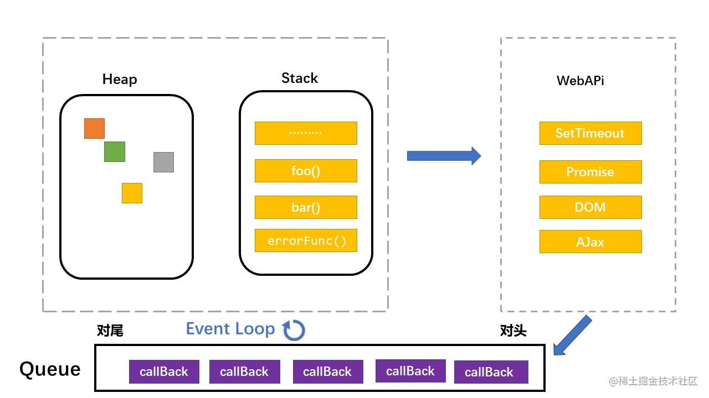
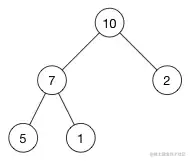
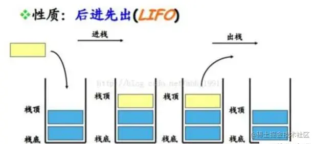
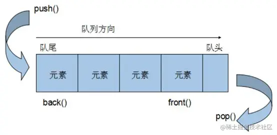
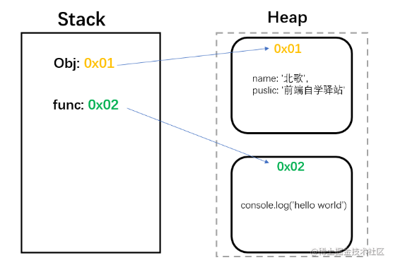
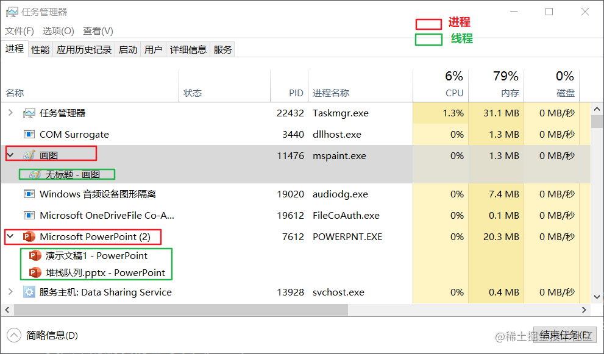
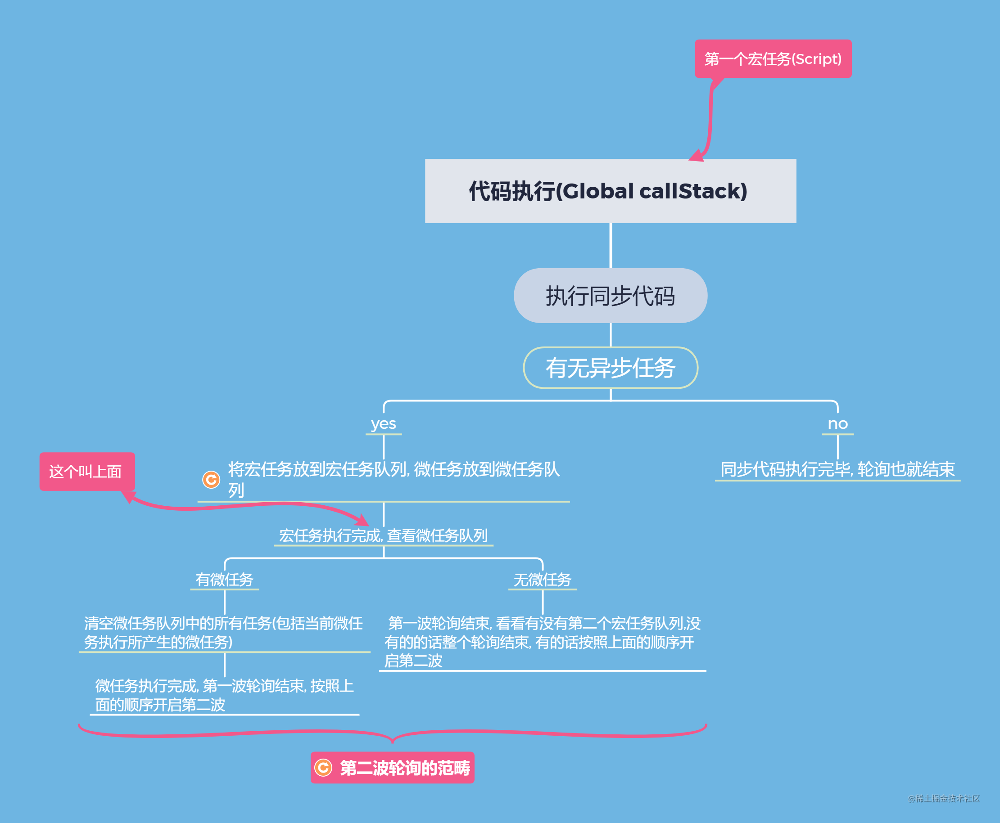
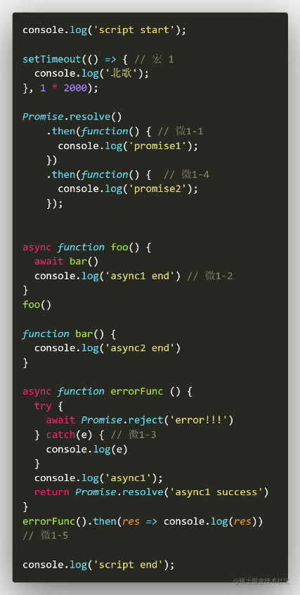

## 前言 

因为掘金改版之后对于字数有了一定的限制（亲测了下在12500字左右，所以看到标题还有几万字长文的标题一定是在唬你的😂）文章美化排版之后字数超出了限制所以打算将后面的部分单独拎出来写, 这样也更好的写出相对比较深入的一点的内容, 对于`【前端体系】`这类文章内容一定是包括但不限于标题的，我会尽可能的拓展、深入、以写出高质量的好文章。

> ❝
> 
> 在线卑微，如果觉得这篇文章对你有帮助的话欢迎大家点个赞👻
> 
> ❞

## 从一道题引出对Event Loop的思考 

对于Event Loop(事件轮询）所涉及的知识概念太多了，如果上来就讲一大堆概念性的东西太枯燥且从一开始就是按照我的思路来走的，所以我打算换一种方式来写这篇文章，你先按照你之前对于Event Loop(事件轮询)的理解来解这道题，我在后面写出我从Event Loop的理解思考这题的方式。两种不同的理解、想法、互相碰撞，我可能有理解不对的，你也可能有之前忽略的一些知识点，我们


不好意思放错了😅，这张图


### 题目 

```java
console.log('script start');

setTimeout(() => {
  console.log('北歌');
}, 1 * 2000);

Promise.resolve()
.then(function() {
  console.log('promise1');
}).then(function() {
  console.log('promise2');
});


async function foo() {
  await bar()
  console.log('async1 end')
}
foo()

async function errorFunc () {
  try {
    await Promise.reject('error!!!')
  } catch(e) {
    console.log(e)
  }
  console.log('async1');
  return Promise.resolve('async1 success')
}
errorFunc().then(res => console.log(res))

function bar() {
  console.log('async2 end') 
}

console.log('script end');
```

好了，可以暂时不往下翻，先按照自己的理解来解下这道题。

\----------------------------------------------- 我是分割线 --------------------------------------------

相信这道题肯定难不倒大家，但是大家是按照什么样的方式来解出这道题的呢？其实这道题考察你了很多知识点，下面我将用我的理解来说说对这道题的思考。水平有限、有任何问题欢迎评论区指出。

## JS的运行机制 



先来解释上图中出现的几个单词所要表达的含义。

Heap(堆)、Stack(栈)、Queue(队列)、Event Loop(事件轮询)

### 程序中的堆栈队列 

Heap(堆)

堆， 是一种动态存储结构，是利用完全二叉树维护的一组数据，堆分为两种，一种为最大堆，一种为最小堆，将根节点最大的堆叫做最大堆或大根堆，根节点最小的堆叫做最小堆或小根堆。 堆是线性数据结构，相当于一维数组，有唯一后继。

如最大堆



栈（Stack）

栈在程序中的设定是限定仅在表尾进行插入或删除操作的线性表。 栈是一种数据结构，它按照后进先出(`LIFO: last-in-first-out`)的原则存储数据，先进入的数据被压入栈底，最后的数据在栈顶，需要读数据的时候从栈顶开始弹出数据。 栈是只能在某一端插入和删除的特殊线性表。 

队列（Queue）

队列特殊之处在于它只允许在表的前端（`front`）进行删除操作，而在表的后端（`rear`）进行插入操作，和栈一样，队列是一种操作受限制的线性表。 进行插入操作的端称为队尾，进行删除操作的端称为队头。 队列中没有元素时，称为空队列。

队列的数据元素又称为队列元素。在队列中插入一个队列元素称为入队，从队列中删除一个队列元素称为出队。因为队列只允许在一端插入，在另一端删除，所以只有最早进入队列的元素才能最先从队列中删除，故队列又称为先进先出（`FIFO: first-in-first-out`） 

### js中的堆栈队列 

下面我解释下JavaScript语言中的堆、栈、队列。

堆

堆， 动态分配的内存，大小不定也不会自动释放，存放引用类型，指那些可能由多个值构成的对象，保存在堆内存中，包含引用类型的变量，实际上保存的不是变量本身，而是指向该对象的指针。可以简单理解为存储代码块。

堆的作用：存储引用类型值的数据

```java
let obj = {
    name: '北歌'，
    puslic: '前端自学驿站'
}

let func = () => {
    console.log('hello world')
}
```



栈

js中的栈准确来将应该叫调用栈(EC Stack)，会自动分配内存空间，会自动释放，存放基本类型，简单的数据段，占据固定大小的空间。

栈的作用：存储基本类型值，还有一个很要的作用。提供代码执行的环境

队列

js中的队列可以叫做任务队列或异步队列，任务队列里存放各种异步操作所注册的回调，里面分为两种任务类型，宏任务(`macroTask`)和微任务(`microTask`)。

好，下面可以回到正题上来了。

### 为什么会出现Event Loop 

总所周知JS是一门单线程的非阻塞脚本语言，Event Loop就是为了解决JS异步编程的一种解决方案。


### JS为什么是单线程语言，那它是怎么实现异步编程(非阻塞)运行的 

第一个问题： JavaScript的诞生就是为了处理浏览器网页的交互（DOM操作的处理、UI动画等), 设计成单线程的原因就是不想让浏览器变得太复杂，因为多线程需要共享资源、且有可能修改彼此的运行结果（两个线程修改了同一个DOM节点就会产生不必要的麻烦），这对于一种网页脚本语言来说这就太复杂了。

第二个问题： JavaScript是单线程的但它所运行的宿主环境—浏览器是多线程，浏览器提供了各种线程供Event Loop调度来协调JS单线程运行时不会阻塞。

### 小结 

先总结一波个人对于JS运行机制的理解：

> 代码执行开启一个全局调用栈(主栈)提供代码运行的环境，在执行过程中同步任务的代码立即执行，遇到异步任务将异步的回调注册到任务队列中，等待同步代码执行完毕查看异步是否完成，如果完成将当前异步任务的回调拿到主栈中执行

## 进程和线程 

进程：进程是 CPU 资源分配的最小单位(是能拥有资源和独立运行的最小单位)

线程：线程是 CPU 调度的最小单位(线程是建立在进程的基础上的一次程序运行单位)

对于进程和线程并没有确切统一的描述，可以简单的理解：

> 比如一个应用程序: 如QQ、浏览器启动时会开启一个进程，而该进程可以有多个线程来进行资源调度和分配，达到运行程序的作用。
> 
> 更通俗的话讲：打开QQ应用程序开启了进程来运行程序(QQ), 有多个线程来进行资源调度和分配(多个线程来分配打开QQ所占用的运存)，达到运行程序(QQ)的作用.

用操作系统来作个例子：



> 线程依赖进程，一个进程可以有一个或者多个线程，但是线程只能是属于一个进程。

### JS的单线程 

js的单线程指的是javaScript引擎只有一个线程

单线程就意味着，所有任务需要排队，前一个任务结束，才会执行后一个任务。如果前一个任务耗时很长，后一个任务就不得不一直等着。 js 引擎执行异步代码而不用等待，是因有为有任务队列和事件轮询。

 *  任务队列：任务队列是一个先进先出的队列，它里面存放着各种任务回调。
 *  事件轮询：事件轮询是指主线程重复从任务队列中取任务、执行任务的过程。

### 浏览器的多线程 

1.  GUI 渲染线程
    
     *  绘制页面，解析 HTML、CSS，构建 DOM 树，布局和绘制等
     *  页面重绘和回流
     *  与 JS 引擎线程互斥，也就是所谓的 JS 执行阻塞页面更新
2.  JS 引擎线程
    
     *  负责 JS 脚本代码的执行
     *  负责准执行准备好待执行的事件，即定时器计数结束，或异步请求成功并正确返回的事件
     *  与 GUI 渲染线程互斥，执行时间过长将阻塞页面的渲染
3.  事件触发线程
    
     *  负责将准备好的事件交给 JS 引擎线程执行
     *  多个事件加入任务队列的时候需要排队等待(JS 的单线程)
4.  定时器触发线程
    
     *  负责执行异步的定时器类的事件，如 setTimeout、setInterval
     *  定时器到时间之后把注册的回调加到任务队列的队尾
5.  HTTP 请求线程
    
     *  负责执行异步请求
     *  主线程执行代码遇到异步请求的时候会把函数交给该线程处理，当监听到状态变更事件，如果有回调函数，该线程会把回调函数加入到任务队列的队尾等待执行

## Event Loop 

呼，终于回到正题了！

对于事件轮询上面其实已经解释的很清楚了：

> 事件轮询就是解决javaScript单线程对于异步操作的一些缺陷，让 javaScript做到既是单线程，又绝对不会阻塞的核心机制，是用来协调各种事件、用户交互、脚本执行、UI 渲染、网络请求等的一种机制。

### 浏览器中的Eveent Loop执行顺序 

[Processing model][]规范定义了`Eveent Loop`的循环过程：

一个Eveent Loop只要存在，就会不断执行下边的步骤：

 *  1.在tasks(任务)队列中选择最老的一个task,用户代理可以选择任何task队列，如果没有可选的任务，则跳到下边的microtasks步骤。
 *  2.将上边选择的task设置为[正在运行的task][task]。
 *  3.Run: 运行被选择的task。
 *  4.将Eveent Loop的[currently running task][task]变为null。
 *  5.从task队列里移除前边运行的task。
 *  6.Microtasks: 执行[microtasks任务检查点][microtasks]。（也就是执行microtasks队列里的任务）
 *  7.更新渲染（Update the rendering）：可以简单理解为浏览器渲染...
 *  8.如果这是一个worker event loop，但是没有任务在task队列中，并且[WorkerGlobalScope][]对象的closing标识为true，则销毁Eveent Loop，中止这些步骤，然后进行定义在[Web workers][]章节的[run a worker][]。
 *  9.返回到第一步。

Eveent Loopp会不断循环上面的步骤，概括说来：

 *  `Eveent Loop`会不断循环的去取`tasks`队列的中最老的一个task(可以理解为宏任务）推入栈中执行，并在当次循环里依次执行并清空`microtask`队列里的任务。
 *  执行完`microtask`队列里的任务，有可能会渲染更新。（浏览器很聪明，在一帧以内的多次dom变动浏览器不会立即响应，而是会积攒变动以最高60HZ(大约16.7ms每帧)的频率更新视图）

### 宏任务和微任务优先问题 

> 在任务对列(queue)中注册的异步回调又分为两种类型，宏任务和微任务。我们为了方便理解可以认为在任务队列中有宏任务队列和微任务队列。宏任务队列有多个，微任务只有一个

 *  宏任务(macro Task)
    
     *  script(整体代码)
     *  setTimeout/setInterval
     *  setImmediate(Node环境)
     *  UI 渲染
     *  requestAnimationFrame
     *  ....
 *  微任务(micro Task)
    
     *  Promise的then()、catch()、finally()里面的回调
     *  process.nextTick(Node 环境）
     *  ...

个人理解的执行顺序：

1.  代码从开始执行调用一个全局执行栈，script标签作为宏任务执行
2.  执行过程中同步代码立即执行，异步代码放到任务队列中，任务队列存放有两种类型的异步任务，宏任务队列，微任务队列。
3.  同步代码执行完毕也就意味着第一个宏任务执行完毕(script)
    
     *  1、先查看任务队列中的微任务队列是否存在宏任务执行过程中所产生的微任务
        
        1-1、有的话就将微任务队列中的所有微任务清空
        
        2-2、微任务执行过程中所产生的微任务放到微任务队列中，在此次执行中一并清空
     *  2、如果没有再看看宏任务队列中有没有宏任务，有的话执行，没有的话事件轮询第一波结束
        
        2-1、执行过程中所产生的微任务放到微任务队列
        
        2-2、完成宏任务之后执行清空微任务队列的代码



> 所以是宏任务优先，在宏任务执行完毕之后才会来一次性清空任务队列中的所有微任务。

### 解题分析过程 

将最开始的那道题搬下来

```java
// => 代码一执行就开始执行了一个宏任务-宏0
console.log('script start'); 

setTimeout(() => { // 宏 1
  console.log('北歌');
}, 1 * 2000);

Promise.resolve()
    .then(function() { // 微1-1
      console.log('promise1');
    })
    .then(function() { // 微1-4 => 这个then中的会等待上一个then执行完成之后得到其状态才会向Queue注册状态对应的回调，假设上一个then中主动抛错且没有捕获，那就注册的是这个then中的第二个回调了。
      console.log('promise2'); 
    });


async function foo() {
  await bar() // => await(promise的语法糖)，会异步等待获取其返回值
  // => 后面的代码可以理解为放到异步队列微任务中。 这里可以保留疑问后面会详细说
  console.log('async1 end') // 微1-2
}
foo()

function bar() {
  console.log('async2 end') 
}

async function errorFunc () {
  try {
    await Promise.reject('error!!!')
  } catch(e) {
      // => 从这后面开始所有的代码可以理解为放到异步队列微任务中
    console.log(e)  // 微1-3
  }
  console.log('async1');
  return Promise.resolve('async1 success')
}
errorFunc().then(res => console.log(res)) // 微1-5

console.log('script end');
```

上面代码对于Promise的用法我就不多讲了, 在后面我会写关于Promise源码解析的文章。

注意一点就是Promise.then().then()，在注册异步任务的时候，第二个then中的回调是依赖第一个then中回调的结果的，如果执行没有异常才会在该异步任务执行完毕之后注册状态对应的回调

#### 第一次执行 

全局一个宏任务执行, 输出同步代码。挂载宏1、微1-1、微1-2、微1-3、微1-4。 1-表示属于第一次轮询

```java
run: script start、 async2 end、script end
```

#### 第二次执行 

同步代码执行完毕，开始执行异步任务中的微任务队列中的代码。

微任务队列：只有一个队列且会在当前轮询一次清空

```java
run:
	执行微1-1: promise1
	执行微1-2: async1 end
	执行微1-3: error!!!、async1 。当前异步回调执行完毕才Promise.resolve('async1 success')，然后注册then()中的成功的回调-微1-5
	执行微1-4: promise2
    执行刚刚注册的微1-5: async1 success
```

到这第一波轮询结束

#### 第三次执行 

开启第二波轮询：执行宏1

```java
run: '北歌'
```

到这。整个轮询结束。

> 其实相对难以理解的也就是微任务，对于微任务也就是上面说的只有一个队列会在此次轮询中一次清空(包括此次执行过程中所产生的微任务)。

举个栗子🌰

你去堂食排队打菜，原本你计划今天只吃两个菜(微任务队列中只注册了两个回调)，在打菜的过程中你看到你最喜欢吃的红烧肉(微任务执行的过程中遇到的新的微任务)，你肯定得再加个菜(将微任务加入到微任务队列)

#### 画图分析 

相信通过上面的讲解你们应该都能明白，为了让你们更深刻的理解，形成较强的场景印象，我画了个动图


为了大家方便对照着看，我将代码贴了出来



## 打怪进阶 

通过上面的讲解现在可以刷几道题来看看自己撑握的怎么样了。（更新：解析会有点长可以自己写做一遍再来看跟好理解）

规定 现在为了方便大家理解，请记住一下规定：

 *  分析以每次轮询做为分析，同步代码块是直接输出结果的
 *  异步任务代码块中，红色表示宏任务，绿色表示微任务
 *  `微1-`表示第一次轮询中的微任务队列中的所有微任务，`微2-`表示第二次，以此类推

### 黄金题 

```java
console.log('1');

setTimeout(() => {
  console.log('2');
  Promise.resolve().then(() => {
    console.log('3');
  })
  new Promise((resolve) => {
    console.log('4');
    resolve();
  }).then(() => {
    console.log('5')
  })
})

Promise.reject().then(() => {
  console.log('13');
}, () => {
  console.log('12');
})

new Promise((resolve) => {
  console.log('7');
  resolve();
}).then(() => {
  console.log('8')
})

setTimeout(() => {
  console.log('9');
  Promise.resolve().then(() => {
    console.log('10');
  })
  new Promise((resolve) => {
    console.log('11');
    resolve();
  }).then(() => {
    console.log('12')
  })
})
```

这题比较简单就不解析了。

### 砖石题 

```java
new Promise((resolve, reject) => {
  console.log(1)
  resolve()
})
.then(() => { // 微1-1
  console.log(2)
  new Promise((resolve, reject) => {
      console.log(3)
      setTimeout(() => { // 宏2
        reject();
      }, 3 * 1000);
      resolve() // TODO 注1
  })
    .then(() => { // 微1-2  TODO 注2
      console.log(4)
      new Promise((resolve, reject) => {
          console.log(5)
          resolve();
      })
        .then(() => { // 微1-4
          console.log(7)
        })
        .then(() => { // 微1-6
          console.log(9)
        })
    })
    .then(() => {  // 微1-5 TODO 注3
      console.log(8)
    })
})
.then(() => { // 微1-3
  console.log(6)
})
=
```

解析：

#### 第一次轮询 

script标签(宏0)执行

输出同步代码：

```java
1
```

挂载异步任务：

```java
() => { // 微1-1 -> 在该回调还没有被放到主栈中执行的时候里面都是普通的代码你也不知道里面那些是异步任务
  console.log(2)
  new Promise((resolve, reject) => {
      console.log(3)
      setTimeout(() => {
        reject();
      }, 3 * 1000);
      resolve()
  })
    .then(() => { 
      console.log(4)
      new Promise((resolve, reject) => {
          console.log(5)
          resolve();
        })
        .then(() => { 
          console.log(7)
        })
        .then(() => { 
          console.log(9)
        })
    })
    .then(() => { 
      console.log(8)
    })
}
```

同步代码完毕的同时第一个宏任务也执行完毕，开始清空异步任务中的微任务队列：

```java
微1-1: 2、3
```

注1

> promise的状态一旦改变就不可更改(主动抛错还是可以影响下一个then的状态的)，reject的那个放到宏任务中还没有执行，所以微1-1中的new Promise状态就是fulfilled，

注2

> 微1-1中的newPromise确定了状态之后，第一个then中的第一个回调可以被注册到异步任务中了，但是第二个可还没有被注册，且在挂载好微1-2，微1-1回调执行没有任务异常，状态延续下去挂在最外层的then(1-3)

执行微任务中所产生新的微任务, 放到微任务队列中，该微任务也会在此次轮询中被清空:

```java
() => { // 微1-2
      console.log(4)
      new Promise((resolve, reject) => {
          console.log(5)
          resolve();
        })
        .then(() => { 
          console.log(7)
        })
        .then(() => { 
          console.log(9)
        })
}

) => { // 微1-3
  console.log(6)
}
```

执行微任务过程中所产生的宏任务放到新宏任务队列中：

```java
() => { // 宏2
	reject();
 }
```

开始执行微任务执行过程中产生的微任务：

 *  先执行微1-2

```java
微1-2： 4、5
```

执行微任务1-2中所产生新的微任务, 放到微任务队列中，该微任务也会在此次轮询中被清空，但你得等前面的微任务执行完(很好的说明了队列的先进先出):

```java
() => { // 微1-4
   console.log(7)
}

() => {  // 微1-5
   console.log(8)
}
```

注2

> 还是和上面挂在微1-3的套路一样，在微-2执行到resolve()那一步后，紧跟着的第一个.then中的第一个回调的状态可以确定了，注册微1-4的但是第二个还没有被挂在噢，因为他上面那个回调都还没执行呢(你能确定上面那个then中没有主动抛错嘛？所以二个then也不一定就会注册成功的回调)，到此优胜微1-2就执行完了，状态向下延续微1-2then下面的then中可以去注册成功的回调了，注册微1-5

 *  执行微1-3

```java
微1-3: 6
```

微1-3执行完成之后可以执行微1-2执行过程中的产生的微任务了

 *  执行微1-4

```java
微1-4: 7
```

执行微任务1-4中所产生新的微任务, 放到微任务队列中，该微任务也会在此次轮询中被清空，但你得等前面的微任务执行完(很好的说明了队列的先进先出):

```java
() => { // 微1-6
   console.log(9)
}
```

 *  执行微1-5

```java
微1-5: 8
```

微1-5执行完成之后可以执行微1-4执行过程中的产生的微任务了

```java
微1-6: 9
```

至此微任务终于被清空了，此次轮询结束输出结果有：

```java
同步代码： 1
微1-1: 2、3  
微1-2： 4、5
微1-3: 6
微1-4: 7
微1-5: 8
微1-6: 9
```

#### 第二次轮询 

开启宏2, 这段代码

```java
() => { // 宏2
	reject();
}
```

then状态早已确定，这段代码没有个锤子用。

输出结果：

```java
1 -> 2 -> 3 -> 4 -> 5 -> 6 -> 7 -> 8 -> 9
```

### 王者题 

```java
Promise.resolve()
  .then(() => {
    console.log('promise1');
    return new Promise((resolve, reject) => {
        setTimeout(() => {
          console.log('timer2')
          resolve()
        }, 0)
    })
      .then(async () => {
        await foo();
        return new Error('error1')
      })
      .then((ret) => {
        setTimeout(() => {
          console.log(ret);
          Promise.resolve()
          .then(() => {
            return new Error('error!!!')
          })
          .then(res => {
            console.log("then: ", res)
          })
          .catch(err => {
            console.log("catch: ", err)
          })
        }, 1 * 3000)
      }, err => {
        console.log(err);
      })
      .finally((res) => {
        console.log(res);
        throw new Error('error2')
      })
      .then((res) => {
        console.log(res);
      }, err => {
        console.log(err);
      })
  })
  .then(() => {
    console.log('promise2');
  })

function foo() {
  setTimeout(() => { 
    console.log('async1');
  }, 2 * 1000);
}

setTimeout(() => {
  console.log('timer1')
  Promise.resolve()
    .then(() => {
      console.log('promise3')
    })
}, 0)

console.log('start');
```

这道题和最强王者题差不多，我先用这种方式解析，下面那道题有每一步的解析，不然字数会超(建议放IDE中分析)：

```java
Promise.resolve()
  .then(() => { // 微1-1
    console.log('promise1');
    return new Promise((resolve, reject) => {
        setTimeout(() => { // 宏3 
          console.log('timer2') 
          resolve() // TODO 因为是在异步确认Promise的状态, 
                    // TODO 所以当状态还没有确定之前下面的then中的回调都不会注册当异步任务中
        }, 0)
    })
      .then(async () => { // 微3-1
        // TODO 先看着
        // await 表达式简单理解为'异步等待'获取结果, 
        // await是为了优化'Promise'的then链写法 直接帮你去异步等待拿到结果
        // 可以理解为 await foo() => Promise.then((res) => res) 
        // await表达式后面的代码可以看成 Promise.then((res) => res).then(() => {return new Error('error1')})

        console.log( await foo()) // TODO 注: 对于await解释下面第四天题的分析很透彻了,不知道可以往下看
        // TODO 再看着
        // await 表达式需要异步去等待获取,await表达式下面的代码相当于挂在到异步队列微任务中
        // 但前提是需要异步等待获取结果之后
        return new Error('error1') // 微4-1
      }) 
      .then((ret) => {  // 微4-2
        setTimeout(() => { // 宏5
          console.log(ret);
          Promise.resolve()
          .then(() => { // 微5-1
            return new Error('error!!!')
          })
          .then(res => { // 微5-2
            console.log("then: ", res)
          })
          .catch(err => {
            console.log("catch: ", err)
          })
        }, 1 * 3000)
      }, err => {
        console.log(err);
      })
      .finally((res) => { // 微3-2 前面状态不确定,但是finally不管状态如何都执行且不接受任务参数
        console.log(res);
        throw new Error('error2')
      })
      .then((res) => { // 微3-3
        console.log(res);
      }, err => {
        console.log(err);
      })
  })
  .then(() => { // 微3-4
    console.log('promise2');
  })

async function foo() {
  setTimeout(() => { // 宏4
    console.log('async1');
  }, 2 * 1000);
  return Promise.resolve(1)
}

setTimeout(() => { // 宏2
  console.log('timer1')
  Promise.resolve()
    .then(() => { // 微2-1
      console.log('promise3')
    })
}, 0)

console.log('start');

/**
 * TODO 微1-表示第一次轮询中的微任务
 * 
 * 第一次轮询
 * 代码首次加载script作用宏任务执行: 
 *  挂载异步任务: 微1-1 宏2
 *  输出: start
 * 
 * 宏任务执行完毕: 开始执行微任务列表, 微1-1
 *  挂载异步任务: 宏3
 *  输出: promise1
 * 
 * 
 * 
 * 第二次轮询
 * 首先执行宏任务: 宏2
 * 挂载异步任务: 微2-1
 * 输出: timer1
 * 
 * 宏任务执行完毕: 开始执行微任务列表, 微2-1
 * 挂载异步任务: 无
 * 输出: promise3
 * 
 * 
 * 
 * 
 * 第三次轮询
 * 首先执行宏任务: 宏3
 * 挂载异步任务: 微3-1 微3-2 微3-3 微3-4
 * 输出: timer2  
 * 
 * 宏任务执行完毕: 开始执行微任务列表, 微3-1 微3-2 微3-3 微3-4
 * 挂载异步任务: 宏4
 * 输出: undefined error2 promise2
 * 
 * 
 * 
 * 第四次轮询
 * 首先执行宏任务: 宏4
 * 挂载异步任务: 微4-1
 * 输出: async1
 * 
 * 宏任务执行完毕: 开始执行微任务列表, 微4-1 
 * 挂载异步任务: 微4-2
 * 输出: 没有输出, 现在的回调在没有确定状态都注册过且在轮询中被调用过, 很好的说明了挂在异步时候的是callBack
 * 
 * 
 * 第五次轮询
 * 首先执行宏任务: 宏5
 * 挂载异步任务: 微4-1
 * 输出: error1 then: error1!!!
 */


// start ->promise1 -> timer1 -> promise3 -> timer2  -> undefined -> error2 -> 
// promise2 -> async1 -> error1 -> then: error!!!
```

### 荣耀王者 

下面让我们来一起做最后这道题。

```java
async function async1() {
  console.log('async1 start');
  new Promise((resolve, reject) => {
    try {
      throw new Error('error1')
    } catch(e) {
      console.log(e);
    }
    setTimeout(() => { // 宏3
      resolve('promise4')
    }, 3 * 1000);
  })
    .then((res) => { // 微3-1
      console.log(res);
    }, err => {
      console.log(err);
    })
    .finally(res => { // 微3-2 // TODO注3
      console.log(res);
    })
  console.log(await async2()); // 微4-1  TODO-注1
  console.log('async1 end'); // 微4-2 // TODO-注2
}

function async2() {
  console.log('async2');
  return new Promise((resolve) => {
    setTimeout(() => { // 宏4
      resolve(2)
    }, 1 * 3000);
  })
}

console.log('script start');

setTimeout(() => { // 宏2
  console.log('setTimeout');
}, 0)

async1();

new Promise((resolve) => {
  console.log('promise1');
  resolve();
})
  .then(() => { // 微1-2
    console.log('promise2');
    return new Promise((resolve) => {
      resolve()
    })
      .then(() => { // 微1-3
        console.log('then 1-1')
      })
  })
  .then(() => { // 微1-4
    console.log('promise3');
  })


console.log('script end');
```

#### 规定 

现在为了方便大家理解，请记住一下规定：

 *  分析以每次轮询做为分析，同步代码块是直接输出结果的
 *  异步任务代码块中，红色表示宏任务，绿色表示微任务
 *  `微1-`表示第一次轮询中的微任务队列中的所有微任务，`微2-`表示第二次，以此类推

#### 第一次轮询 

script标签(宏0)执行

输出同步代码：

```java
script start -> async1 start -> error1 -> async2 -> promise1 -> script end
```

挂载异步任务:

```java
-() => { // 宏2
-  console.log('setTimeout');
-}

-() => { // 宏3
-  resolve('promise4')
-}

-() => { // 宏4
-  resolve(2)
-}


+() => { // 微1-1
+  console.log('promise2');
+  return new Promise((resolve) => {
+  resolve()
+}
```

同步代码完毕的同时第一个宏任务也执行完毕，开始清空异步任务中的微任务队列：

```java
微1-1: promise2 -> 微1-2: then 1-1 -> 微1-3: promise3
```

执行微任务中所产生新的微任务, 放到微任务队列中，该微任务也会在此次轮询中被清空:

```java
+() => { // 微1-2
+  console.log('then 1-1')
+}

+() => { // 微1-3
+  console.log('promise3');
+}
```

执行微任务过程中所产生的宏任务放到新宏任务队列中：

```java
本次微任务执行没有产生新的宏任务
```

注1

> 这里得说一下，很多人认为await将代码同步化的意思，其实await是Promise的语法糖，内部的实现也是依靠Promise, 其诞生也就是为了优化promise的then链写法，用同步的方式编写异步代码，让代码看起来更简洁明了 await的真实意思是 async wait(异步等待的意思)await表达式相当于调用后面返回promise的then方法，异步（等待）获取其返回值。即 await<==>promise.then
> 
> 这里的async2函数返回的Promise中开启了一个宏任务，await异步等待需要等待宏任务执行才能获取其返回值，也就是说宏任务不执行await表达式就压根不能调用Promise的then方法

注2

> 前面说过await表达式后面的代码可以简单理解为放入到微任务中，但是前面await 表达式压根就没有获取异步等待的结果这后面的代码从跳出当前执行栈后就压根没有挂载到异步任务中，有些教程说的await 表达式后面的代码可以看成微任务队列的第一个这种说法是错误的！

此次轮询结束输出结果有：

```java
script start -> async1 start -> error1 -> async2 -> promise1 -> script end
微1-1: promise2 -> 微1-2: then 1-1 -> 微1-3: promise3
```

#### 第二次轮询 

上面第一波轮询结束，开启第二波轮询

执行第二个宏任务队列(宏任务队列只存放一个宏任务)：

```java
宏2：setTimeout
```

宏任务执行完毕没有产生新的微任务，也没有产生新的宏任务。第二次轮询结束

此次轮询结束输出结果有：

```java
宏2：setTimeout
```

#### 第三次轮询 

执行第三个宏任务队列(宏任务队列只存放一个宏任务)：

```java
宏任务本身没有输出啥，不过确定了下Promise的状态并传递了个'promise4'给下一个then中的成功回调
```

宏任务执行过程中产生的新的微任务放到微任务队列:

```java
+(res) => { // 微3-1
+  console.log(res);
+}
```

宏任务执行完毕开始清空异步任务中的微任务队列：

```java
微3-1: promise4 -> 微3-2: undefined
```

执行微任务中所产生新的微任务, 放到微任务队列中，该微任务也会在此次轮询中被清空:

```java
+res => { // 微3-2 // TODO注3
+  console.log(res);
+}
```

执行微任务过程中所产生的宏任务放到新宏任务队列中：

```java
本次微任务执行没有产生新的宏任务
```

此次轮询结束输出结果有：

```java
微3-1: promise4 -> 微3-2: undefined
```

注3

> 前面说过promise.finally()也是微任务，finally可以理解为不管promise的状态是成功或失败都要执行我。但是我不接受任何结果。因此finally接受不到返回值res为undefined

#### 第四次轮询 

执行第四个宏任务队列(宏任务队列只存放一个宏任务)：

```java
宏任务本身没有输出啥，不过确定了下Promise的状态并传递了个2给下一个then中的成功回调
```

宏任务执行过程中产生的新的微任务放到微任务队列:

上面说过await => Promise.then(), 上面宏任务执行完毕确定了promise状态可以去获取异步等待的结果。 相当于这样： Promise.then((res) => \{return res\}) 而await表达式后面的代码相当于在异步等待获取结果后放到微任务队列中 相当于这样： Promise.then((res) => \{return res\}).finally(() => \{\}), 只有在await 表达式前面获取到结果后才会在代码挂在到异步队列中

可以做个实验将上面异步等待定时器的值设定为更长时间，这个时候await表达式后面的代码是不为响应的，只有获取到了异步等待的结果，才会响应。

```java
+(res) => {return res} // 微4-1

+() => {async1 end} // 微4-2
```

宏任务执行完毕开始清空异步任务中的微任务队列：

```java
微4-1: 2 -> 微4-2: async1 end
```

执行微任务中所产生新的微任务, 放到微任务队列中，该微任务也会在此次轮询中被清空:

```java
本次微任务执行没有产生新的微任务
```

执行微任务过程中所产生的宏任务放到新宏任务队列中：

```java
本次微任务执行没有产生新的宏任务
```

此次轮询结束输出结果有：

```java
微4-1: 2 -> 微4-2: async1 end
```

#### 所有轮询完毕之后的完整结果 

```java
script start -> async1 start -> error1 -> async2 -> promise1 -> script end
微1-1: promise2 -> 微1-2: then 1-1 -> 微1-3: promise3

宏2：setTimeout

微3-1: promise4 -> 微3-2: undefined

微4-1: 2 -> 微4-2: async1 end
```

# 写在最后 

对于【前端体系】这系列的文章我是抱着很认真，很想写好的心态的，但毕竟我还是前端小白&写作新人，如果文章中有那块写的不太好或有问题欢迎大家指出，我也会在后面的文章不停修改。也希望自己进步的同时能跟你们一起成长。喜欢我文章的朋友们也可以关注一下

我会很感激第一批关注我的人。此时，年轻的我和你，轻装上阵；而后，富裕的你和我，满载而归。

## 系列文章 

[【前端体系】从地基开始打造一座万丈高楼][Link 1]

[【前端体系】正则在开发中的应用场景可不只是规则校验][Link 2]

## 参考文章 

[深入理解 JavaScript Event Loop][JavaScript Event Loop]

[一次弄懂Event Loop][Event Loop]


[Processing model]: https://link.juejin.cn?target=https%3A%2F%2Fhtml.spec.whatwg.org%2Fmultipage%2Fwebappapis.html%23event-loop-processing-model
[task]: https://link.juejin.cn?target=https%3A%2F%2Fhtml.spec.whatwg.org%2Fmultipage%2Fwebappapis.html%23currently-running-task
[microtasks]: https://link.juejin.cn?target=https%3A%2F%2Fhtml.spec.whatwg.org%2Fmultipage%2Fwebappapis.html%23perform-a-microtask-checkpoint
[WorkerGlobalScope]: https://link.juejin.cn?target=https%3A%2F%2Fhtml.spec.whatwg.org%2Fmultipage%2Fworkers.html%23workerglobalscope
[Web workers]: https://link.juejin.cn?target=https%3A%2F%2Fhtml.spec.whatwg.org%2Fmultipage%2Fworkers.html%23workers
[run a worker]: https://link.juejin.cn?target=https%3A%2F%2Fhtml.spec.whatwg.org%2Fmultipage%2Fworkers.html%23run-a-worker
[Link 1]: https://juejin.cn/post/6867784542338416648
[Link 2]: https://juejin.cn/post/6872236622591721485
[JavaScript Event Loop]: https://link.juejin.cn?target=https%3A%2F%2Fzhuanlan.zhihu.com%2Fp%2F34229323
[Event Loop]: https://juejin.cn/post/6844903764202094606#heading-0
