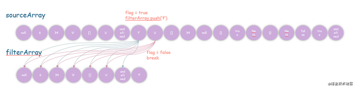
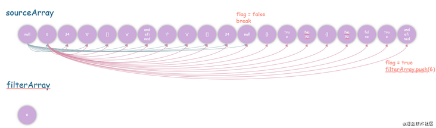
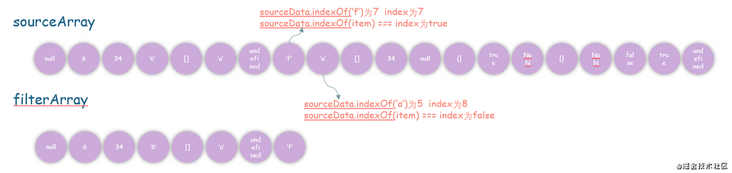
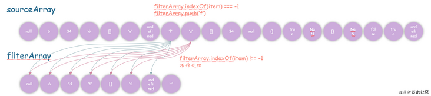
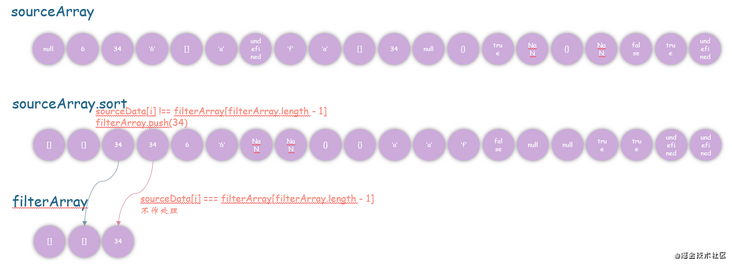
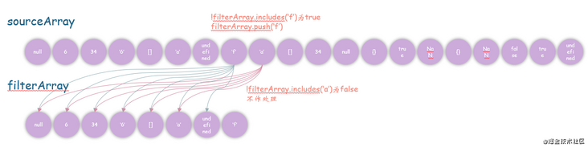
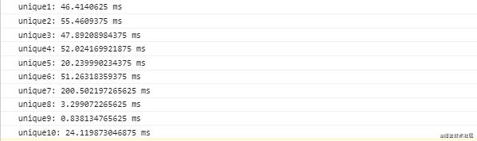

- [数组去重](#数组去重)
  - [双循环](#双循环)
  - [indexOf](#indexof)
  - [sort](#sort)
  - [includes](#includes)
  - [reduce](#reduce)
  - [map](#map)
  - [set](#set)
  - [object](#object)
- [数组扁平化](#数组扁平化)
  - [concat + 递归](#concat--递归)
  - [... + 递归](#--递归)
  - [reduce + 递归](#reduce--递归)
  - [flat](#flat)
- [数组并集](#数组并集)
  - [filter + includes](#filter--includes)
  - [set](#set-1)
- [数组交集](#数组交集)
  - [filter + includes](#filter--includes-1)
  - [set](#set-2)
- [数组差集](#数组差集)
  - [filter + includes](#filter--includes-2)
  - [set](#set-3)
- [数组分割](#数组分割)
  - [while + slice](#while--slice)
  - [reduce](#reduce-1)
- [数组转对象](#数组转对象)
  - [Object.assign](#objectassign)
  - [reduce](#reduce-2)
- [参考文章](#参考文章)

## 数组去重 

数组去重的测试数据如下：

```java
const sourceArray = [
null, 6, 34, '6', [], 'a', undefined, 'f', 'a', [], 
34, null, {}, true, NaN, {}, NaN, false, true, undefined
]

const filterArray = unique(sourceArray)
```

### 双循环 

 image.png

```java
function unique(sourceData) {
  let flag
  let filterArray = []
  for (let i = 0; i < sourceData.length; i++) {
    flag = true 
    for (let j = 0; j < filterArray.length; j++) {
      if (sourceData[i] === filterArray[j]) {
        flag = false
        break
      }
    }
    if (flag) {
      filterArray.push(sourceData[i])
    }
  }
  return filterArray
}
// [null, 6, 34, "6", [], "a", undefined, "f", [], {}, true, NaN, {}, NaN, false]
```

 image.png

```java
function unique(sourceData) {
  let flag
  let filterArray = []
  for (let i = 0; i < sourceData.length; i++) {
    flag = true 
    for (let j = i + 1; j < sourceData.length; j++) {
      if (sourceData[i] === sourceData[j]) {
        flag = false
        break
      }
    }
    if (flag) {
      filterArray.push(sourceData[i])
    }
  }
  return filterArray
}
// [6, "6", [], "f", "a", [], 34, null, {}, NaN, {}, NaN, false, true, undefined]
```

### indexOf 

 image.png

```java
function unique(sourceData) {
  return sourceData.filter((item, index) => {
    return sourceData.indexOf(item) === index
  })
}
// [null, 6, 34, "6", [], "a", undefined, "f", [], {}, true, {}, false]
```

`注：用sourceData.indexOf(NaN)返回的永远是-1，而index永远不可能为-1，所以NaN过滤掉了`

 1624948470(1).jpg

```java
function unique(sourceData) {
  let filterArray = []
  sourceData.forEach(item => {
    // filterArray数组中没有item
    if (filterArray.indexOf(item) === -1) {
      filterArray.push(item)
    }
  })
  return filterArray
}
// [null, 6, 34, "6", [], "a", undefined, "f", [], {}, true, NaN, {}, NaN, false]
```

### sort 

 image.png

```java
function unique(sourceData) {
  let filterArray = []
  sourceData.sort()
  for (let i = 0; i < sourceData.length; i++) {
    if (sourceData[i] !== filterArray[filterArray.length - 1]) {
      filterArray.push(sourceData[i])
    }
  }
  return filterArray
}
// [[], [], 34, 6, "6", NaN, NaN, {}, {}, "a", "f", false, null, true, undefined]
```

注：以上几个方案都不适用于含有NaN、数组、对象等引用数据类型的情况。

### includes 

 image.png

```java
function unique(sourceData) {
  let filterArray = []
  sourceData.forEach(item => {
    if (!filterArray.includes(item)) {
      filterArray.push(item)
    }
  })
  return filterArray
}
// [[], [], 34, 6, "6", NaN, {}, {}, "a", "f", false, null, true, undefined]
```

### reduce 

```java
function unique(sourceData = []) {
  return sourceData.reduce((pre, cur) => pre.includes(cur) ? pre : [...pre, cur], [])
}
// [[], [], 34, 6, "6", NaN, {}, {}, "a", "f", false, null, true, undefined]
```

### map 

```java
function unique(sourceData) {
  let map = new Map() // 创建Map实例
  return sourceData.filter(item => {
    return !map.has(item) && map.set(item, 1)
  })
}
// [[], [], 34, 6, "6", NaN, {}, {}, "a", "f", false, null, true, undefined]
```

### set 

```java
function unique10(sourceData) {
  return [...new Set(sourceData)]
}
// [[], [], 34, 6, "6", NaN, {}, {}, "a", "f", false, null, true, undefined]
```

注：以上几个方案不适用于含有数组、对象等引用数据类型的情况。

### object 

利用对象属性的唯一性去重。

```java
function unique(sourceData) {
  let map = new Map() // 创建Map实例
  let filterArray = []
  for (let i = 0; i < sourceData.length; i++) {
    /** 
     * 为什么要使用JSON.stringify()
     * typeof sourceData[i] + sourceData[i] 拼接字符串时可能存在[object Object]
    */
    if (!map[typeof sourceData[i] + JSON.stringify(sourceData[i])]) {
      map[typeof sourceData[i] + JSON.stringify(sourceData[i])] = true;
      filterArray.push(sourceData[i]);
    }
  }
  return filterArray
}
// [[], 34, 6, "6", NaN, {}, "a", "f", false, null, true, undefined]
```

随机生成了10000组数字类型的数据，按上面代码编写的顺序执行时间如下：

 image.png

总结一下：耗时较短的是 `set` `map` `sort` 几个方案，耗时较长的是 `reduce` 方案，能处理引用数据类型的只有 `object` 方案。

## 数组扁平化 

数组扁平化的测试数据如下：

```java
const sourceArray = [4, '4', ['c', 6], {}, [7, ['v']], ['s', [6, 23, ['叹郁孤']]]]
```

### concat + 递归 

```java
function flat(sourceArray, flatArray) {
  sourceArray.forEach(item => {
    Array.isArray(item) ? flatArray.concat(flat(item, flatArray)) : flatArray.push(item)
  });
  return flatArray
}
const flatArray = flat(sourceArray, [])
// [4, "4", "c", 6, {…}, 7, "v", "s", 6, 23, "叹郁孤"]
```

### ... + 递归 

```java
function flat(sourceArray) {
  while (sourceArray.some(item => Array.isArray(item))) {
    sourceArray = [].concat(...sourceArray);
  }
  return sourceArray;
}
const flatArray = flat(sourceArray)
// [4, "4", "c", 6, {…}, 7, "v", "s", 6, 23, "叹郁孤"]
```

### reduce + 递归 

```java
function flat(sourceArray) {
  return sourceArray.reduce((pre, cur) => pre.concat(Array.isArray(cur) ? flat3(cur) : cur), [])
}
const flatArray = flat(sourceArray)
// [4, "4", "c", 6, {…}, 7, "v", "s", 6, 23, "叹郁孤"]
```

### flat 

```java
function flat(sourceArray) {
   /**
   * flat参数说明
   * 默认：flag() 数组只展开一层
   * 数字：flat(2) 数组展开两层，传入控制展开层数的数字；数字小于等于0，返回原数组
   * Infinity：flat(Infinity)，展开成一维数组
  */
  return sourceArray.flat(Infinity)
}
const flatArray = flat(sourceArray)
// [4, "4", "c", 6, {…}, 7, "v", "s", 6, 23, "叹郁孤"] 
```

## 数组并集 

数组并集、交集、差集的测试数据如下：

```java
const sourceArray = [
  48, 34, '6', undefined, 'f', 'a',
  34, true, NaN, false, 34, true, 'f'
] 
const sourceArray2 = [
  52, 34, '6', undefined, 's', 23,
  'cf', true, NaN, false, NaN
]
```

### filter + includes 

```java
function union(sourceArray, sourceArray2) {
  const unionArray = sourceArray.concat(sourceArray2.filter(item => !sourceArray.includes(item)))
  return [...new Set(unionArray)]
}
const unionArray = union(sourceArray, sourceArray2)
// [48, 34, "6", undefined, "f", "a", true, NaN, false, 52, "s", 23, "cf"]
```

### set 

```java
function union(sourceArray, sourceArray2) {
  return [...new Set([...sourceArray, ...sourceArray2])]
}
const unionArray = union(sourceArray, sourceArray2)
// [48, 34, "6", undefined, "f", "a", true, NaN, false, 52, "s", 23, "cf"]
```

## 数组交集 

### filter + includes 

```java
function intersect(sourceArray, sourceArray2) {
  const intersectArray = sourceArray.filter(item => sourceArray2.includes(item))
  return [...new Set(intersectArray)]
}
const intersectArray = intersect(sourceArray, sourceArray2)
// [34, "6", undefined, true, NaN, false]
```

### set 

```java
function intersect(sourceArray, sourceArray2) {
  sourceArray = new Set(sourceArray)
  sourceArray2 = new Set(sourceArray2)
  const intersectArray = [...sourceArray].filter(item => sourceArray2.has(item))
  return [...new Set(intersectArray)]
}
const intersectArray = intersect(sourceArray, sourceArray2)
// [34, "6", undefined, true, NaN, false]
```

## 数组差集 

### filter + includes 

```java
function difference(sourceArray, sourceArray2) {
  const differenceArray = sourceArray.concat(sourceArray2)
    .filter(item => !sourceArray2.includes(item))
  return [...new Set(differenceArray)]
}
const differenceArray = difference(sourceArray, sourceArray2)
// [48, "f", "a"]
```

### set 

```java
function difference(sourceArray, sourceArray2) {
  sourceArray = new Set(sourceArray)
  sourceArray2 = new Set(sourceArray2)
  const intersectArray = [...sourceArray].filter(item => !sourceArray2.has(item))
  return [...new Set(intersectArray)]
}
const differenceArray = difference(sourceArray, sourceArray2)
// [48, "f", "a"]
```

## 数组分割 

数组分割测试数据如下：

```java
const sourceArray = [73, 343, 'g', 56, 'j', 10, 32, 43, 90, 'z', 9, 4, 28, 'z', 58, 78, 'h']

const chunkArray = chunk(sourceArray, 4)
```

### while + slice 

```java
function chunk(sourceArray = [], length = 1) {
  let chunkArray = []
  let index = 0
  while (index < sourceArray.length) {
    chunkArray.push(sourceArray.slice(index, index += length))
  }
  return chunkArray
}
const chunkArray = chunk(sourceArray, 4)
// [[73, 343, "g", 56], ["j", 10, 32, 43], [90, "z", 9, 4], [28, "z", 58, 78], ["h"]]
```

### reduce 

以下是出自 25个你不得不知道的数组reduce高级用法 这篇文章的数组分割方法，乍眼一看可能不太好理解，我稍微改了下代码结并加了注释便于理解。原始代码如下：

```java
function chunk(arr = [], size = 1) {
    return arr.length ? arr.reduce((t, v) => (t[t.length - 1].length === size ? t.push([v]) : t[t.length - 1].push(v), t), [[]]) : [];
}
```

调整后的代码：

```java
function chunk(arr = [], size = 1) {
  if (arr.length) {
    arr = arr.reduce((t, v) => {
    /**
       * t的初始值为[[]]，这时t.length为1，所以t[t.length - 1]为[]，t[t.length - 1].length为0，将v push到t[0]中，此时t = [[73]]
       * 这时t.length还是为1，所以t[t.length - 1]为[73]，t[t.length - 1].length为1，将v push到t[0]中，此时t = [[73, 343]]
       * 直到t[0]有四个数据后[[73, 343, "g", 56]]
       * 这时t.length为1，所以t[t.length - 1]为[73, 343, "g", 56]，t[t.length - 1].length为4，将[v] push到t中，此时t = [[73, 343, "g", 56]['j']]，以此类推
      */
      t[t.length - 1].length === size ? t.push([v]) : t[t.length - 1].push(v)
      return t
    }, [[]])
  }
  return arr
}
// [[73, 343, "g", 56], ["j", 10, 32, 43], [90, "z", 9, 4], [28, "z", 58, 78], ["h"]] 
```

## 数组转对象 

### Object.assign 

```java
const sourceArray = ['CSS世界', '活着', '资本论']
function toObject(sourceArray) {
  return Object.assign({}, sourceArray)
}
const result = toObject(sourceArray)
// {0: "CSS世界", 1: "活着", 2: "资本论"}
```

### reduce 

第一种对象形式

```java
const books = [
  { name: "CSS世界", author: "张鑫旭", price: 69, serialNumber: 'ISBN: 97871151759' },
  { name: "活着", author: "余华", price: 17.5, serialNumber: 'I247.57/105' },
  { name: "资本论", author: "马克思", price: 75, serialNumber: '9787010041155' }
];
function toObject(books) {
  return books.reduce((pre, cur) => {
    /**
     * ...rest用于获取剩余的解构数据
     * 如：{ name: "CSS世界", author: "张鑫旭", price: 69 }
    */
    const { serialNumber, ...rest } = cur;
    pre[serialNumber] = rest;
    return pre;
  }, {});
}
const map = toObject(books)
/**
 * {
 *   ISBN: 97871151759: {name: "CSS世界", author: "张鑫旭", price: 69}, 
 *   I247.57/105: {name: "活着", author: "余华", price: 17.5}, 
 *   9787010041155: {name: "资本论", author: "马克思", price: 75}
 * }
*/
```

第二种对象形式

```java
// 方案一
const person = [
  { name: "Siri", age: 22 },
  { name: "Bob", age: 20 },
  { name: "Tom", age: 21 }
];
function toObject(person) {
  return person.reduce((pre, cur) => (pre[cur.name] = cur.age, pre), {})
}
const result = toObject(person)
// {Siri: 22, Bob: 20, Tom: 21}

// 方案二
function toObject2(person) {
  return person.reduce((pre, cur) => ({...pre, [cur.name]: cur.age}), {})
}
const result = toObject2(person)
// {Siri: 22, Bob: 20, Tom: 21}
```

## 参考文章 

 *  解锁多种JavaScript数组去重姿势
 *  25个你不得不知道的数组reduce高级用法
