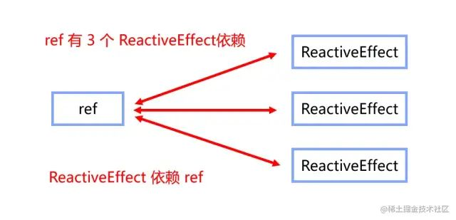
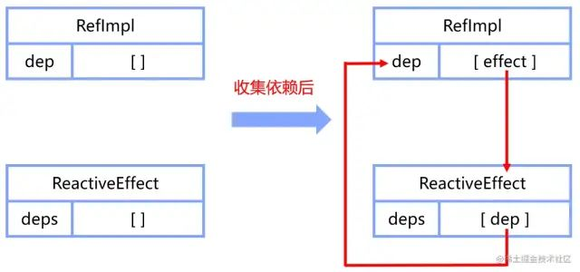
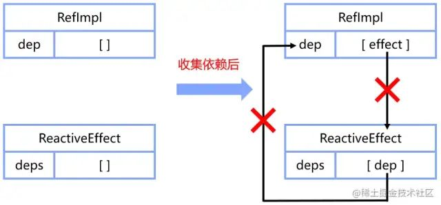
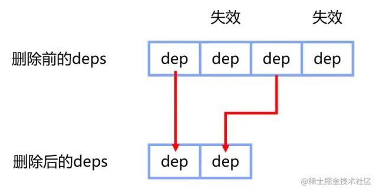

- [前言](#前言)
- [什么是响应性？](#什么是响应性)
  - [ref 的测试用例](#ref-的测试用例)
  - [依赖收集和触发更新](#依赖收集和触发更新)
- [概念约定](#概念约定)
- [ref 源码解析](#ref-源码解析)
  - [ref 对象的实现](#ref-对象的实现)
  - [依赖是怎么被收集的](#依赖是怎么被收集的)
  - [依赖是怎么被触发的](#依赖是怎么被触发的)
  - [effect 函数](#effect-函数)
  - [ReactiveEffect 副作用对象](#reactiveeffect-副作用对象)
  - [依赖更新算法优化](#依赖更新算法优化)
    - [如何给响应式变量做标记](#如何给响应式变量做标记)
    - [判断响应式变量是否被标记](#判断响应式变量是否被标记)
    - [副作用对象的优化实现](#副作用对象的优化实现)
- [参考文章](#参考文章)

# 前言 

本文使用 ref 对 vue 的响应性进行解读，仅仅是响应性原理解析，不涉及 vue 组件等概念。

vue 的响应性的实现，在 @vue/reactivity 包下，对应的源码目录为 packages/reactivity。如何调试 vue 源码，可查看该文章\[1\]

> 为什么使用 ref 进行讲解，而不是 reactive？

ref 比 reactive 的实现简单，且不需要用到 es6 的 Proxy，仅仅需要使用到对象的 getter 和 setter 函数

因此，讲述响应性原理，我们用简单的 ref ，尽量减少大家的理解成本

# 什么是响应性？ 

> 这部分的响应性定义，来自 vue3 官方文档\[2\]

这个术语在程序设计中经常被提及，但这是什么意思呢？响应性是一种允许我们以声明式的方式去适应变化的编程范例。人们通常展示的典型例子，是一份 excel 电子表格 (一个非常好的例子)。

如果将数字 2 放在第一个单元格中，将数字 3 放在第二个单元格中并要求提供 SUM，则电子表格会将其计算出来给你。不要惊奇，同时，如果你更新第一个数字，SUM 也会自动更新。

JavaScript 通常不是这样工作的——如果我们想用 JavaScript 编写类似的内容：

```java
let val1 = 2
let val2 = 3
let sum = val1 + val2

console.log(sum) // 5

val1 = 3

console.log(sum) // 仍然是 5
复制代码
```

如果我们更新第一个值，sum 不会被修改。

那么我们如何用 JavaScript 实现这一点呢？

我们这里直接看 @vue/reactive 的测试用例，来看看怎么使用，才会做到响应性的效果

## ref 的测试用例 

it 包裹的是测试用例的具体内容，我们只需要关注回调里面的代码即可。

```java
it('should be reactive', () => {
    const a = ref(1)
    let dummy
    let calls = 0
    effect(() => {
        calls++
        dummy = a.value
    })
    expect(calls).toBe(1)
    expect(dummy).toBe(1)
    a.value = 2
    expect(calls).toBe(2)
    expect(dummy).toBe(2)
    // same value should not trigger
    a.value = 2
    expect(calls).toBe(2)
    expect(dummy).toBe(2)
})
复制代码
```

我们从测试用例中，可以看出有以下几点结论：

1.  被 effect 包裹的函数，会自动执行一次。
2.  被 effect 函数包裹的函数体，拥有了响应性 —— 当 effect 内的函数中的 ref 对象 a.value 被修改时，该函数会自动重新执行。
3.  当 a.value 被设置成同一个值时，函数并不会自动的重新执行。

> effect 是什么？

官方文档中的描述\[3\]：Vue 通过一个副作用 (effect) 来跟踪函数。副作用是一个函数的包裹器，在函数被调用之前就启动跟踪。Vue 知道哪个副作用在何时运行，并能在需要时再次执行它。

简单地说，要使一个函数拥有响应性，就应该将它包裹在（传入）effect 函数里。

那么这里也可以稍微猜一下，如果有这么一个 updateDom 函数：

```java
const a_ref = ref('aaaa')
function updateDom(){
    return document.body.innerText = a_ref.value
}
effect(updateDom)
setTimeout(()=>{
    a_ref.value = 'bbb'
},1000)
复制代码
```

只要用 effect 包裹一下，当 a\_ref.value 改变，就会自动设置 document.body.innerText，从而更新界面。

（当然这里也只是猜一下，实际上基本的原理，也与这个差不多，但会复杂很多。由于本文篇幅优先，并没有涉及到这部分）

## 依赖收集和触发更新 

要实现响应性，就需要在合适的时机，再次执行副作用 effect。如何确定这个合适的时机？就需要依赖收集（英文术语：track）和触发更新（英文术语：trigger）

仍然看这个测试用例的例子

```java
it('should be reactive', () => {
    const a = ref(1)
    let dummy
    let calls = 0
    effect(() => {
        calls++
        dummy = a.value
    })
    expect(calls).toBe(1)
    expect(dummy).toBe(1)
    a.value = 2
    expect(calls).toBe(2)
    expect(dummy).toBe(2)
    // same value should not trigger
    a.value = 2
    expect(calls).toBe(2)
    expect(dummy).toBe(2)
})
复制代码
```

我们已经知道，effect 包裹的函数，要在合适的时机被再次执行，那么在这个例子中，合适的时机就是，a.value 这个 ref 对象被修改。

由于副作用函数，使用了 a.value，因此副作用函数，依赖 a 这个 ref 变量。我们应该把这个依赖记录下来。

假如是自己实现，可以这么写：

```java
const a = {
    // 当 a 被访问时，可以将副作用函数存储在 a 对象的 dependency 属性中，实际上 @vue/reactivity 会稍微复杂一点 
 get value(){
        const fn = // 假设有办法拿到 effect 的副作用函数
        // fn 就是以下这个函数
        // () => {
        //    calls++
        //    dummy = a.value
        // })
        a.dependence = fn
    }
    // 当 a.value 被修改时，可以这么触发更新
    set value(){
        this.dependence()
    }
}
复制代码
```

这样就可以做到，当 ref 被获取时，收集依赖（即将副作用函数保存起来）；当 ref 被修改时，触发更新（即调用副作用函数）

当然这个实现非常简单，实际上还要考虑很多情况，例如：

 *  一个副作用函数，可能依赖多个 ref。如 computed，就可能依赖多个 ref，才能算出最终的值，因此依赖是一组的副作用函数。
 *  不是任何时候都收集依赖。仅仅在 effect 包裹的时候，才收集依赖
 *  一开始依赖 a 这个 ref 的，但后来不依赖了
 *  ……

这些情况都是我们没有考虑进去的，那么，接下来，我们就看看真正的 ref 的实现

# 概念约定 

在讲解源码前，我们这里先对一些概念进行约定：

 *  副作用对象：在接下来的源码解析中，特指 effect 函数内部创建的一个对象，类型为 ReactiveEffect（先记住有这么名字即可）。 被收集依赖的实际对象。先介绍这么多，后面还会有详细介绍
 *  副作用函数：在接下来的源码解析中，特指传入 effect 的函数，也是被触发再次执行的函数。

```java
effect(() => {
    calls++
    dummy = a.value
})
复制代码
```

 *  响应式变量：ref、reactive、computed 等函数返回的变量。
 *  track：收集依赖
 *  trigger：触发更新
 *  副作用对象依赖响应式变量。如：ReactiveEffect 依赖某个 ref
 *  响应式变量，拥有多个依赖，依赖的值副作用对象。如：某个 ref 拥有（收集到） n 个 ReactiveEffect 依赖

 image-20211231112331231

# ref 源码解析 

通过 ref 的实现，看依赖是什么，是怎么被收集的

## ref 对象的实现 

```java
export function ref(value?: unknown) {
  return createRef(value)
}

// shallowRef，只是将 createRef 的第二个参数 shallow，标记为 true
export function shallowRef(value?: unknown) {
  return createRef(value, true)
}

function createRef(rawValue: unknown, shallow = false) {
  // 如果已经是ref，则直接返回
  if (isRef(rawValue)) {
    return rawValue
  }
  return new RefImpl(rawValue, shallow)
}
复制代码
```

ref 和 shallowRef， 本质都是 RefImpl 对象实例，只是 shallow 属性不同

为了便于理解，我们可以只关注 ref 的实现，即默认 shallow === false

接下来，我们看看 RefImpl 是什么

```java
class RefImpl<T> {
  private _value: T
  private _rawValue: T

  // 用于存储依赖的副作用函数
  public dep?: Dep = undefined
  public readonly __v_isRef = true

  constructor(value: T, public readonly _shallow = false) {
    // 保存原始 value 到 _rawValue
    this._rawValue = _shallow ? value : toRaw(value)
    // convert函数的作用是，如果 value 是对象，则使用 reactive(value) 处理，否则返回value
    // 因此，将一个对象传入 ref，实际上也是调用了 reactive
    this._value = _shallow ? value : convert(value)
  }

  get value() {
    // 收集依赖
    trackRefValue(this)
    return this._value
  }

  set value(newVal) {
    newVal = this._shallow ? newVal : toRaw(newVal)
    // 如果值改变，才会触发依赖
    if (hasChanged(newVal, this._rawValue)) {
      this._rawValue = newVal
      this._value = this._shallow ? newVal : convert(newVal)
      // 触发依赖
      triggerRefValue(this, newVal)
    }
  }
}
复制代码
```

在 RefImpl 对象中

 *  getter 获取 value 属性时，trace 收集依赖
 *  setter 设置 value 属性时，trigger 触发依赖

因此，只有访问/修改 ref 的 value 属性，才会收集/触发依赖

## 依赖是怎么被收集的 

```java
export function trackRefValue(ref: RefBase<any>) {
  // 判断是否需要收集依赖
  if (isTracking()) {
    ref = toRaw(ref)
    // 如果没有 dep 属性，则初始化 dep，dep 是一个 Set<ReactiveEffect>，存储副作用函数
    if (!ref.dep) {
      ref.dep = createDep()
    }
    // 收集 effect 依赖
    trackEffects(ref.dep)
  }
}

// 判断是否需要收集依赖
export function isTracking() {
  // shouldTrack 是一个全局变量，代表当前是否需要 track 收集依赖
  // activeEffect 也是个全局变量，代表当前的副作用对象 ReactiveEffect
  return shouldTrack && activeEffect !== undefined
}
复制代码
```

> 为什么需要使用 isTracking，来判断是否收集依赖？

不是任何情况 ref 被访问时，都需要收集依赖。例如：

 *  没有被 effect 包裹时，由于没有副作用函数（即没有依赖，activeEffect === undefined）， 不应该收集依赖
 *  某些特殊情况，即使包裹在 effect，也不应该收集依赖（即 shouldTrack === false）。如：组件生命周期执行、组件 setup 执行

> ref.dep 有什么作用？

ref.dep 的类型是`Set<ReactiveEffect>` ，关于 ReactiveEffect 的细节会在后面详细阐述

ref.dep 用于存储副作用对象，这些副作用对象，依赖该 ref，ref 被修改时就会触发

我们再来看看 trackEffects：

```java
// 代表当前的副作用 effect
let activeEffect: ReactiveEffect | undefined

export function trackEffects(
  dep: Dep
) {
  // 这个是局部变量的 shouldTrack，跟上一部分的全局 shouldTrack 不一样
  let shouldTrack = false
  // 已经 track 收集过依赖，就可以跳过了
  shouldTrack = !dep.has(activeEffect!)

  if (shouldTrack) {
    // 收集依赖，将 effect 存储到 dep
    dep.add(activeEffect!)
    // 同时 effect 也记录一下 dep
    // 用于 trigger 触发 effect 后，删除 dep 里面对应的 effect，即 dep.delete(activeEffect)
    activeEffect!.deps.push(dep)
  }
}
复制代码
```

收集依赖，就是把 activeEffect（当前的副作用对象），保存到 ref.dep 中（当触发依赖时，遍历 ref.dep 执行 effect ）

然后把 ref.dep，也保存到 effect.deps 中（用于在触发依赖后， ref.dep.delete(effect)，双向删除依赖）

 image-20211230205303018

## 依赖是怎么被触发的 

看完 track 收集依赖，那看看依赖是怎么被触发的

```java
export function triggerRefValue(ref: RefBase<any>, newVal?: any) {
  // ref 可能是 reactive 对象的某个属性的值
  // 这时候在 triggerRefValue(this, newVal) 时取 this，拿到的是一个 reactive 对象
  // 需要获取 Proxy 代理背后的真实值 ref 对象
  ref = toRaw(ref)
  // 有依赖才触发 effect
  if (ref.dep) {
     triggerEffects(ref.dep)
  }
}
复制代码
```

再来看看 triggerEffects

```java
export function triggerEffects(
  dep: Dep | ReactiveEffect[]
) {
  // 循环遍历 dep，去取每个依赖的副作用对象 ReactiveEffect
  for (const effect of isArray(dep) ? dep : [...dep]) {
    // 默认不允许递归，即当前 effect 副作用函数，如果递归触发当前 effect，会被忽略
    if (effect !== activeEffect || effect.allowRecurse) {
      // effect.scheduler可以先不管，ref 和 reactive 都没有
      if (effect.scheduler) {
        effect.scheduler()
      } else {
        // 执行 effect 的副作用函数
        effect.run()
      }
    }
  }
}
复制代码
```

这里省略了一些代码，这样结构更清晰。

当 ref 被修改时，会 trigger 触发依赖，即执行了 ref.dep 里的所有副作用函数（effect.run 运行副作用函数）

> 为什么默认不允许递归？

```java
const foo = ref([])
effect(()=>{
    foo.value.push(1)
})
复制代码
```

在这个副作用函数中，即会使用到 foo.value（getter 收集依赖），又会修改 foo 数组（触发依赖）。如果允许递归，会无限循环。

至此，ref 依赖收集和触发的逻辑，已经比较清晰了。

那么，接下来，我们需要进一步了解的是，effect 函数、ReactiveEffect 副作用对象、副作用函数，它们是什么，它们之间有什么关系？

## effect 函数 

我们来看一下 effect 的实现

```java
// 传入一个 fn 函数
export function effect<T = any>(
  fn: () => T
){
  // 参数 fn，可能也是一个 effect，所以要获取到最初始的 fn 参数
  if ((fn as ReactiveEffectRunner).effect) {
    fn = (fn as ReactiveEffectRunner).effect.fn
  }

  // 创建 ReactiveEffect 对象
  const _effect = new ReactiveEffect(fn)
  _effect.run()
  
  const runner = _effect.run.bind(_effect)
  runner.effect = _effect
  return runner
}
复制代码
```

effect 函数接受一个函数作为参数，该函数，我们称之为副作用函数

effect 函数内部，会创建 ReactiveEffect 对象，我们称之为副作用对象

effect 函数，返回一个 runner，是一个函数，直接调用就是调用副作用函数；runner 的属性 effect，保存着它对应的 ReactiveEffect 对象 。

因此，它们的关系如下：

effect 函数的入参为副作用函数，在 effect 函数内部会创建副作用对象

我们继续深入看看 ReactiveEffect 对象的实现

## ReactiveEffect 副作用对象 

该部分（effect.run 函数）代码有比较大的删减，点击查看未删减的源码\[4\]

> 为什么要删减这部分代码？

在 vue 3.2 版本以后，effect.run 做了优化，提升性能，其中涉及到位运算。

优化方案在极端的情况下（effect 非常多次嵌套），会降级到原来的老方案（优化前，3.2版本前的方案）

因此，为了便于理解，我这里先介绍优化前的方案，深入了解，并阐述该方案的缺点， 以便更好地理解为什么需要进行优化。

删减部分为优化后的方案，这部分的方案会在下一小节进行介绍。

下面是 ReactiveEffect 代码解析：

```java
// 全局公用的 effect 栈，由于可以 effect 嵌套，因此需要用栈保存 ReactiveEffect 副作用对象
const effectStack: ReactiveEffect[] = []
export class ReactiveEffect<T = any> {
  active = true
    
  // 存储 Dep 对象，如上一小节的 ref.dep
  deps: Dep[] = []

  constructor(
    public fn: () => T,
    public scheduler: EffectScheduler | null = null,
    scope?: EffectScope | null
  ) {
    // 可以暂时不看，与 effectScope API 相关 https://v3.cn.vuejs.org/api/effect-scope.html#effectscope
    // 将当前 ReactiveEffect 副作用对象，记录到 effectScope 中
    // 当 effectScope.stop() 被调用时，所有的 ReactiveEffect 对象都会被 stop
    recordEffectScope(this, scope)
  }

  run() {
    // 如果当前 ReactiveEffect 副作用对象，已经在栈里了，就不需要再处理了
    if (!effectStack.includes(this)) {
      try {
        // 保存上一个的 activeEffect，因为 effect 可以嵌套
        effectStack.push((activeEffect = this))
        // 开启 shouldTrack 开关，缓存上一个值
        enableTracking()

        // 在该 effect 所在的所有 dep 中，清除 effect，下面会详细阐述
        cleanupEffect(this)
          
        // 执行副作用函数，执行过程中，又会 track 当前的 effect 进来，依赖重新被收集
        return this.fn()
      } finally {
        // 关闭shouldTrack开关，恢复上一个值
        resetTracking()
        // 恢复上一个的 activeEffect
        effectStack.pop()
        const n = effectStack.length
        activeEffect = n > 0 ? effectStack[n - 1] : undefined
      }
    }
  }
}

// 允许 track
export function enableTracking() {
  // trackStack 是个全局的栈，由于 effect 可以嵌套，所以是否 track 的标记，也需要用栈保存
  trackStack.push(shouldTrack)
  // 打开全局 shouldTrack 开关
  shouldTrack = true
}

// 重置上一个 track 状态
export function resetTracking() {
  const last = trackStack.pop()
  // 恢复上一个 track 状态
  shouldTrack = last === undefined ? true : last
}
复制代码
```

> 为什么要用栈保存 effect 和 track 状态？

因为effect可能会嵌套，需要保存之前的状态，effect执行完成后恢复

> cleanupEffect 做了什么？

回顾下图：

 image-20220102234627353

effect.deps，也存储着响应式变量的 dep（dep 是一个依赖集合， ReactiveEffect 对象的集合），目的是在effect 执行后，在所有的 dep 中删除当前执行过的 effect，双向删除

删除代码如下：

```java
function cleanupEffect(effect: ReactiveEffect) {
  const { deps } = effect
  if (deps.length) {
    for (let i = 0; i < deps.length; i++) {
      // 从 ref.dep 中删除 ReactiveEffect
      deps[i].delete(effect)
    }
    // 从 ReactiveEffect.deps 中删除 dep
    deps.length = 0
  }
}
复制代码
```

> 删除的 ReactiveEffect 如何被重新收集？

在 cleanupEffect 中，在各个 dep 中，删除该 ReactiveEffect 对象。

在执行 `this.fn()` 时，执行副作用函数，副作用函数的执行中，当使用到响应式变量（如 ref.value）时，又会 trackEffect，重新收集依赖。

> 为什么要先删除，再重新收集依赖？

因为执行前后的依赖可能不一致，考虑一下情况：

```java
const switch = ref(true)
const foo = ref('foo')
effect( () = {
  if(switch.value){
    console.log(foo.value)
  }else{
    console.log('else condition')
  }
})
switch.value = false
复制代码
```

当 switch 为 true 时，triggerEffect，双向删除后，执行副作用函数，switch、foo 会重新收集到依赖 effect

当 switch 变成 false 后，triggerEffect，双向删除后，执行副作用函数，仅有 switch 能重新收集到依赖 effect

 image-20211231110604009

由于 effect 副作用函数执行前后，依赖的响应式变量（这里是 ref ）可能不一致，因此 vue 会先删除全部依赖，再重新收集。

细心的你，可能会发现：自己写 vue 代码时，很少会出现前后依赖不一致的情况。那既然这样，删除全部依赖这个实现就有优化的空间，能不能只删除失效的依赖呢？

## 依赖更新算法优化 

该优化是 vue 3.2 版本引入的，原因即上一小节所说的，可以只删除失效的依赖。并且在极端的嵌套深度下，能够降级到 cleanupEffect 方法，对所有依赖进行删除。

先想想，假如是自己实现，要怎么写好呢？

1.  不使用 cleanupEffect 删除所有依赖
2.  执行副作用函数前，给 ReactiveEffect 依赖的 响应式变量，加上 was 的标记（was 是 vue 给的名称，过去的意思）
3.  执行 `this.fn()`， track 重新收集依赖时，给 ReactiveEffect 的每个依赖， 加上 new 的标记
4.  最后，对失效（有 was 但是没有 new）依赖进行删除

> 为什么是标记在响应式对象，而不是 ReactiveEffect ？

再回顾一下响应式变量和 ReactiveEffect 的关系：

 image-20211231112331231

ReactiveEffect 依赖响应式变量（ref），响应式变量（ref）拥有多个 ReactiveEffect 依赖。

只删除失效的依赖。就要确定哪些依赖（响应式变量）需要被删除（实际上是响应式变量的 dep 被删除）

因此，需要在响应式变量上做标记，对已经不依赖的响应式变量，将它们的 dep，从 ReactiveEffect.deps 中删除

### 如何给响应式变量做标记 

实现如下：

```java
export const initDepMarkers = ({ deps }: ReactiveEffect) => {
  if (deps.length) {
    // 循环 deps，对每个 dep 进行标记
    for (let i = 0; i < deps.length; i++) {
      // 标记 dep 为 was，w 是 was 的意思
      deps[i].w |= trackOpBit
    }
  }
}
复制代码
```

这部分代码其实比较难理解，尤其是使用了位运算符，如果一开始就解析这些代码的话，很容易就劝退了。

下面我们对问题进行分析：

> 为什么这里标记的是 dep？

这里的 dep，对于 ref，就是 ref.dep，它是一个 `Set<ReactiveEffect>` 。

dep 跟 ref 的关系是一一对应的，一个 ref仅仅有一个 dep，因此，标记在 dep 和 标记在 ref，是等价的

> 那为什么不在响应式变量上标记呢？

因为响应式变量的类型有几种：ref、computed、reactive，它们都使用 dep 对象存储依赖，对它们都有的 dep 对象进行标记，可以将标记代码更好的进行复用（否则要判断不同的类型，执行不同的标记逻辑）。

如果未来新增一种响应式变量，只需要也是用 dep 进行存储依赖即可

> 这个按位与位运算的作用是什么？

先来看看 dep 的真实结构，它其实还有两个属性 w 和 n：

```java
export type Dep = Set<ReactiveEffect> & TrackedMarkers
type TrackedMarkers = {
  /**
   * wasTracked，代表副作用函数执行前被 track 过
   */
  w: number
  /**
   * newTracked，代表副作用函数执行后被 track
   */
  n: number
}
复制代码
```

那这个 w 和 n 是怎么做标记的？我们先来看看位运算做了什么，不了解位运算的同学 ，可以先看看这里的介绍\[5\]

```java
dep.w |= trackOpBit // 即 dep.w = dep.w | trackOpBit
复制代码
```

 image-20220103205852303

将响应式变量标记，就是将对应整数的二进制位，设置成 1

dep.n 的标记方法也是如此。

> 为什么要使用位运算？

1.  位运算速度快
2.  只需要使用一个 number 类型的数据，就能存储不同深度的标记（was / new）

如果不使用位运算，需要实现同样的标记能力，需要用数组存储不同深度的标记，数据结构如下：

```java
export type Dep = Set<ReactiveEffect> & TrackedMarkers
type TrackedMarkers = {
  /**
   * wasTrackedList，代表副作用函数执行前被 track 过
   * 设计为数组，是因为 effect 可以嵌套，代表响应式变量在所在的 effect 深度（嵌套层级）中是否被 track
   */
  wasTrackedList: boolean[]
  /**
   * newTracked，代表副作用函数执行后被 track
   * 设计为数组，是因为 effect 可以嵌套，代表响应式变量在所在的 effect 深度（嵌套层级）中是否被 track
   */
  newTrackedList: boolean[]
}
复制代码
```

使用数组存储标记位，修改处理没有直接位运算快。由于 vue 每次执行副作用函数（一个页面有非常多的副作用函数），都需要频繁进行标记，这开销也是非常大的。因此，这里使用了运算符，提升了标记的速度，也节省了运行内存

> trackOpBit 是什么？

trackOpBit 是代表当前操作的位，它是由 effect 嵌套深度决定的。

```java
// 全局变量嵌套深度一开始为 0 
effectTrackDepth = 0

// 每次执行 effect 副作用函数前，全局变量嵌套深度会自增 1，执行完成 effect 副作用函数后会自减
trackOpBit = 1 << ++effectTrackDepth
复制代码
```

当深度为 1 时，trackOpBit 是 2（二进制：00000010），操作的是第二位，将 dep.w 的第二位变成 1

因此如图所说，dep.w 的第一位是不使用的

> 为什么最大标记嵌套深度为 30？

从图中我们可以看到，深度受存储类型的位数限制，否则就会溢出。

在JavaScript内部，数值都是以64位浮点数的形式储存，但是做位运算的时候，是以32位带符号的整数进行运算的，并且返回值也是一个32位带符号的整数。

```java
1 << 30
// 1073741824
1 << 31
// -2147483648，溢出
复制代码
```

因此，深度最大为 30，超过 30，则需要降级方案，使用全部清除再全部重新收集依赖的方案

### 判断响应式变量是否被标记 

```java
export const wasTracked = (dep: Dep): boolean => (dep.w & trackOpBit) > 0

export const newTracked = (dep: Dep): boolean => (dep.n & trackOpBit) > 0
复制代码
```

使用 `wasTracked` 和 `newTracked` 判断 dep 是否在当前深度被标记

trackOpBit 是一个全局变量，根据当前深度生成的

 image-20220103210036377

如图，如果需要判断深度为 2 时（trackOpBit 第 3 位为 1），是否被标记，仅当 `dep.w` 的第 3 位为 1 时， `wasTracked` 或 `newTracked` 才会返回 true

vue 通过这样巧妙的位运算，快速算出依赖在当前深度是否被标记

### 副作用对象的优化实现 

```java
// 当前 effect 的嵌套深度，每次执行会 ++effectTrackDepth
let effectTrackDepth = 0
// 最大的 effect 嵌套层数为 30
const maxMarkerBits = 30      
// 位运算操作的第 trackOpBit 位
export let trackOpBit = 1
export class ReactiveEffect<T = any> {
  run() {
    if (!effectStack.includes(this)) {
      try {
        // 省略代码: 保存上一个 activeEffect
        
        // trackOpBit: 根据深度生成 trackOpBit
        trackOpBit = 1 << ++effectTrackDepth

        // maxMarkerBits: 可支持的最大嵌套深度，为 30
        // 这里就是之前说到的，正常情况下使用优化方案，极端嵌套场景下，使用降级方案
        if (effectTrackDepth <= maxMarkerBits) {
          // 标记所有的 dep 为 was
          initDepMarkers(this)
        } else {
          // 降级方案，删除所有的依赖，再重新收集
          cleanupEffect(this)
        }
         // 执行过程中标记新的 dep 为 new
        return this.fn()
      } finally {
        if (effectTrackDepth <= maxMarkerBits) {
          // 对失效依赖进行删除
          finalizeDepMarkers(this)
        }
  // 恢复上一次的状态
        // 嵌套深度 effectTrackDepth 自减
        // 重置操作的位数
        trackOpBit = 1 << --effectTrackDepth

        // 省略代码: 恢复上一个 activeEffect
      }
    }
  }
}
复制代码
```

整体的思路如下：

 *  如果当前深度不超过 30，使用优化方案
 *  执行副作用函数前，给 ReactiveEffect 依赖的 响应式变量，加上 was 的标记（was 是 vue 给的名称，表示过去依赖）
    
    执行 `this.fn()`， track 重新收集依赖时，给 ReactiveEffect 的每个依赖， 加上 new 的标记
    
    对失效依赖进行删除（有 was 但是没有 new）
    
    恢复上一个深度的状态
 *  如果深度超过 30 ，超过部分，使用降级方案：
 *  双向删除 ReactiveEffect 副作用对象的 所有依赖（effect.deps.length = 0）
    
    执行 `this.fn()`， track 重新收集依赖时
    
    恢复上一个深度的状态

标记 ReactiveEffect 的所有的 dep 为 was 的实现：

```java
export const initDepMarkers = ({ deps }: ReactiveEffect) => {
  if (deps.length) {
    for (let i = 0; i < deps.length; i++) {
      deps[i].w |= trackOpBit // 遍历每个 dep 标记为 was
    }
  }
}
复制代码
```

对失效依赖进行删除的实现如下（有 was 但是没有 new）：



```java
export const finalizeDepMarkers = (effect: ReactiveEffect) => {
  const { deps } = effect
  if (deps.length) {
    let ptr = 0
    for (let i = 0; i < deps.length; i++) {
      const dep = deps[i]
      //有 was 标记但是没有 new 标记，应当删除
      if (wasTracked(dep) && !newTracked(dep)) {
        dep.delete(effect)
      } else {
        // 需要保留的依赖，放到数据的较前位置，因为在最后会删除较后位置的所有依赖
        deps[ptr++] = dep
      }
      // 清理 was 和 new 标记，将它们对应深度的 bit，置为 0
      dep.w &= ~trackOpBit
      dep.n &= ~trackOpBit
    }
    // 删除依赖，只保留需要的
    deps.length = ptr
  }
}
复制代码
```

# 参考文章 

 *  [vue 官方文档](https://cn.vuejs.org/guide/introduction.html) 
 *  [vue-next 源码](https://github.com/vuejs/core)
