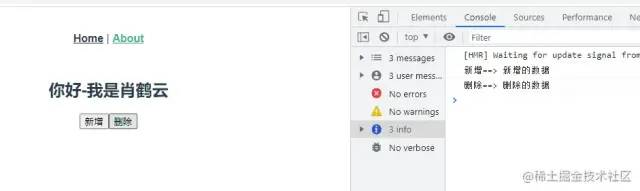

- [vue3.2 到底更新了什么？](#vue32-到底更新了什么)
- [setup 的简单介绍](#setup-的简单介绍)
- [变量、方法不需要 return 出来](#变量方法不需要-return-出来)
- [组件不需要在注册](#组件不需要在注册)
- [分析引入 setup 后组件的变化](#分析引入-setup-后组件的变化)
- [新增 defineProps](#新增-defineprops)
- [defineProps 的使用](#defineprops-的使用)
  - [父组件传递参数](#父组件传递参数)
  - [子组件接受参数](#子组件接受参数)
- [子组件怎么向父组件抛出事件？defineEmits的到来！](#子组件怎么向父组件抛出事件defineemits的到来)
  - [子组件使用](#子组件使用)
  - [父组件](#父组件)
- [如何获取子组件中的属性值](#如何获取子组件中的属性值)
  - [子组件](#子组件)
  - [父组件](#父组件-1)
  - [新增指令 v-memo](#新增指令-v-memo)
- [style v-bind 该同学已经从实验室毕业了](#style-v-bind-该同学已经从实验室毕业了)
- [style v-bind将span变成红色](#style-v-bind将span变成红色)

#### vue3.2 到底更新了什么？ 

```java
根据原文内容的更新的内容主要有以下 5 块：
1.SSR：服务端渲染优化。@vue/server-renderer包加了一个ES模块创建，
与Node.js解耦，使在非Node环境用@vue/serve-render做服务端渲染成为可能，
比如(Workers、Service Workers)
2.New SFC Features：新的单文件组件特性
3.Web Components：自定义 web 组件。这个我们平时很少用到，但是应该知道
4.Effect Scope API：effect 作用域，
用来直接控制响应式副作用的释放时间(computed 和 watchers)。
这是底层库的更新，开发不用关心，但是应该知道
5.Performance Improvements：性能提升。这是内部的提升，跟开发无关
复制代码
```

#### setup 的简单介绍 

```java
起初 Vue3.0 暴露变量必须 return 出来，template中才能使用；
这样会导致在页面上变量会出现很多次。
很不友好，vue3.2只需在script标签中添加setup。
可以帮助我们解决这个问题。

1.组件只需引入不用注册，属性和方法也不用返回，
也不用写setup函数，也不用写export default ，
甚至是自定义指令也可以在我们的template中自动获得。
复制代码
```

#### 变量、方法不需要 return 出来 

```java
<template>
  <div class="home">
    显示的值{{flag }}
    <button @click="changeHander">改变值</button>
  </div>
</template>
<!-- 只需要在script上添加setup -->
<script lang="ts" setup>
    import { ref } from 'vue';

    <!-- flag变量不需要在 return出去了 -->
    let flag=ref("开端-第一次循环")

    <!-- 函数也可以直接引用,不用在return中返回 -->
    let changeHander=():void=>{
        flag.value='开端-第二次循环'
    }

</script>
复制代码
```


#### 组件不需要在注册 

```java
<!-- 这个是组件 -->
<template>
    <div>
        <h2> 你好-我是肖鹤云</h2>
    </div>
</template>


使用的页面
<template>
  <div class="home">
    <test-com></test-com>
  </div>
</template>
<script lang="ts" setup>
// 组件命名采用的是大驼峰，引入后不需要在注册，是不是爽歪歪呀!
//在使用的使用直接是小写和横杠的方式连接 test-com
import TestCom from "../components/TestCom.vue"
</script>
复制代码
```

#### 分析引入 setup 后组件的变化 

```java
在 script setup 中，
引入的组件可以直接使用无需再通过components进行注册，[是不是真的很香啊!]
并且无法指定当前组件的名字，它会自动以文件名为主，也就是不用再写name属性了。
当我们的页面上需要使用很多组件时，它的功能一下就体现出来了。
复制代码
```

#### 新增 defineProps 

```java
刚刚我一直在强调,不需要使用setup函数，机智的小伙伴会说:
那么子组件怎么接受父组件传递过来的值呢?
props，emit怎么获取呢?
别担心,新的api出现了,我们的主角 defineProps
复制代码
```

#### defineProps 的使用 

##### 父组件传递参数 

```java
<template>
  <div class="home">
    <test-com :info="msg" time="42分钟"></test-com>
  </div>
</template>
<script lang="ts" setup>
// 组件命名采用的是大驼峰，引入后不需要在注册，是不是爽歪歪呀!
import TestCom from "../components/TestCom.vue"
let msg='公交车-第一次循环'
</script>
复制代码
```

##### 子组件接受参数 

```java
<template>
    <div>
        <h2> 你好-我是肖鹤云</h2>
        <p>信息:{{ info}}</p>
        <p>{{ time }}</p>
    </div>
</template>
<script lang="ts" setup>
import {defineProps} from 'vue'
defineProps({
    info:{
        type:String,
        default:'----'
    },
    time:{
        type:String,
        default:'0分钟'
    },
})
</script>
复制代码
```


#### 子组件怎么向父组件抛出事件？defineEmits的到来！ 

##### 子组件使用 

```java
别担心，我们使用defineEmits。它可以像父组件抛出事件。
<template>
    <div>
        <h2> 你好-我是肖鹤云</h2>
        <button @click="hander1Click">新增</button>
        <button @click="hander2Click">删除</button>
    </div>
</template>

<script lang="ts" setup>
 import {defineEmits} from 'vue'
//  使用defineEmits创建名称，接受一个数组
let $myemit=defineEmits(['myAdd','myDel'])
let hander1Click=():void=>{
    $myemit('myAdd','新增的数据')
}

let hander2Click=():void=>{
    $myemit('myDel','删除的数据')
}
</script>
复制代码
```

##### 父组件 

```java
<template>
  <div class="home">
    <test-com @myAdd="myAddHander" @myDel='myDelHander'></test-com>
  </div>
</template>
<script lang="ts" setup>
// 组件命名采用的是大驼峰，引入后不需要在注册，是不是爽歪歪呀!
//在使用的使用直接是小写和横杠的方式连接 test-com
import TestCom from "../components/TestCom.vue"
let myAddHander=(mess):void=>{
  console.log('新增==>',mess);
}

let myDelHander=(mess):void=>{
  console.log('删除==>', mess);
}
</script>
复制代码
```



#### 如何获取子组件中的属性值 

##### 子组件 

```java
<template>
    <div>
        <h2> 你好-我是肖鹤云</h2>
        <p>性别:{{ sex}}</p>
        <p>其他信息:{{ info}}</p>
    </div>
</template>

<script lang="ts" setup>
import { reactive, ref,defineExpose } from "vue";
let sex=ref('男')
let info=reactive({
    like:'喜欢李诗晴',
    age:27
})
// 将组件中的属性暴露出去，这样父组件可以获取
defineExpose({
    sex,
    info
})
</script>
复制代码
```

##### 父组件 

```java
<template>
  <div class="home">
    <test-com @myAdd="myAddHander" @myDel='myDelHander' ref="testcomRef"></test-com>
    <button @click="getSonHander">获取子组件中的数据</button>
  </div>
</template>
<script lang="ts" setup>
import TestCom from "../components/TestCom.vue"
import {ref} from 'vue'
const testcomRef = ref()
const getSonHander=()=>{
  console.log('获取子组件中的性别', testcomRef.value.sex );
  console.log('获取子组件中的其他信息', testcomRef.value.info );
}
</script>
复制代码
```


##### 新增指令 v-memo 

```java
v-memod会记住一个模板的子树,元素和组件上都可以使用。
该指令接收一个固定长度的数组作为依赖值进行[记忆比对]。
如果数组中的每个值都和上次渲染的时候相同，则整个子树的更新会被跳过。
即使是虚拟 DOM 的 VNode 创建也将被跳过，因为子树的记忆副本可以被重用。
因此渲染的速度会非常的快。
需要注意得是:正确地声明记忆数组是很重要。
开发者有责任指定正确的依赖数组，以避免必要的更新被跳过。
<li v-for="item in listArr"  :key="item.id"  v-memo="['valueA'，'valueB']">
    {{ item.name   }}
</li>
v-memod的指令使用较少，它的作用是:缓存模板中的一部分数据。
只创建一次，以后就不会再更新了。也就是说用内存换取时间。
复制代码
```

#### style v-bind 该同学已经从实验室毕业了 

```java
经过尤大大和团队的努力，<style> v-bind 已经从实验室毕业了。
我们可以使用这个属性了。爽歪歪！
我们可以在style中去使用变量。是不是感觉很牛逼呀！
现在我们用起来，第一次使用<style> v-bind
复制代码
```

#### style v-bind将span变成红色 

```java
<template>
  <span> 有开始循环了-开端 </span>  
</template>
<script setup>
  import { reactive } from 'vue'
  const state = reactive({
    color: 'red'
  })
</script>
<style scoped>
  span {
    /* 使用v-bind绑定state中的变量 */
    color: v-bind('state.color');
  }  
</style>
复制代码
```
