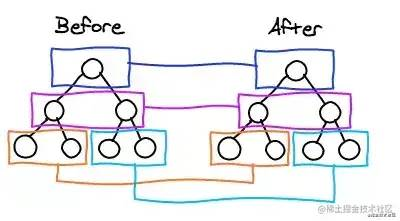
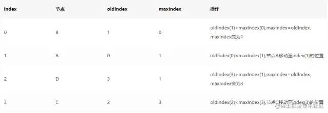

- [1.对于组件化的理解，组件化带来的好处](#1对于组件化的理解组件化带来的好处)
  - [react和vue中组件化的相同点](#react和vue中组件化的相同点)
  - [react和vue组件化的差异](#react和vue组件化的差异)
- [2.虚拟DOM](#2虚拟dom)
  - [什么是虚拟DOM](#什么是虚拟dom)
  - [虚拟DOM的优点](#虚拟dom的优点)
  - [react和vue中虚拟DOM的相同点](#react和vue中虚拟dom的相同点)
    - [两者对diff算法的优化基本上思路是相同的：](#两者对diff算法的优化基本上思路是相同的)
    - [diff 算法源码实现相同之处](#diff-算法源码实现相同之处)
  - [react和vue中虚拟DOM的差别](#react和vue中虚拟dom的差别)
    - [dom的更新策略不同](#dom的更新策略不同)
    - [diff 算法源码实现不同之处](#diff-算法源码实现不同之处)
      - [react的diff](#react的diff)
      - [vue的diff](#vue的diff)
      - [为什么react不使用双指针提升比较效率](#为什么react不使用双指针提升比较效率)
      - [总结](#总结)
- [3.数据驱动视图](#3数据驱动视图)
  - [vue中的数据驱动视图](#vue中的数据驱动视图)
  - [react的数据驱动视图](#react的数据驱动视图)
  - [参考资料](#参考资料)

Vue 和 React 作为当前前端两大火热的框架，面试的时候自然不少被提及：  

 *  请说一下你对react/vue框架的理解
 *  请对比一下两大框架的优缺点

其实react和vue大体上是相同的，比如都使用虚拟DOM高效的更新视图，都提倡组件化，都实现了数据驱动视图，都使用diff算法，也都对diff算法进行了优化，都有router库实现url到组件的映射，都有状态管理等等.....

但是在具体实现上又不尽相同，接下来就从组件化，虚拟DOM以及数据驱动视图三个方面对比下vue和react框架的相同和不同之处。

## 1.对于组件化的理解，组件化带来的好处 

1.  组件是独立和可复用的代码组织单元，它使开发者使用小型、独立和通常可复用的组件构建大型应用;
2.  组件化开发能大幅提高应用 开发效率、测试性、 复用性等;
3.  降低整个系统的耦合度，在保持接口不变的情况下，我们可以替换不同的组件快速完成需求，例如输入框，可以替换为日历、时间、范围等组件作具体的实现
4.  调试方便，由于整个系统是通过组件组合起来的，在出现问题的时候，可以用排除法直接移除组件，或者根据报错的组件快速定位问题，之所以能够快速定位，是因为每个组件之间低耦合，职责单一，所以逻辑会比分析整个系统要简单
5.  提高可维护性，由于每个组件的职责单一，并且组件在系统中是被复用的，所以对代码进行优化可获得系统的整体升级

### react和vue中组件化的相同点 

react和vue都推崇组件化，通过将页面拆分成一个一个小的可复用单元来提高代码的复用率和开发效率。在开发时react和vue有相同的套路，比如都有父子组件传参，都有数据状态管理，都有前端路由等。

### react和vue组件化的差异 

React推荐的做法是JSX + inline style, 也就是把 HTML 和 CSS 全都写进 JavaScript 中,即 all in js;

Vue 推荐的做法是 template 的单文件组件格式(简单易懂，从传统前端转过来易于理解),即 html,css,JS 写在同一个文件(vue也支持JSX写法)

## 2.虚拟DOM 

### 什么是虚拟DOM 

虚拟 DOM（Virtual DOM）本质上是JS 和 DOM 之间的一个映射缓存，它在形态上表现为一个能够描述 DOM 结构及其属性信息的 JS 对象。它主要存储在内存中。主要来说：

 *  虚拟dom是一个js对象，存储在内存之中。
 *  虚拟dom能够描述真实dom（存在一个对应关系）
 *  当数据变化的时候，生成新的DOM，对比新旧虚拟DOM的差异，将差异更新到真实DOM上

### 虚拟DOM的优点 

 *  减少 DOM 操作：虚拟 DOM 可以将多次 DOM 操作合并为一次操作
 *  研发效率的问题：虚拟 DOM 的出现，为数据驱动视图这一思想提供了高度可用的载体，使得前端开发能够基于函数式 UI 的编程方式实现高效的声明式编程。
 *  跨平台的问题：虚拟 DOM 是对真实渲染内容的一层抽象。同一套虚拟 DOM，可以对接不同平台的渲染逻辑，从而实现“一次编码，多端运行”

### react和vue中虚拟DOM的相同点 

Vue与React都使用了 Virtual DOM + Diff算法， 不管是Vue的Template模板+options api 写法， 还是React的Class或者Function写法,最后都是生成render函数，而render函数执行返回VNode(虚拟DOM的数据结构，本质上是棵树)。

当每一次UI更新时，总会根据render重新生成最新的VNode，然后跟以前缓存起来老的VNode进行比对，再使用Diff算法（框架核心）去真正更新真实DOM（虚拟DOM是JS对象结构，同样在JS引擎中，而真实DOM在浏览器渲染引擎中，所以操作虚拟DOM比操作真实DOM开销要小的多）

#### 两者对diff算法的优化基本上思路是相同的： 

 *  tag不同认为是不同节点
 *  只比较同一层级，不跨级比较
 *  同一层级的节点用key唯一标识，tag和key都相同则认为是同一节点

#### diff 算法源码实现相同之处 

在处理老节点部分，都需要把节点处理 key - value 的 Map 数据结构，方便在往后的比对中可以快速通过节点的 key 取到对应的节点。同样在比对两个新老节点是否相同时，key 是否相同也是非常重要的判断标准。所以不同是 React, 还是 Vue，在写动态列表的时候，都需要设置一个唯一值 key，这样在 diff 算法处理的时候性能才最大化。

### react和vue中虚拟DOM的差别 

react和vue的虚拟dom都是用js对象来模拟真实DOM，用虚拟DOM的diff来最小化更新真实DOM，可以减小不必要的性能损耗，按颗粒度分为不同的类型比较同层级dom节点，进行增、删、移的操作。

按颗粒度分为tree diff, component diff, element diff. tree diff 比较同层级dom节点，进行增、删、移操作。如果遇到component， 就会重新tree diff流程。

参考链接\[1\]

#### dom的更新策略不同 

react 会自顶向下全diff。vue会跟踪每一个组件的依赖关系,不需要重新渲染整个组件树。

在react中，当状态发生改变时，组件树就会自顶向下的全diff, 重新render页面， 重新生成新的虚拟dom tree, 新旧dom tree进行比较， 进行patch打补丁方式，局部更新dom。所以react为了避免父组件更新而引起不必要的子组件更新， 可以在shouldComponentUpdate做逻辑判断，减少没必要的render， 以及重新生成虚拟dom，做差量对比过程。

在vue中， 通过Object.defineProperty 把 data 属性全部转为 getter/setter。同时watcher实例对象会在组件渲染时，将属性记录为dep, 当dep 项中的 setter被调用时，通知watch重新计算，使得关联组件更新。

Diff 算法借助元素的 Key 判断元素是新增、删除、修改，从而减少不必要的元素重渲染。

#### diff 算法源码实现不同之处 

##### react的diff 

声明newChildren就是即将更新的 JSX 对象

1.  当newChildren类型为object、number、string，代表同级只有一个节点
2.  检查上次更新时的fiber节点是否存在对应的DOM节点  
    
    
     *  存在：DOM节点是否可以复用（ 通过tag和key进行判断 ）
     *  可以：将上次更新的fiber节点副本作为本次新生成的fiber节点并返回
        
        不可以：标记当前节点为待删除节点，新生成一个fiber节点并返回
     *  不存在：新生成一个fiber节点并返回
3.  
4.  当newChildren类型为Array，同级有多个节点，会进行两次遍历：
5.  第一层遍历:
    
     *  遍历newChildren，i = 0，将newChildren\[i\]与oldFiber比较，判断DOM节点是否可复用。
     *  如果可复用，i++，比较newChildren\[i\]与oldFiber.sibling是否可复用。可以复用则重复此步骤。
     *  如果不可复用，立即跳出整个遍历。
     *  如果newChildren遍历完或者oldFiber遍历完（即oldFiber.sibling === null），跳出遍历。
6.  由上述，第一次遍历完可能存在以下2种情况: a. 若是因为"不可复"用导致的跳出遍历：newChildren没有遍历完，oldFiber也没有遍历完。b. 若是因为"newChildren遍历完或者oldFiber遍历完"导致的跳出遍历：可能newChildren遍历完，或oldFiber遍历完，或他们同时遍历完。（带着第一轮遍历的结果去进行第二轮的遍历）
7.  第二轮遍历：第二轮遍历的时候会将剩余未比较的老节点和剩余未比较的新节点进行遍历  
    
    
     *  newChildren没遍历完，oldFiber遍历完：遍历余下的newChildren依次进行插入
     *  newChildren遍历完，oldFiber没遍历完：遍历剩下的oldFiber依次进行删除
     *  newChildren与oldFiber都没遍历完：这意味着有节点在这次更新中改变了位置。
        
         
     *  index：新集合的遍历下标。
     *  oldIndex：当前节点在老集合中的下标
     *  maxIndex：在新集合访问过的节点中，其在老集合的最大下标
    
    如果当前节点在新集合中的位置比老集合中的位置靠前的话，是不会影响后续节点操作的，这里这时候节点不用动
    
    操作过程中只比较oldIndex和maxIndex，规则如下：
    
     *  当oldIndex>maxIndex时，将oldIndex的值赋值给maxIndex
     *  当oldIndex=maxIndex时，不操作
     *  当oldIndex<maxIndex时，将当前节点移动到index的位置
    
    diff过程如下：
8.  节点B：此时 maxIndex=0，oldIndex=1；满足 maxIndex< oldIndex，因此B节点不动，此时maxIndex= Math.max(oldIndex, maxIndex)，就是1
    
    节点A：此时maxIndex=1，oldIndex=0；不满足maxIndex< oldIndex，因此A节点进行移动操作，此时maxIndex= Math.max(oldIndex, maxIndex)，还是1
    
    节点D：此时maxIndex=1, oldIndex=3；满足maxIndex< oldIndex，因此D节点不动，此时maxIndex= Math.max(oldIndex, maxIndex)，就是3
    
    节点C：此时maxIndex=3，oldIndex=2；不满足maxIndex< oldIndex，因此C节点进行移动操作，当前已经比较完了 当ABCD节点比较完成后，diff过程还没完，还会整体遍历老集合中节点，看有没有没用到的节点，有的话，就删除
9.  

更详细的diff参考这里\[2\]

##### vue的diff 

patch函数会接受两个参数：oldVnode 和 vnode，其分别指旧的vnode和新的vnode

1.  只有新节点
2.  createElm 创建新的节点
3.  只有旧节点
4.  删除旧节点
5.  新旧节点都存在：通过 sameVnode 判断节点是否一样：
6.  一样：直接调用 patchVnode 去处理这两个节点  
    
    
     *  Vnode 是文本节点，则更新文本（文本节点不存在子节点）
     *  当新Vnode.text 存在，而且和 旧 VNode.text 不一样时，直接更新这个 DOM 的 文本内容
        
        新Vnode 的 text 为空，直接把 文本DOM 赋值给空
     *  Vnode 有子节点，则处理比较更新子节点
     *  新旧节点都有子节点，而且不一样，那就执行updateChildren  
        
7.   *   *  updateChildren 维持新旧节点首尾的四个指针进行遍历对比，遵循的原则是：能不移动，尽量不移动。不行就移动，实在不行就新建 
8.   *  只有新子节点：执行创建
        
        只有旧子节点：执行删除 
    
    不一样：直接创建新节点，删除旧节点
9.  

##### 为什么react不使用双指针提升比较效率 

react在源码中注释道：React 不能通过双端对比进行 Diff 算法优化是因为目前 Fiber 上没有设置反向链表，而且想知道就目前这种方案能持续多久，如果目前这种模式不理想的话，那么也可以增加双端对比算法。

也就是说虽然更新的JSX对象即newChildren为数组形式，但是和newChildren中每个值进行比较的是上次更新的Fiber节点，Fiber节点的同级节点是由sibling指针链接形成的链表。

即 newChildren\[0\]与oldFiber比较，newChildren\[1\]与oldFiber.sibling比较。

单链表无法使用双指针，所以无法对算法使用双指针优化。

基于以上原因，Diff算法的整体逻辑会经历两轮遍历：

 *  第一轮遍历：处理更新的节点。
 *  第二轮遍历：处理剩下的不属于更新的节点（新增、删除、移动）。

##### 总结 

Vue2的核心Diff算法采用了双端比较的算法，同时从新旧children的两端开始进行比较，借助key值找到可复用的节点，再进行相关操作。相比React的Diff算法，同样情况下可以减少移动节点次数，减少不必要的性能损耗，更加的优雅。

## 3.数据驱动视图 

数据驱动视图：就是数据变化的时候，相应的视图会得到更新。开发者只需要关注数据的变化而不用再去手动的操作DOM。

### vue中的数据驱动视图 

Vuejs的数据驱动是通过MVVM这种框架来实现的。MVVM框架主要包含3个部分:model、view和 viewModel。

 *  Model:指的是数据部分，对应到前端就是javascript对象
 *  View:指的是视图部分，对应前端就是dom
 *  ViewModel:就是连接视图与数据的中间件

ViewModel是实现数据驱动视图的核心，当数据变化的时候，ViewModel能够监听到这种变化，并及时的通知view做出修改。同样的，当页面有事件触发时，ViewModel也能够监听到事件，并通知model进行响应。ViewModel就相当于一个观察者，监控着双方的动作，并及时通知对方进行相应的操作。

首先，vuejs在实例化的过程中，会对遍历传给实例化对象选项中的data 选项，遍历其所有属性并使用 Object.defineProperty 把这些属性全部转为 getter/setter。

同时每一个实例对象都有一个watcher实例对象，他会在模板编译的过程中,用getter去访问data的属性，watcher此时就会把用到的data属性记为依赖，这样就建立了视图与数据之间的联系。

当之后我们渲染视图的数据依赖发生改变（即数据的setter被调用）的时候，watcher会对比前后两个的数值是否发生变化，然后确定是否通知视图进行重新渲染。这样就实现了所谓的数据对于视图的驱动。

### react的数据驱动视图 

首先了解一些列内容：

 *  pending：当前所有等待更新的 state队列。
 *  isBatchingUpdates：React中用于标识当前是否处理批量更新状态，默认false。
 *  dirtyComponent：当前所有待更新state的 组件队列。

React通过setState实现数据驱动视图，通过setState来引发一次组件的更新过程从而实现页面的重新渲染(除非shouldComponentUpdate返回false)。

 *  setState()首先将接收的第一个参数state存储在pending队列中；（state）
 *  判断当前React是否处于批量更新状态，是的话就将需要更新state的组件添加到dirtyComponents中；（组件）
 *  不是的话，它会遍历dirtyComponents的所有组件，调用updateComponent方法更新每个dirty组件（开启批量更新事务） 

### 参考资料 

\[1\] 参考链接:https://www.php.cn/website-design-ask-491178.html

 \[2\] 更详细的diff参考这里: https://juejin.cn/post/6844904167472005134
