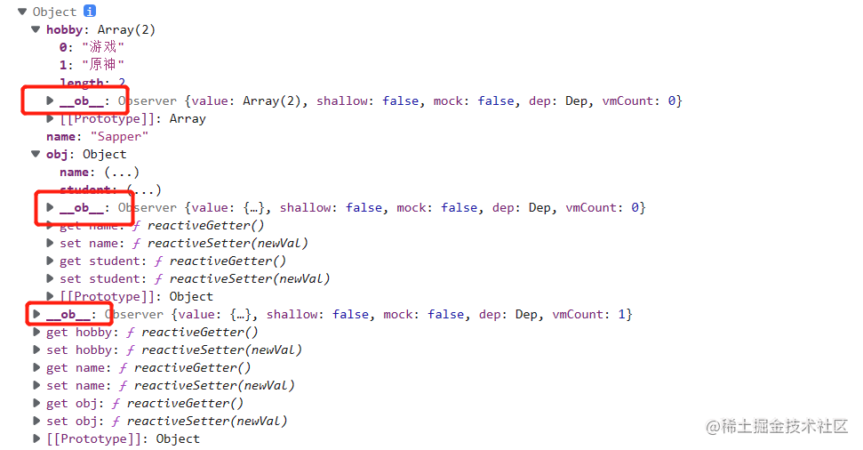

- [1 Vue2响应式原理](#1-vue2响应式原理)
  - [Vue2响应式原理小结：](#vue2响应式原理小结)
- [Vue3响应式原理](#vue3响应式原理)
  - [Vue3响应式原理小结：](#vue3响应式原理小结)
- [参考资料](#参考资料)

在讲解之前，我们先了解一下数据响应式是什么？所谓数据响应式就是建立`响应式数据`与`依赖`（调用了响应式数据的操作）之间的关系，当响应式数据发生变化时，可以通知那些使用了这些响应式数据的依赖操作进行相关更新操作，可以是DOM更新，也可以是执行一些回调函数。从Vue2到Vue3都使用了响应式，那么它们之间有什么区别？

 *  Vue2响应式：基于`Object.defineProperty()`实现的。
 *  Vue3响应式：基于`Proxy`实现的。

那么它们之间有什么区别？为什么Vue3会选择Proxy替代defineProperty？我们先看看下面两个例子：

```java
// 
defineReactive(data,key,val){
    Object.defineProperty(data,key,{
      enumerable:true,
      configurable:true,
      get:function(){
        console.log(`对象属性:${key}访问defineReactive的get！`)
        return val;
      },
      set:function(newVal){
        if(val===newVal){
          return;
        }
        val = newVal;
        console.log(`对象属性:${key}访问defineReactive的set！`)
      }
    })
}
```

```java
let obj = {};
this.defineReactive(obj,'name','sapper');
// 修改obj的name属性
obj.name = '工兵';
console.log('obj',obj.name);
// 为obj添加age属性
obj.age = 12;
console.log('obj',obj);
console.log('obj.age',obj.age);
// 为obj添加数组属性
obj.hobby = ['游戏', '原神'];
obj.hobby[0] = '王者';
console.log('obj.hobby',obj.hobby);

// 为obj添加对象属性
obj.student = {school:'大学'};
obj.student.school = '学院';
console.log('obj.student.school',obj.student.school);
```

 从上图可以看出使用defineProperty定义了包含name属性的对象obj，然后添加age属性、添加hobby属性（数组）、添加student属性并分别访问，都没有触发obj对象中的get、set方法。也就是说`defineProperty定义对象不能监听添加额外属性或修改额外添加的属性的变化`，我们再看看这样一个例子：

```java
let obj = {};
// 初始化就添加hobby
this.defineReactive(obj,'hobby',['游戏', '原神']);
// 改变数组下标0的值
obj.hobby[0] = '王者';
console.log('obj.hobby',obj.hobby);
```


假如我们一开始就为obj添加hobby属性，我们发现修改数组下标0的值，并没有触发obj里的set方法，也就是说`defineProperty定义对象不能监听根据自身数组下标修改数组元素的变化`，注意地，如果是直接用defineProperty定义数组元素是可以监听的，但是对于数组比较大的时候就很牺牲性能，尤神考虑到性能就没有使用这种方法。那么我们继续看一下Proxy代理的对象例子：

```java
// proxy实现
let targetProxy = {name:'sapper'};
let objProxy = new Proxy(targetProxy,{
    get(target,key){
      console.log(`对象属性:${key}访问Proxy的get！`)
      return target[key];
    },
    set(target,key,newVal){
      if(target[key]===newVal){
        return;
      }
      console.log(`对象属性:${key}访问Proxy的set！`)
      target[key]=newVal;
      return target[key];
    }
})
// 修改objProxy的name属性
objProxy.name = '工兵';
console.log('objProxy.name',objProxy.name);
// 为objProxy添加age属性
objProxy.age = 12;
console.log('objProxy.age',objProxy.age);
// 为objProxy添加hobby属性
objProxy.hobby = ['游戏', '原神'];
objProxy.hobby[0] = '王者';
console.log('objProxy.hobby',objProxy.hobby);
// 为objProxy添加对象属性
objProxy.student = {school:'大学'};
objProxy.student.school = '学院';
console.log('objProxy.student.school',objProxy.student.school);
```

 从上图是不是发现了Proxy与defineProperty的明显区别之处了，Proxy能支持对象添加或修改触发get、set方法，不管对象内部有什么属性。所以

 *  Object.defineProperty()：defineProperty定义对象不能监听添加额外属性或修改额外添加的属性的变化；defineProperty定义对象不能监听根据自身数组下标修改数组元素的变化。我们看看Vue里的用法例子：
    
    ```java
    data() {
       return {
         name: 'sapper',
         student: {
           name: 'sapper',
           hobby: ['原神', '天涯明月刀'],
         },
       };
     },
     methods: {
       deleteName() {
         delete this.student.name;
         console.log('删除了name', this.student);
       },
       addItem() {
         this.student.age = 21;
         console.log('添加了this.student的属性', this.student);
       },
       updateArr() {
         this.student.hobby[0] = '王者';
         console.log('更新了this.student的hobby', this.student);
       },
    }
    ```
    
     从图中确实可以修改data里的属性，但是不能及时渲染，所以Vue2提供了两个属性方法解决了这个问题：`Vue.$set`和`Vue.$delete`。
    
    > 注意不能直接this.\_ data.age这样去添加age属性，也是不支持的。
    
    ```java
    this.$delete(this.student, 'name');// 删除student对象属性name
    this.$set(this.student, 'age', '21');// 添加student对象属性age
    this.$set(this.student.hobby, 0, '王者');// 更新student对象属性hobby数组
    ```
    
    
 *  Proxy：解决了上面两个弊端，proxy可以实现：
 *  可以直接监听对象而非对象属性，可以监听对象添加额外属性的变化;
    
    ```java
    const user = {name:'张三'}
    const obj = new Proxy(user,{
      get:function (target,key){
        console.log("get run");
        return target[key];
      },
      set:function (target,key,val){
        console.log("set run");
        target[key]=val;
        return true;
      }
    })
    obj.age = 22;
    console.log(obj); // 监听对象添加额外属性打印set run!
    ```
 *  可以直接监听数组的变化。
    
    ```java
    const obj = new Proxy([2,1],{
      get:function (target,key){
        console.log("get run");
        return target[key];
      },
      set:function (target,key,val){
        console.log("set run");
        target[key]=val;
        return true;
      }
    })
    obj[0] = 3;
    console.log(obj); // 监听到了数组元素的变化打印set run!
    ```
 *  Proxy 返回的是一个新对象,而 Object.defineProperty 只能遍历对象属性直接修改。
 *  支持多达13 种拦截方法,不限于 apply、ownKeys、deleteProperty、has 等等是Object.defineProperty 不具备的。

总的来说，Vue3响应式使用Proxy解决了Vue2的响应式的诟病，从原理上说，它们所做的事情都是一样的，依赖收集和依赖更新。

## 1 Vue2响应式原理 

> 这里基于Vue2.6.14版本进行分析

Vue2响应式：通过Object.defineProperty()对每个属性进行监听，当对属性进行读取的时候就会触发getter，对属性修改的时候就会触发setter。首先我们都知道Vue实例中有data属性定义响应式数据，它是一个对象。我们看看下面例子的data：

```java
data(){
 return {
  name: 'Sapper',
  hobby: ['游戏', '原神'],
  obj: {
    name: '张三',
    student: {
      major: '软件工程',
      class: '1班',
    }
  }
 }
}
```

 从上图我们可以看到，data中的每一个属性都会带 `__ob__` 属性，它是一个Observer对象，其实Vue2中响应式的关键就是这个对象，在data中的每一个属性都会带get、set方法，而Vue源码中其实把get、set分别定义为reactiveGetter、reactiveSetter，这些东西怎么添加进去的。Vue2又是怎么数据变化同时实时渲染页面？先看看下面的图：

 ❓ 给data属性创建Observer实例：通过初注册响应式函数initState中调用了initData函数实现为data创建Observer实例。


```java
function initData(vm: Component) {
  // 获取组件中声明的data属性
  let data: any = vm.$options.data
  // 对new Vue实例下声明、组件中声明两种情况的处理
  data = vm._data = isFunction(data) ? getData(data, vm) : data || {}
  ...
  // observe data
  const ob = observe(data) // 为data属性创建Observer实例
  ob && ob.vmCount++
}
```

❓ 通过Observer实例把data中所有属性转换成getter/setter形式来实现响应性：对data属性分为两种情况处理：`对象属性处理`（defineReactive实现）和`数组属性处理`。数组怎么处理（后面再详细说明）

> 注意地，由于Vue实例的data永远都是一个对象，所以data里面包含的数组类型只有对象属性、数组属性。

 ❓ 在getter收集依赖，在setter中触发依赖：当读取data中的数据时，会在get方法中收集依赖，当修改data中的数据时，会在set方法中通知依赖更新。defineReactive方法中主要是做四件事情：`创建Dep实例`、`给对象属性添加get/set方法`、`收集依赖`、`通知依赖更新`。


从上面我们知道了dep.depend()实现了依赖收集，dep.notify()实现了通知依赖更新，那么Dep类究竟做了什么？我们先看看下面的图：

 从图中我们得明确一点，`谁使用了变化的数据`，也就是说哪个依赖使用了变化的数据，其实就是Dep.taget，它就是我们需要收集的依赖，是一个Watcher实例对象，其实Watcher对象有点类似watch监听器，我们先看一个例子：

```java
vm.$watch('a.b.c',function(newVal,oldVal)){....}
```

> 怎么监听多层嵌套的对象，其实就是通过.分割为对象，循环数组一层层去读数据，最后一后拿到的就是想要对的数据。

```java
export function parsePath (path){
 const segment = path.split('.');
 return function(obj){
 ...
   for(let i=0;i<segment.length;i++){
     if(!obj) return;
     obj = obj[segment[i]]
   }
   return obj
 }
}
```

当嵌套对象a.b.c属性发生变化时，就会触发第二个参数中的函数。也就是说a.b.c就是变化的数据，当它的值发生变化时，通知Watcher，接着Watcher触发第二个参数执行回调函数。我们看看Watcher类源码，是不是发现了cb其实就与watch的第二参数有异曲同工之妙。

```java
export default class Watcher implements DepTarget {
  vm?: Component | null
  cb: Function
  deps: Array<Dep>
  ...
  constructor(vm: Component | null,expOrFn: string | (() => any),cb: Function,...) {
    ...
    this.getter = parsePath(expOrFn)// 解析嵌套对象
    ...
  }
  get() { // 读取数据
    ...
    return value
  }

  addDep(dep: Dep) {
    ...
    dep.addSub(this)//添加依赖
    ...
  }
  cleanupDeps() {// 删除依赖
    ...
    dep.removeSub(this)
    ...
  }
  update() {// 通知依赖更新
   this.run()
   ...
  }

  run() {
   ...
   this.cb.call(this.vm, value, oldValue)
  }
  ...
  depend() { // 收集依赖
    let i = this.deps.length
    while (i--) {
      this.deps[i].depend()
    }
  }
  ...
}
```

❓ 实现对数组的监听：从最开始的例子，我们了解对象以及嵌套对象的监听，但是Object.defineProperty是用来监听对象指定属性的变化，不支持数组监听，那么数组又是怎么监听？我们上面说了data中的数据被赋予响应性都是在Observer中实现的，那么监听的实现也是在Observer对象中实现的，先对数组的特定方法做自定义处理，为了拦截数组元素通知依赖更新，然后才通过observeArray函数遍历创建Observer实例，主要分为两种情况：

```java
// 源码Observer类中对数组处理的部分代码
if (Array.isArray(value)) {
  if (hasProto) {
    protoAugment(value, arrayMethods)
  } else {
    copyAugment(value, arrayMethods, arrayKeys)
  }
  this.observeArray(value)
}
```

 *  当浏览器支持\_\_ proto \_\_ 对象：强制赋值当前arrayMethods给target的\_\_ proto \_\_ 对象，直接给当前target数组带上自定义封装的数组方法，从而实现监听数组变化。其实arrayMethods处理后就是下面这样一个对象：
    
    
    
    ```java
    protoAugment(value, arrayMethods)
    
    function protoAugment (target, src: Object) {
      target.__proto__ = src
    }
    ```
 *  当浏览器不支持\_\_ proto \_\_ 对象：遍历数组元素通过defineProperty定义为元素带上自定义封装的原生数组方法，由于自定义数组方法中做了拦截通知依赖更新，从而实现监听数组的变化。
    
    ```java
    const arrayKeys = Object.getOwnPropertyNames(arrayMethods)
    console.log(arrayKeys);// ['push', 'pop', 'shift', 'unshift', 'splice', 'sort', 'reverse']
    copyAugment(value, arrayMethods, arrayKeys)
    
    function copyAugment (target: Object, src: Object, keys: Array<string>) {
      for (let i = 0, l = keys.length; i < l; i++) {
        const key = keys[i]
        def(target, key, src[key])// 遍历数组元素通过为元素带上
      }
    }
    ```
    
    对数组的Array原生方法做了自定义封装的源码如下，在自定义方法中拦截通知依赖更新。 
    
    ```java
    // 遍历target实现创建Observer实例
    observeArray (items: Array<any>) {
     for (let i = 0, l = items.length; i < l; i++) {
      observe(items[i])
     }
    }
    ```

### Vue2响应式原理小结： 

 *  给data创建Observer实例。
 *  Observer类实现对数据封装getter、setter的响应性。
 *  针对数组类型数据，自定义封装Array原生方法，在封装过程中拦截执行通知依赖更新。
 *  真正通过Watcher通知依赖更新，通过run方法中的cb回调函数，实现类似watch侦听器第二参数中监听变化后的操作。

## Vue3响应式原理 

> 这里基于Vue3.2.41版本进行分析

其实Vue3的响应原理与Vue2的响应原理都差不多，唯一不同的就是它们的实现方式，Vue3通过创建Proxy的实例对象而实现的，它们都是收集依赖、通知依赖更新。而Vue3中把依赖命名为副作用函数effect，也就是数据改变发生的副作用，我们先来看一下例子：

```java
const house = {status:'未出租',price:1200,type:'一房一厅'};
const obj = new Proxy(house, {
  get (target, key) {
    return target[key];
  },
  set (target, key, newVal) {
    target[key] = newVal;
    return true;
  }
})
function effect () {
  console.log('房子状态：'+obj.status);
}

effect () // 触发了proxy对象的get方法
obj.status = '已出租！';
effect ()
```

通过Proxy创建一个代理对象，把house代理给obj，obj是代理对象，house是被代理对象。house对象中数据改变，由于effect函数读取了对象属性，所以当数据改变，也需要及时更新副作用函数effect。但是问题来了，假如对象中多个属性的，依赖于数据变化的多个副作用函数，数据变化一次都需要执行一次，代码写起来就会很冗余，所以我们需要这样处理：

```java
const objSet = new Set();
const obj = new Proxy(house, {
  // 拦截读取操作
  get (target, key) {
    objSet.add(effect) // 收集effect
    return target[key];
  },
  set (target, key, newVal) {
    target[key] = newVal;
    objSet.forEach(fn=>fn()) // 遍历effect
    return true;
  }
})
```

把副作用函数都存到Set实例中，Set可以过滤重复数据，然后在获取数据中收集副作用函数，在修改数据中遍历执行副作用函数，这样就简化了代码，不需要每次改变都要执行一次了，也就是修改一次数据及时更新effect。虽然上面已经实现了响应式的雏形了，但是还需要解决很多问题：

❓ 假如这个副作用函数是一个匿名函数，这时候需要怎么处理？ 添加一个全局变量临时存储。

```java
effect (()=>console.log('房子状态：'+obj.status)) // 上面的例子会直接报not define
```

```java
// 添加一个全局变量activeEffect存储依赖函数，这样effect就不会依赖函数的名字了
let activeEffect;
function effect (fn) {
 activeEffect = fn;
 // 执行副作用函数
 fn()
}
```

❓ 假如读取不存在的属性的时候，副作用函数发生什么？ 副作用函数会被重新执行，由于`目标字段与副作用函数没有建立明确的函数联系`。所以这就需要引入唯一key辨识每一个数据的副作用函数，以target（目标数据）、key（字段名）、effectFn（依赖）。看下图：

```java
setTimeout(() => {
  obj.notExit = '不存在的属性';
}, 1000)
```

分三种情况分析副作用函数存储数据唯一标识

 *  两个副作用函数同时读取同一个对象的属性值：


 *  一个副作用函数中读取了同一个对象不同属性：


 *  不同副作用函数中读取两个不同对象的相同属性：

 所以为了解决这些不同情况的副作用保存问题，所以Vue3引入了Weak、Map、Set三个集合方法来保存对象属性的相关副作用函数：


```java
const weakMap = new WeakMap();
let activeEffect;
const track = ((target,key)=>{
  if(!activeEffect){
      return;
    }
    // 从weakMap中获取当前target对象
    let depsMap = weakMap.get(target);
    if(!depsMap){
      weakMap.set(target,(depsMap=new Map()))
    }
    // 从Map中属性key获取当前对象指定属性
    let deps = depsMap.get(key)
    if(!deps){
      // 副作用函数存储
      depsMap.set(target,(deps=new Set()))
    }
    deps.add(activeEffect)  
})
const trigger = ((target,key)=>{
  // 从weakMap中获取当前target对象
  const depsMap = weakMap.get(target);
    if(!depsMap) return;
    // 从Map中获取指定key对象属性的副作用函数集合
    const effects = depsMap.get(key);
    effects&&effects.forEach(fn=>fn())
})
```

❓ WeakMap与Map的区别是？ 区别就是垃圾回收器是否回收的问题，WeakMap对象对key是弱引用，如果target对象没有任何引用，可以被垃圾回收器回收，这就需要它了。相对于WeakMap，不管target是否引用，Map都不会被垃圾回收，容易造成内存泄露。我们看一下下面例子：

```java
const map = new Map();
const weakMap = new WeakMap();
(function(){
  const foo = {foo:1};
  const bar = {bar:2};
  map.set(foo,1);
  weakMap.set(bar,2);
})() // 函数执行完，weakMap内的所有属性都被垃圾回收器回收了
setTimeout(() => {
 console.log(weakMap);// 刷新页面发现weakMap里面没有属性了
}, 2000)
```

❓ 假如在一个副作用函数中调用了对象的两个属性，但是有布尔值控制，按正常来说，副作用函数只能执行一次get获取值的，但是我们现有的实现方法还实现不了，我们看看下面例子。

```java
const effectFn = (() => {
  const str = obj.status ? '' : obj.type;
})
const obj = new Proxy(house, {
  get(target, key) {
    console.log('get run!');// 打印了两次
    ...
  },
  set(target, key, newVal) {
   ...
  }
})
```

通过这个例子，我们是不是需要解决这个问题，也就是当每次副作用函数执行时，我们可以先把它从所有与之关联的依赖集合中删除。我们看看源码例子：

```java
// 清空副作用函数依赖的集合
function cleanupEffect(effect: ReactiveEffect) {
  const { deps } = effect
  if (deps.length) {
    for (let i = 0; i < deps.length; i++) {
      deps[i].delete(effect)
    }
    deps.length = 0
  }
}
```

❓ 嵌套副作用函数处理：由于副作用函数可能是嵌套，比如副作用函数中effectFn1中有还有一个副作用函数effectFn2，以上面的方法对于嵌套函数的处理用全局变量 activeEffect 来存储通过 effect 函数注册的副作用函数，这意味着同一时刻 activeEffect 所存储的副作用函数只能有一个。当副作用函数发生嵌套时，内层副作用函数的执行会覆盖 activeEffect 的值，并且永远不会恢复到原来的值。看了很多资料举例用effect栈存储，是的没错，当执行副作用函数的时候把它入栈，执行完毕后把它出栈。现在我们一起看一下源码怎么处理的：

 *  按位跟踪标记递归深度方式（优化方案）：通过用二进制位标记当前嵌套深度的副作用函数是否记录过，如果记录过就，如果已经超过最大深度，因为采用降级方案，是全部删除然后重新收集副作用函数的。
    
    ```java
    let effectTrackDepth = 0 // 当前副作用函数递归深度
    export let trackOpBit = 1 // 在track函数中执行当前的嵌套副作用函数的标志位
    const maxMarkerBits = 30 // 最大递归深度支持30位，
    ```
    
    > 为什么需要设置30位，因为31位会溢出。
    
    ```java
    // 每次执行 effect 副作用函数前，全局变量嵌套深度会自增1
    trackOpBit = 1 << ++effectTrackDepth
    
    // 执行完副作用函数后会自减
    trackOpBit = 1 << --effectTrackDepth;
    ```
    
    > 为什么是左移一位，是因为第一位也就是说当前深度只是1，所以保持不变，不用管，从第二位开始。
    
    ```java
    if (effectTrackDepth <= maxMarkerBits) {
        // 执行副作用函数之前，使用 `deps[i].w |= trackOpBit`对依赖dep[i]进行标记，追踪依赖
        initDepMarkers(this)
      } else {
        // 降级方案：完全清理
        cleanupEffect(this)
      }
    ```
    
    如何判断当前依赖是否已记录过，通过按位与判断是否有位已经标识，有就大于0：
    
    ```java
    //代表副作用函数执行前被 track 过
    export const wasTracked = (dep: Dep): boolean => (dep.w & trackOpBit) > 0
    //代表副作用函数执行后被 track 过
    export const newTracked = (dep: Dep): boolean => (dep.n & trackOpBit) > 0
    ```
    
    清理依赖：
    
    ```java
    export const finalizeDepMarkers = (effect: ReactiveEffect) => {
      const { deps } = effect
      if (deps.length) {
        let ptr = 0
        for (let i = 0; i < deps.length; i++) {
          const dep = deps[i]
          // 有 was 标记但是没有 new 标记，应当删除
          if (wasTracked(dep) && !newTracked(dep)) {
            dep.delete(effect)
          } else {
            // 需要保留的依赖
            deps[ptr++] = dep
          }
          // 清空，把当前位值0，先按位非，再按位与
          dep.w &= ~trackOpBit
          dep.n &= ~trackOpBit
        }
        // 保留依赖的长度
        deps.length = ptr
      }
    }
    ```
 *  完全清理方式（降级方案）：逐个清理掉当前依赖集合deps中每个依赖。
    
    ```java
    function cleanupEffect(effect: ReactiveEffect) {
      const { deps } = effect
      if (deps.length) {
        for (let i = 0; i < deps.length; i++) {
          deps[i].delete(effect)
        }
        deps.length = 0
      }
    }
    ```

❓ 响应式可调度性scheduler：trigger 动作触发副作用函数重新执行时，有能力决定副作用函数执行的时机、次数以及方式。

Vue3响应式的6个细节我们都了解了，我们可以对副作用工作流做一个全面总结如图：

 Vue3响应式的关键在于两个函数：`track`（收集依赖）和`trigger`（触发依赖）。

```java
// target: 响应式代理对象, type: 订阅类型(get、hase、iterate), key: 要获取的target的键值
export function track(target: object, type: TrackOpTypes, key: unknown) {
// 如果允许追踪, 并且当前有正在运行的副作用
  if (shouldTrack && activeEffect) {
  // 获取当前target订阅的副作用集合, 如果不存在, 则新建一个
    let depsMap = targetMap.get(target)
    if (!depsMap) {
      // 获取对应属性key订阅的副作用, 如果不存在, 则新建一个
      targetMap.set(target, (depsMap = new Map()))
    }
    let dep = depsMap.get(key)
    if (!dep) {
      depsMap.set(key, (dep = createDep()))
    }
    ...
    // 处理订阅副作用
    trackEffects(dep, eventInfo)
  }
}

export function trackEffects(dep: Dep,debuggerEventExtraInfo?: DebuggerEventExtraInfo) {
  let shouldTrack = false
  if (effectTrackDepth <= maxMarkerBits) { // 如果当前追踪深度不超过最大深度(30), 则添加订阅
    if (!newTracked(dep)) { // 如果未订阅过, 则新建
      dep.n |= trackOpBit // 据当前的追踪标识位设置依赖的new值
      shouldTrack = !wasTracked(dep) // 开启订阅追踪
    }
  } else {
    shouldTrack = !dep.has(activeEffect!)
  }

  if (shouldTrack) {
    dep.add(activeEffect!) // 将当前正在运行副作用作为新订阅者添加到该依赖中
    activeEffect!.deps.push(dep) // 缓存依赖到当前正在运行的副作用依赖数组
    ...
  }
}
```

```java
// 根据不同的type从depsMap取出，放入effects，随后通过run方法将当前的`effect`执行
export function trigger(target: object,type: TriggerOpTypes,key?: unknown,newValue?: unknown,oldValue?: unknown,oldTarget?: Map<unknown, unknown> | Set<unknown>) {
  const depsMap = targetMap.get(target) // 获取响应式对象的副作用Map, 如果不存在说明未被追踪, 则不需要处理
  if (!depsMap) {
    return
  }
  let deps: (Dep | undefined)[] = []
  // 如果是清除操作，那就要执行依赖原始数据的所有监听方法。因为所有项都被清除了。
  if (type === TriggerOpTypes.CLEAR) { // clear
    // 如果是调用了集合的clear方法, 则要对其所有的副作用进行处理
    deps = [...depsMap.values()]
  } else if (key === 'length' && isArray(target)) {
    const newLength = Number(newValue)
    depsMap.forEach((dep, key) => {
      if (key === 'length' || key >= newLength) {
        deps.push(dep)
      }
    })
  } else { // set add delete
    // key不为void 0，则说明肯定是SET | ADD | DELETE这三种操作 
    // 然后将依赖这个key的所有监听函数推到相应队列中
    if (key !== void 0) {
      deps.push(depsMap.get(key))
    }
    switch (type) { // 根据不同type取出并存入deps
      case TriggerOpTypes.ADD:
         // 如果原始数据是数组，则key为length，否则为迭代行为标识符
        if (!isArray(target)) {
          deps.push(depsMap.get(ITERATE_KEY))
          if (isMap(target)) {
            deps.push(depsMap.get(MAP_KEY_ITERATE_KEY))
          }
        } else if (isIntegerKey(key)) {
          deps.push(depsMap.get('length'))
        }
        break
      case TriggerOpTypes.DELETE:
       // 如果原始数据是数组，则key为length，否则为迭代行为标识符
        if (!isArray(target)) {
          deps.push(depsMap.get(ITERATE_KEY))
          if (isMap(target)) {
            deps.push(depsMap.get(MAP_KEY_ITERATE_KEY))
          }
        }
        break
      case TriggerOpTypes.SET:
        if (isMap(target)) {
          deps.push(depsMap.get(ITERATE_KEY))
        }
        break
    }
  }
  ...
    const effects: ReactiveEffect[] = []
    for (const dep of deps) {
      if (dep) {
        effects.push(...dep)
      }
    }
    // 遍历effects元素执行run函数
    triggerEffects(createDep(effects))
  }
}
```

### Vue3响应式原理小结： 

> Vue3中的副作用函数其实就是Vue2的依赖

 *  activeEffect解决匿名函数问题。
 *  WeakMap、Map、Set存储对象属性的相关副作用函数。
 *  处理副作用函数时，假如有多个响应式属性，控制只触发生效的属性或用到的属性。
 *  嵌套副作用函数，使用二进制位记录嵌套副作用，通过控制二进制位是否清理嵌套副作用实现层级追踪。
 *  track()实现依赖收集、层级依赖追踪、依赖清理（解决嵌套副作用）。
 *  trigger()当某个依赖值发生变化时触发的, 根据依赖值的变化类型, 会收集与依赖相关的不同副作用处理对象, 然后逐个触发他们的 run 函数, 通过执行副作用函数获得与依赖变化后对应的最新值

## 参考资料 

 *  《深入浅出Vue.js》 -- 刘博文 著
 *  《Vue.js设计与实现》 -- 霍春阳 著
 *  [\#从 Proxy 到 Vue3 响应式][Proxy _ Vue3]
 *  [\# vue3响应式系统源码解析-Effect篇][vue3_-Effect]
 *  [\# Vue3 源码阅读（6）：响应式系统 —— ref][Vue3 _6_ _ ref]
 *  [\# vue3.0 响应式原理(超详细)][vue3.0]
 *  [\# 带你深入Vue3响应式系统][_Vue3]
 *  [\# 图解 Vue 响应式原理][_ Vue]
 *  [\# Vue 源码解读（3）—— 响应式原理][Vue _3_]


[Proxy _ Vue3]: https://link.juejin.cn?target=https%3A%2F%2Fcloud.tencent.com%2Fdeveloper%2Farticle%2F2183938%3Ffrom%3D10680
[vue3_-Effect]: https://juejin.cn/post/6844903977599893517
[Vue3 _6_ _ ref]: https://link.juejin.cn?target=https%3A%2F%2Fblog.csdn.net%2Ff18855666661%2Farticle%2Fdetails%2F126331284
[vue3.0]: https://juejin.cn/post/6858899262596448270
[_Vue3]: https://link.juejin.cn?target=https%3A%2F%2Fcloud.tencent.com%2Fdeveloper%2Farticle%2F2188661
[_ Vue]: https://juejin.cn/post/6857669921166491662
[Vue _3_]: https://juejin.cn/post/6950826293923414047