- [我希望你能掌握的前置知识](#我希望你能掌握的前置知识)
- [流程梳理](#流程梳理)
- [创建目录](#创建目录)
- [初始化参数阶段](#初始化参数阶段)
  - [`Cli`命令行传递参数](#cli命令行传递参数)
  - [`webpack.config.js`传递参数](#webpackconfigjs传递参数)
  - [实现合并参数阶段](#实现合并参数阶段)
- [编译阶段](#编译阶段)
  - [创建`compiler`对象](#创建compiler对象)
  - [编写`Plugin`](#编写plugin)
  - [寻找`entry`入口](#寻找entry入口)
- [模块编译阶段](#模块编译阶段)
  - [根据入口文件路径分析入口文件](#根据入口文件路径分析入口文件)
  - [`buildModule`模块编译方法](#buildmodule模块编译方法)
    - [读取文件内容](#读取文件内容)
    - [调用`loader`处理匹配后缀文件](#调用loader处理匹配后缀文件)
      - [实现简单自定义loader](#实现简单自定义loader)
      - [使用loader处理文件](#使用loader处理文件)
    - [`webpack`模块编译阶段](#webpack模块编译阶段)
      - [tryExtensions方法实现](#tryextensions方法实现)
    - [递归处理](#递归处理)
- [编译完成阶段](#编译完成阶段)
- [输出文件阶段](#输出文件阶段)
  - [分析原始打包输出结果](#分析原始打包输出结果)
  - [输出文件阶段](#输出文件阶段-1)
  - [`getSourceCode`方法](#getsourcecode方法)
- [大功告成](#大功告成)
- [写在最后](#写在最后)


写在前边  


`Webpack`在前端前端构建工具中可以堪称中流砥柱般的存在，日常业务开发、前端基建工具、高级前端面试...任何场景都会出现它的身影。

也许对于它的内部实现机制你也许会感到疑惑，日常工作中基于`Webpack Plugin/Loader`之类查阅`API`仍然不明白各个参数的含义和应用方式。

其实这一切原因本质上都是基于`Webpack`工作流没有一个清晰的认知导致了所谓的“面对`API`无从下手”开发。

文章中我们会从如何实现模块分析项目打包的角度出发，使用最通俗，最简洁，最明了的代码带你揭开`Webpack`背后的神秘面纱，带你实现一个简易版`Webpack`，从此对于任何`webpack`相关底层开发了然于胸。

这里我们只讲「干货」，用最通俗易懂的代码带你走进`webpack`的工作流。

# 我希望你能掌握的前置知识 

 *  Tapable \[2\]

Tapable\[3\]包本质上是为我们更方面创建自定义事件和触发自定义事件的库，类似于`Nodejs`中的`EventEmitter Api`。

`Webpack`中的插件机制就是基于Tapable实现与打包流程解耦，插件的所有形式都是基于`Tapable`实现。

 *  Webpack Node Api \[4\]

基于学习目的我们会着重于`Webpack Node Api`流程去讲解，实际上我们在前端日常使用的`npm run build`命令也是通过环境变量调用`bin`脚本去调用`Node Api`去执行编译打包。

 *  Babel \[5\]

`Webpack`内部的`AST`分析同样依赖于`Babel`进行处理，如果你对`Babel`不是很熟悉。我建议你可以先去阅读下这两篇文章「前端基建」带你在Babel的世界中畅游\[6\]、\\\# 从Tree Shaking来走进Babel插件开发者的世界\[7\]。

> 当然后续我也会去详解这些内容在`Webpack`中的应用，但是我更加希望在阅读文章之前你可以去点一点上方的文档稍微了解一下前置知识。

# 流程梳理 

在开始之前我们先对于整个打包流程进行一次梳理。

这里仅仅是一个全流程的梳理，现在你没有必要非常详细的去思考每一个步骤发生了什么，我们会在接下来的步骤中去一步一步带你串联它们。

 image.png

整体我们将会从上边5个方面来分析`Webpack`打包流程:

1.  初始化参数阶段。
    
    这一步会从我们配置的`webpack.config.js`中读取到对应的配置参数和`shell`命令中传入的参数进行合并得到最终打包配置参数。
2.  开始编译准备阶段
    
    这一步我们会通过调用`webpack()`方法返回一个`compiler`方法，创建我们的`compiler`对象，并且注册各个`Webpack Plugin`。找到配置入口中的`entry`代码，调用`compiler.run()`方法进行编译。
3.  模块编译阶段
    
    从入口模块进行分析，调用匹配文件的`loaders`对文件进行处理。同时分析模块依赖的模块，递归进行模块编译工作。
4.  完成编译阶段
    
    在递归完成后，每个引用模块通过`loaders`处理完成同时得到模块之间的相互依赖关系。
5.  输出文件阶段
    
    整理模块依赖关系，同时将处理后的文件输出到`ouput`的磁盘目录中。

接下来让我们详细的去探索每一步究竟发生了什么。

# 创建目录 

工欲善其事，必先利其器。首先让我们创建一个良好的目录来管理我们需要实现的`Packing tool`吧！

让我们来创建这样一个目录:

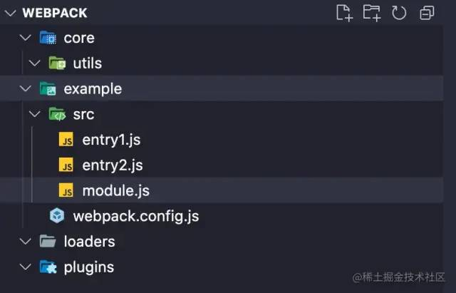 image.png

 *  `webpack/core`存放我们自己将要实现的 `webpack`核心代码。
 *  `webpack/example`存放我们将用来打包的实例项目。
 *  `webpack/example/webpak.config.js`配置文件.
    
    `webpack/example/src/entry1`第一个入口文件
    
    `webpack/example/src/entry1`第二个入口文件
    
    `webpack/example/src/index.js`模块文件
 *  `webpack/loaders`存放我们的自定义 `loader`。
 *  `webpack/plugins`存放我们的自定义 `plugin`。

# 初始化参数阶段 

往往，我们在日常使用阶段有两种方式去给`webpack`传递打包参数，让我们先来看看如何传递参数:

## `Cli`命令行传递参数 

通常，我们在使用调用`webpack`命令时，有时会传入一定命令行参数，比如:

```java
webpack --mode=production
# 调用webpack命令执行打包 同时传入mode为production
复制代码
```

## `webpack.config.js`传递参数 

另一种方式，我相信就更加老生常谈了。

我们在项目根目录下使用`webpack.config.js`导出一个对象进行`webpack`配置:

```java
const path = require('path')

// 引入loader和plugin ...
module.exports = {
  mode: 'development',
  entry: {
    main: path.resolve(__dirname, './src/entry1.js'),
    second: path.resolve(__dirname, './src/entry2.js'),
  },
  devtool: false,
  // 基础目录，绝对路径，用于从配置中解析入口点(entry point)和 加载器(loader)。
  // 换而言之entry和loader的所有相对路径都是相对于这个路径而言的
  context: process.cwd(),
  output: {
    path: path.resolve(__dirname, './build'),
    filename: '[name].js',
  },
  plugins: [new PluginA(), new PluginB()],
  resolve: {
    extensions: ['.js', '.ts'],
  },
  module: {
    rules: [
      {
        test: /\.js/,
        use: [
          // 使用自己loader有三种方式 这里仅仅是一种
          path.resolve(__dirname, '../loaders/loader-1.js'),
          path.resolve(__dirname, '../loaders/loader-2.js'),
        ],
      },
    ],
  },
};
复制代码
```

同时这份配置文件也是我们需要作为实例项目`example`下的实例配置，接下来让我们修改`example/webpack.config.js`中的内容为上述配置吧。

> 当然这里的`loader`和`plugin`目前你可以不用理解，接下来我们会逐步实现这些东西并且添加到我们的打包流程中去。

## 实现合并参数阶段 

这一步，让我们真正开始动手实现我们的`webpack`吧！

首先让我们在`webpack/core`下新建一个`index.js`文件作为核心入口文件。

同时建立一个`webpack/core`下新建一个`webpack.js`文件作为`webpack()`方法的实现文件。

首先，我们清楚在`NodeJs Api`中是通过`webpack()`方法去得到`compiler`对象的。

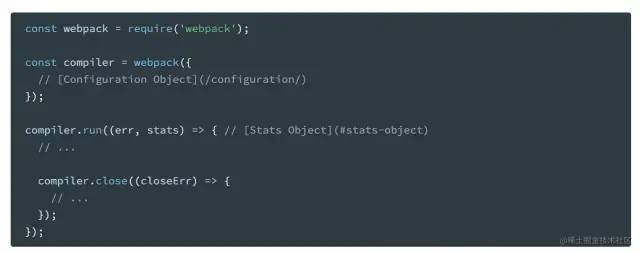 image.png

此时让我们按照原本的`webpack`接口格式来补充一下`index.js`中的逻辑:

 *  我们需要一个 `webpack`方法去执行调用命令。
 *  同时我们引入 `webpack.config.js`配置文件传入 `webpack`方法。

```java
// index.js
const webpack = require('./webpack');
const config = require('../example/webpack.config');
// 步骤1: 初始化参数 根据配置文件和shell参数合成参数
const compiler = webpack(config);
复制代码
```

嗯，看起来还不错。接下来让我们去实现一下`webpack.js`:

```java
function webpack(options) {
  // 合并参数 得到合并后的参数 mergeOptions
  const mergeOptions = _mergeOptions(options);
}

// 合并参数
function _mergeOptions(options) {
  const shellOptions = process.argv.slice(2).reduce((option, argv) => {
    // argv -> --mode=production
    const [key, value] = argv.split('=');
    if (key && value) {
      const parseKey = key.slice(2);
      option[parseKey] = value;
    }
    return option;
  }, {});
  return { ...options, ...shellOptions };
}

module.export = webpack;
复制代码
```

这里我们需要额外说明的是

`webpack`文件中需要导出一个名为`webpack`的方法，同时接受外部传入的配置对象。这个是我们在上述讲述过的。

当然关于我们合并参数的逻辑，是将外部传入的对象和执行`shell`时的传入参数进行最终合并。

在`Node Js`中我们可以通过`process.argv.slice(2)`来获得`shell`命令中传入的参数，比如:

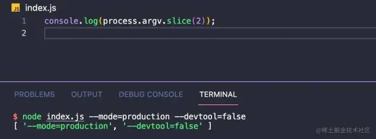 image.png

当然`_mergeOptions`方法就是一个简单的合并配置参数的方法，相信对于大家来说就是小菜一碟。

恭喜大家🎉，千里之行始于足下。这一步我们已经完成了打包流程中的第一步：合并配置参数。

# 编译阶段 

在得到最终的配置参数之后，我们需要在`webpack()`函数中做以下几件事情:

 *  通过参数创建`compiler`对象。我们看到官方案例中通过调用`webpack(options)`方法返回的是一个`compiler`对象。并且同时调用`compiler.run()`方法启动的代码进行打包。
 *  注册我们定义的`webpack plugin`插件。
 *  根据传入的配置对象寻找对应的打包入口文件。

## 创建`compiler`对象 

让我们先来完成`index.js`中的逻辑代码补全:

```java
// index.js
const webpack = require('./webpack');
const config = require('../example/webpack.config');
// 步骤1: 初始化参数 根据配置文件和shell参数合成参数
// 步骤2: 调用Webpack(options) 初始化compiler对象  
// webpack()方法会返回一个compiler对象

const compiler = webpack(config);

// 调用run方法进行打包
compiler.run((err, stats) => {
  if (err) {
    console.log(err, 'err');
  }
  // ...
});
复制代码
```

可以看到，核心编译实现在于`webpack()`方法返回的`compiler.run()`方法上。

一步一步让我们来完善这个`webpack()`方法：

```java
// webpack.js
function webpack(options) {
  // 合并参数 得到合并后的参数 mergeOptions
  const mergeOptions = _mergeOptions(options);
  // 创建compiler对象
  const compiler = new Compiler(mergeOptions)
  
  return compiler
}

// ...
复制代码
```

让我们在`webpack/core`目录下同样新建一个`compiler.js`文件，作为`compiler`的核心实现文件:

```java
// compiler.js
// Compiler类进行核心编译实现
class Compiler {
  constructor(options) {
    this.options = options;
  }

  // run方法å¯åŠ¨ç¼–译 
  // 同时run方法接受外部传递的callback
  run(callback) {
  }
}

module.exports = Compiler
复制代码
```

此时我们的`Compiler`类就先搭建一个基础的骨架代码。

目前，我们拥有了:

 *  `webpack/core/index.js`作为打包命令的入口文件，这个文件引用了我们自己实现的`webpack`同时引用了外部的`webpack.config.js(options)`。调用`webpack(options).run()`开始编译。
 *  `webpack/core/webpack.js`这个文件目前处理了参数的合并以及传入合并后的参数`new Compiler(mergeOptions)`，同时返回创建的`Compiler`实力对象。
 *  `webpack/core/compiler`，此时我们的`compiler`仅仅是作为一个基础的骨架，存在一个`run()`启动方法。

## 编写`Plugin` 

还记得我们在`webpack.config.js`中使用了两个`plugin`\---`pluginA`、`pluginB`插件吗。接下来让我们来依次实现它们:

在实现`Plugin`前，我们需要先来完善一下`compiler`方法:

```java
const { SyncHook } = require('tapable');

class Compiler {
  constructor(options) {
    this.options = options;
    // 创建plugin hooks
    this.hooks = {
      // 开始编译时的钩子
      run: new SyncHook(),
      // 输出 asset 到 output 目录之前执行 (写入文件之前)
      emit: new SyncHook(),
      // 在 compilation 完成时执行 全部完成编译执行
      done: new SyncHook(),
    };
  }

  // run方法å¯åŠ¨ç¼–译
  // 同时run方法接受外部传递的callback
  run(callback) {}
}

module.exports = Compiler;
复制代码
```

这里，我们在`Compiler`这个类的构造函数中创建了一个属性`hooks`，它的值是三个属性`run`、`emit`、`done`。

关于这三个属性的值就是我们上文提到前置知识的`tapable`的`SyncHook`方法，本质上你可以简单将`SyncHook()`方法理解称为一个`Emitter Event`类。

当我们通过`new SyncHook()`返回一个对象实例后，我们可以通过`this.hook.run.tap('name',callback)`方法为这个对象上添加事件监听，然后在通过`this.hook.run.call()`执行所有`tap`注册的事件。

> 当然`webpack`真实源码中，这里有非常多的`hook`。以及分别存在同步/异步钩子，我们这里更多的是为大家讲解清楚流程，所以仅列举了三个常见且简单的同步钩子。

此时，我们需要明白，我们可以通过`Compiler`类返回的实例对象上`compiler.hooks.run.tap`注册钩子。

接下来让我们切回到`webpack.js`中，让我们来填充关于插件注册的逻辑:

```java
const Compiler = require('./compiler');

function webpack(options) {
  // 合并参数
  const mergeOptions = _mergeOptions(options);
  // 创建compiler对象
  const compiler = new Compiler(mergeOptions);
  // 加载插件
  _loadPlugin(options.plugins, compiler);
  return compiler;
}

// 合并参数
function _mergeOptions(options) {
  const shellOptions = process.argv.slice(2).reduce((option, argv) => {
    // argv -> --mode=production
    const [key, value] = argv.split('=');
    if (key && value) {
      const parseKey = key.slice(2);
      option[parseKey] = value;
    }
    return option;
  }, {});
  return { ...options, ...shellOptions };
}

// 加载插件函数
function _loadPlugin(plugins, compiler) {
  if (plugins && Array.isArray(plugins)) {
    plugins.forEach((plugin) => {
      plugin.apply(compiler);
    });
  }
}

module.exports = webpack;
复制代码
```

这里我们在创建完成`compiler`对象后，调用了`_loadPlugin`方法进行注册插件。

有接触过`webpack`插件开发的同学，或多或少可能都有了解过。任何一个`webpack`插件都是一个类(当然类本质上都是funciton的语法糖)，每个插件都必须存在一个`apply`方法。

这个`apply`方法会接受一个`compiler`对象。我们上边做的就是依次调用传入的`plugin`的`apply`方法并且传入我们的`compiler`对象。

> 这里我请你记住上边的流程，日常我们编写`webpack plugin`时本质上就是操作`compiler`对象从而影响打包结果进行。

> 也许此时你并不是很理解这句话的含义，在我们串联完成整个流程之后我会为大家揭晓这个答案。

接下来让我们去编写这些个插件:

不了解插件开发的同学可以去稍微看一下官方的介绍\[8\]，其实不是很难,我个人强烈建议如果不了解可以先去看看再回来结合上变讲的内容你一定会有所收获的。

首先让我们先创建文件:

 image.png

```java
// plugin-a.js
// 插件A
class PluginA {
  apply(compiler) {
    // 注册同步钩子
    // 这里的compiler对象就是我们new Compiler()创建的实例哦
    compiler.hooks.run.tap('Plugin A', () => {
      // 调用
      console.log('PluginA');
    });
  }
}

module.exports = PluginA;
复制代码
```

```java
// plugin-b.js
class PluginB {
  apply(compiler) {
    compiler.hooks.done.tap('Plugin B', () => {
      console.log('PluginB');
    });
  }
}

module.exports = PluginB;
复制代码
```

看到这里我相信大部分同学都已经反应过来了，`compiler.hooks.done.tap`不就是我们上边讲到的通过`tapable`创建一个`SyncHook`实例然后通过`tap`方法注册事件吗？

没错！的确是这样，关于`webpack`插件本质上就是通过发布订阅的模式，通过`compiler`上监听事件。然后再打包编译过程中触发监听的事件从而添加一定的逻辑影响打包结果。

我们在每个插件的`apply`方法上通过`tap`在编译准备阶段(也就是调用`webpack()`函数时)进行订阅对应的事件，当我们的编译执行到一定阶段时发布对应的事件告诉订阅者去执行监听的事件，从而达到在编译阶段的不同生命周期内去触发对应的`plugin`。

> 所以这里你应该清楚，我们在进行`webpack`插件开发时，`compiler`对象上存放着本次打包的所有相关属性，比如`options`打包的配置，以及我们会在之后讲到的各种属性。

## 寻找`entry`入口 

这之后，我们的绝大多数内容都会放在`compiler.js`中去实现`Compiler`这个类实现打包的核心流程。

任何一次打包都需要入口文件，接下来让我们就从真正进入打包编译阶段。首当其冲的事情就是，我们需要根据入口配置文件路径寻找到对应入口文件。

```java
// compiler.js
const { SyncHook } = require('tapable');
const { toUnixPath } = require('./utils');

class Compiler {
  constructor(options) {
    this.options = options;
    // 相对路径跟路径 Context参数
    this.rootPath = this.options.context || toUnixPath(process.cwd());
    // 创建plugin hooks
    this.hooks = {
      // 开始编译时的钩子
      run: new SyncHook(),
      // 输出 asset 到 output 目录之前执行 (写入文件之前)
      emit: new SyncHook(),
      // 在 compilation 完成时执行 全部完成编译执行
      done: new SyncHook(),
    };
  }

  // run方法å¯åŠ¨ç¼–译
  // 同时run方法接受外部传递的callback
  run(callback) {
    // 当调用run方式时 触发开始编译的plugin
    this.hooks.run.call();
    // 获取入口配置对象
    const entry = this.getEntry();
  }

  // 获取入口文件路径
  getEntry() {
    let entry = Object.create(null);
    const { entry: optionsEntry } = this.options;
    if (typeof entry === 'string') {
      entry['main'] = optionsEntry;
    } else {
      entry = optionsEntry;
    }
    // 将entry变成绝对路径
    Object.keys(entry).forEach((key) => {
      const value = entry[key];
      if (!path.isAbsolute(value)) {
        // 转化为绝对路径的同时统一路径分隔符为 /
        entry[key] = toUnixPath(path.join(this.rootPath, value));
      }
    });
    return entry;
  }
}

module.exports = Compiler;
复制代码
```

```java
// utils/index.js
/**
 *
 * 统一路径分隔符 主要是为了后续生成模块ID方便
 * @param {*} path
 * @returns
 */
function toUnixPath(path) {
  return path.replace(/\\/g, '/');
}
复制代码
```

这一步我们通过`options.entry`处理获得入口文件的绝对路径。

这里有几个需要注意的小点:

 *  `this.hooks.run.call()`

在我们`_loadePlugins`函数中对于每一个传入的插件在`compiler`实例对象中进行了订阅，那么当我们调用`run`方法时，等于真正开始执行编译。这个阶段相当于我们需要告诉订阅者，发布开始执行的订阅。此时我们通过`this.hooks.run.call()`执行关于`run`的所有`tap`监听方法，从而触发对应的`plugin`逻辑。

 *  `this.rootPath`:

在上述的外部`webpack.config.js`中我们配置了一个 `context: process.cwd()`，其实真实`webpack`中这个`context`值默认也是`process.cwd()`。

关于它的详细解释你可以在这里看到Context\[9\]。

简而言之，这个路径就是我们项目启动的目录路径，任何`entry`和`loader`中的相对路径都是针对于`context`这个参数的相对路径。

这里我们使用`this.rootPath`在构造函数中来保存这个变量。

 *  `toUnixPath`工具方法:

因为不同操作系统下，文件分隔路径是不同的。这里我们统一使用`\`来替换路径中的`//`来替换模块路径。后续我们会使用模块相对于`rootPath`的路径作为每一个文件的唯一ID，所以这里统一处理下路径分隔符。

 *  `entry`的处理方法:

关于`entry`配置，`webpack`中其实有很多种。我们这里考虑了比较常见的两种配置方式:

```java
entry:'entry1.js'

// 本质上这段代码在webpack中会被转化为
entry: {
    main:'entry1.js
}
复制代码
```

```java
entry: {
   'entry1':'./entry1.js',
   'entry2':'/user/wepback/example/src/entry2.js'
}
复制代码
```

这两种方式任何方式都会经过`getEntry`方法最终转化称为`{ [模块名]:[模块绝对路径]... }`的形式，关于`geEntry()`方法其实非常简单，这里我就不过于累赘这个方法的实现过程了。

这一步，我们就通过`getEntry`方法获得了一个`key`为`entryName`,`value`为`entryAbsolutePath`的对象了，接来下就让我们从入口文件出发进行编译流程吧。

# 模块编译阶段 

上边我们讲述了关于编译阶段的准备工作:

 *  目录/文件基础逻辑补充。
 *  通过 `hooks.tap`注册 `webpack`插件。
 *  `getEntry`方法获得各个入口的对象。

接下来让我们继续完善`compiler.js`。

在模块编译阶段，我们需要做的事件:

 *  根据入口文件路径分析入口文件，对于入口文件进行匹配对应的 `loader`进行处理入口文件。
 *  将 `loader`处理完成的入口文件使用 `webpack`进行编译。
 *  分析入口文件依赖，重复上边两个步骤编译对应依赖。
 *  如果嵌套文件存在依赖文件，递归调用依赖模块进行编译。
 *  递归编译完成后，组装一个个包含多个模块的 `chunk`

首先，我们先来给`compiler.js`的构造函数中补充一下对应的逻辑:

```java
class Compiler {
  constructor(options) {
    this.options = options;
    // 创建plugin hooks
    this.hooks = {
      // 开始编译时的钩子
      run: new SyncHook(),
      // 输出 asset 到 output 目录之前执行 (写入文件之前)
      emit: new SyncHook(),
      // 在 compilation 完成时执行 全部完成编译执行
      done: new SyncHook(),
    };
    // 保存所有入口模块对象
    this.entries = new Set();
    // 保存所有依赖模块对象
    this.modules = new Set();
    // 所有的代码块对象
    this.chunks = new Set();
    // 存放本次产出的文件对象
    this.assets = new Set();
    // 存放本次编译所有产出的文件名
    this.files = new Set();
  }
  // ...
 }
复制代码
```

这里我们通过给`compiler`构造函数中添加一些列属性来保存关于编译阶段生成的对应资源/模块对象。

> 关于`entries\modules\chunks\assets\files`这几个`Set`对象是贯穿我们核心打包流程的属性，它们各自用来储存编译阶段不同的资源从而最终通过对应的属性进行生成编译后的文件。

## 根据入口文件路径分析入口文件 

上边说到我们在`run`方法中已经可以通过`this.getEntry();`获得对应的入口对象了～

接下来就让我们从入口文件开始去分析入口文件吧！

```java
class Compiler {
    // run方法å¯åŠ¨ç¼–译
  // 同时run方法接受外部传递的callback
  run(callback) {
    // 当调用run方式时 触发开始编译的plugin
    this.hooks.run.call();
    // 获取入口配置对象
    const entry = this.getEntry();
    // 编译入口文件
    this.buildEntryModule(entry);
  }

  buildEntryModule(entry) {
    Object.keys(entry).forEach((entryName) => {
      const entryPath = entry[entryName];
      const entryObj = this.buildModule(entryName, entryPath);
      this.entries.add(entryObj);
    });
  }
  
  
  // 模å—编译方法
  buildModule(moduleName,modulePath) {
    // ...
    return {}
  }
}
复制代码
```

这里我们添加了一个名为`buildEntryModule`方法作为入口模块编译方法。循环入口对象，得到每一个入口对象的名称和路径。

> 比如如假使我们在开头传入`entry:{ main:'./src/main.js' }`的话，`buildEntryModule`获得的形参`entry`为`{ main: "/src...[你的绝对路径]" }`, 此时我们`buildModule`方法接受的entryName为`main`,`entryPath`为入口文件`main`对应的的绝对路径。

> 单个入口编译完成后，我们会在`buildModule`方法中返回一个对象。这个对象就是我们编译入口文件后的对象。

## `buildModule`模块编译方法 

在进行代码编写之前，我们先来梳理一下`buildModule`方法它需要做哪些事情:

 *  `buildModule`接受两个参数进行模块编译，第一个为模块所属的入口文件名称，第二个为需要编译的模块路径。
 *  `buildModule`方法要进行代码编译的前提就是，通过`fs`模块根据入口文件路径读取文件源代码。
 *  读取文件内容之后，调用所有匹配的loader对模块进行处理得到返回后的结果。
 *  得到`loader`处理后的结果后，通过`babel`分析`loader`处理后的代码，进行代码编译。(这一步编译主要是针对`require`语句，修改源代码中`require`语句的路径)。
 *  如果该入口文件没有依赖与任何模块(`require`语句)，那么返回编译后的模块对象。
 *  如果该入口文件存在依赖的模块，递归`buildModule`方法进行模块编译。

### 读取文件内容 

1.  ```java
    我们先调用`fs`模块读取文件内容。
    ```

```java
const fs = require('fs');
// ...
class Compiler {
      //...
      // 模å—编译方法
      buildModule(moduleName, modulePath) {
        // 1. 读取文件原始代码
        const originSourceCode =
          ((this.originSourceCode = fs.readFileSync(modulePath, 'utf-8'));
        // moduleCode为修改后的代码
        this.moduleCode = originSourceCode;
      }
      
      // ...
 }
复制代码
```

### 调用`loader`处理匹配后缀文件 

1.  接下来我们获得了文件的具体内容之后，就需要匹配对应 `loader`对我们的源代码进行编译了。

#### 实现简单自定义loader 

在进行`loader`编译前，我们先来实现一下我们上方传入的自定义`loader`吧。

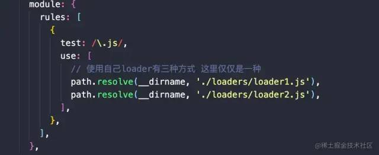 image.png

`webpack/loader`目录下新建`loader-1.js`,`loader-2.js`:

首先我们需要清楚简单来说`loader`本质上就是一个函数，接受我们的源代码作为入参同时返回处理后的结果。

> 关于`loader`的特性，更加详细你可以在这里看到\[10\]，因为文章主要讲述打包流程所以`loader`我们简单的作为倒序处理。更加具体的`loader/plugin`开发我会在后续的文章详细补充。

```java
// loader本质上就是一个函数，接受原始内容，返回转换后的内容。
function loader1(sourceCode) {
  console.log('join loader1');
  return sourceCode + `\n const loader1 = 'https://github.com/19Qingfeng'`;
}

module.exports = loader1;
复制代码
```

```java
function loader2(sourceCode) {
  console.log('join loader2');
  return sourceCode + `\n const loader2 = '19Qingfeng'`;
}

module.exports = loader2;
复制代码
```

#### 使用loader处理文件 

在搞清楚了`loader`就是一个单纯的函数之后，让我们在进行模块分析之前将内容先交给匹配的loader去处理下吧。

```java
// 模å—编译方法
  buildModule(moduleName, modulePath) {
    // 1. 读取文件原始代码
    const originSourceCode =
      ((this.originSourceCode = fs.readFileSync(modulePath)), 'utf-8');
    // moduleCode为修改后的代码
    this.moduleCode = originSourceCode;
    //  2. 调用loader进行处理
    this.handleLoader(modulePath);
  }

  // 匹配loader处理
  handleLoader(modulePath) {
    const matchLoaders = [];
    // 1. 获取所有传入的loader规则
    const rules = this.options.module.rules;
    rules.forEach((loader) => {
      const testRule = loader.test;
      if (testRule.test(modulePath)) {
        if (loader.loader) {
          // 仅考虑loader { test:/\.js$/g, use:['babel-loader'] }, { test:/\.js$/, loader:'babel-loader' }
          matchLoaders.push(loader.loader);
        } else {
          matchLoaders.push(...loader.use);
        }
      }
      // 2. 倒序执行loader传入源代码
      for (let i = matchLoaders.length - 1; i >= 0; i--) {
        // 目前我们外部仅支持传入绝对路径的loader模式
        // require引入对应loader
        const loaderFn = require(matchLoaders[i]);
        // 通过loader同步处理我的每一次编译的moduleCode
        this.moduleCode = loaderFn(this.moduleCode);
      }
    });
  }
复制代码
```

这里我们通过`handleLoader`函数，对于传入的文件路径匹配到对应后缀的`loader`后，依次倒序执行loader处理我们的代码`this.moduleCode`并且同步更新每次`moduleCode`。

最终，在每一个模块编译中`this.moduleCode`都会经过对应的`loader`处理。

### `webpack`模块编译阶段 

上一步我们经历过`loader`处理了我们的入口文件代码，并且得到了处理后的代码保存在了`this.moduleCode`中。

此时，经过`loader`处理后我们就要进入`webpack`内部的编译阶段了。

这里我们需要做的是:针对当前模块进行编译，将当前模块所有依赖的模块(`require()`)语句引入的路径变为相对于跟路径(`this.rootPath`)的相对路径。

> 总之你需要搞明白的是，我们这里编译的结果是期望将源代码中的依赖模块路径变为相对跟路径的路径，同时建立基础的模块依赖关系。后续我会告诉你为什么针对路径进行编译。

让我们继续来完善`buildModule`方法吧:

```java
const parser = require('@babel/parser');
const traverse = require('@babel/traverse').default;
const generator = require('@babel/generator').default;
const t = require('@babel/types');
const tryExtensions = require('./utils/index')
// ...
  class Compiler {
     // ...
      
     // 模å—编译方法
      buildModule(moduleName, modulePath) {
        // 1. 读取文件原始代码
        const originSourceCode =
          ((this.originSourceCode = fs.readFileSync(modulePath)), 'utf-8');
        // moduleCode为修改后的代码
        this.moduleCode = originSourceCode;
        //  2. 调用loader进行处理
        this.handleLoader(modulePath);
        // 3. 调用webpack 进行模块编译 获得最终的module对象
        const module = this.handleWebpackCompiler(moduleName, modulePath);
        // 4. 返回对应module
        return module
      }

      // 调用webpack进行模块编译
      handleWebpackCompiler(moduleName, modulePath) {
        // 将当前模块相对于项目启动根目录计算出相对路径 作为模块ID
        const moduleId = './' + path.posix.relative(this.rootPath, modulePath);
        // 创建模块对象
        const module = {
          id: moduleId,
          dependencies: new Set(), // 该模块所依赖模块绝对路径地址
          name: [moduleName], // 该模块所属的入口文件
        };
        // 调用babel分析我们的代码
        const ast = parser.parse(this.moduleCode, {
          sourceType: 'module',
        });
        // 深度优先 遍历语法Tree
        traverse(ast, {
          // 当遇到require语句时
          CallExpression:(nodePath) => {
            const node = nodePath.node;
            if (node.callee.name === 'require') {
              // 获得源代码中引入模块相对路径
              const moduleName = node.arguments[0].value;
              // 寻找模块绝对路径 当前模块路径+require()对应相对路径
              const moduleDirName = path.posix.dirname(modulePath);
              const absolutePath = tryExtensions(
                path.posix.join(moduleDirName, moduleName),
                this.options.resolve.extensions,
                moduleName,
                moduleDirName
              );
              // 生æˆmoduleId - 针对于跟路径的模块ID 添加进入新的依赖模块路径
              const moduleId =
                './' + path.posix.relative(this.rootPath, absolutePath);
              // 通过babel修改源代码中的require变成__webpack_require__语句
              node.callee = t.identifier('__webpack_require__');
              // 修改源代码中require语句引入的模块 全部修改变为相对于跟路径来处理
              node.arguments = [t.stringLiteral(moduleId)];
              // 为当前模块添加require语句造成的依赖(内容为相对于根路径的模块ID)
              module.dependencies.add(moduleId);
            }
          },
        });
        // 遍历结束根据AST生成新的代码
        const { code } = generator(ast);
        // 为当前模块挂载新的生成的代码
        module._source = code;
        // 返回当前模块对象
        return module
      }
  }
复制代码
```

这一步我们关于`webpack`编译的阶段就完成了。

需要注意的是:

 *  这里我们使用`babel`相关的`API`针对于`require`语句进行了编译，如果对于`babel`相关的`api`不太了解的朋友可以在前置知识中查看我的另两篇文章。这里我就不在累赘了
 *  同时我们代码中引用了一个`tryExtensions()`工具方法，这个方法是针对于后缀名不全的工具方法，稍后你就可以看到这个方法的具体内容。
 *  针对于每一次文件编译，我们都会返回一个module对象，这个对象是重中之重。
 *  `id`属性，表示当前模块针对于 `this.rootPath`的相对目录。
    
    `dependencies`属性，它是一个 `Set`内部保存了该模块依赖的所有模块的模块ID。
    
    `name`属性,它表示该模块属于哪个入口文件。
    
    `_source`属性，它存放模块自身经过 `babel`编译后的字符串代码。

#### tryExtensions方法实现 

我们在上文的`webpack.config.js`有这么一个配置：

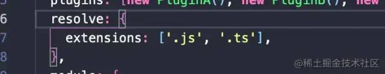 image.png

熟悉`webpack`配置的同学可能清楚，resolve.extensions是针对于引入依赖时，在没有书写文件后缀的情况下，`webpack`会自动帮我们按照传入的规则为文件添加后缀。

在清楚了原理后我们来一起看看`utils/tryExtensions`方法的实现:

```java
/**
 *
 *
 * @param {*} modulePath 模块绝对路径
 * @param {*} extensions 扩展名数组
 * @param {*} originModulePath 原始引入模块路径
 * @param {*} moduleContext 模块上下文(当前模块所在目录)
 */
function tryExtensions(
  modulePath,
  extensions,
  originModulePath,
  moduleContext
) {
  // 优先尝试不需要扩展名选项
  extensions.unshift('');
  for (let extension of extensions) {
    if (fs.existsSync(modulePath + extension)) {
      return modulePath + extension;
    }
  }
  // 未匹配对应文件
  throw new Error(
    `No module, Error: Can't resolve ${originModulePath} in  ${moduleContext}`
  );
}
复制代码
```

这个方法很简单，我们通过`fs.existsSync`检查传入文件结合`extensions`依次遍历寻找对应匹配的路径是否存在，如果找到则直接返回。如果未找到则给予用于一个友好的提示错误。

> 需要注意 `extensions.unshift('');`是防止用户如果已经传入了后缀时，我们优先尝试直接寻找，如果可以找到文件那么就直接返回。找不到的情况下才会依次尝试。

### 递归处理 

经过上一步处理，针对入口文件我们调用`buildModule`可以得到这样的返回对象。

我们先来看看运行`webpack/core/index.js`得到的返回结果吧。

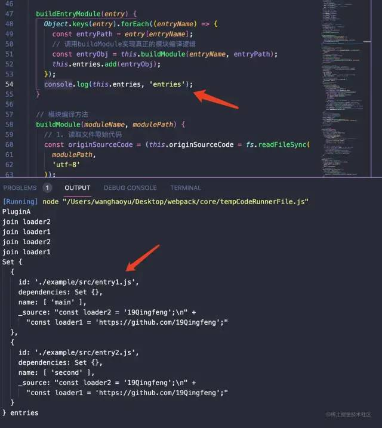 image.png

我在`buildEntryModule`中打印了处理完成后的`entries`对象。可以看到正如我们之前所期待的:

 *  `id`为每个模块相对于跟路径的模块.(这里我们配置的 `context:process.cwd()`)为 `webpack`目录。
 *  `dependencies`为该模块内部依赖的模块，这里目前还没有添加。
 *  `name`为该模块所属的入口文件名称。
 *  `_source`为该模块编译后的源代码。

> 目前`_source`中的内容是基于

此时让我们打开`src`目录为我们的两个入口文件添加一些依赖和内容吧:

```java
// webpack/example/entry1.js
const depModule = require('./module');

console.log(depModule, 'dep');
console.log('This is entry 1 !');


// webpack/example/entry2.js
const depModule = require('./module');

console.log(depModule, 'dep');
console.log('This is entry 2 !');

// webpack/example/module.js
const name = '19Qingfeng';

module.exports = {
  name,
};
复制代码
```

此时让我们重新运行`webpack/core/index.js`:

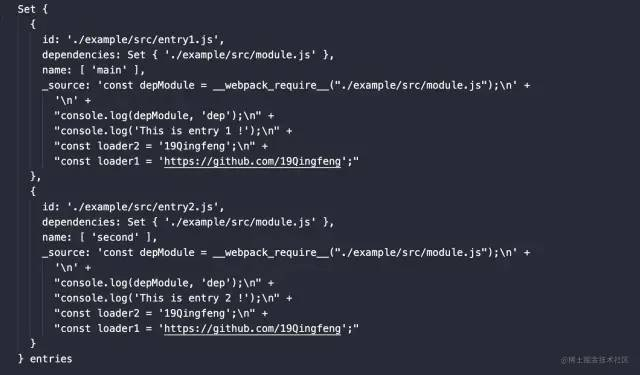 image.png

OK，目前为止我们针对于`entry`的编译可以暂时告一段落了。

总之也就是，这一步我们通过\`\`方法将`entry`进行分析编译后得到一个对象。将这个对象添加到`this.entries`中去。

接下来让我们去处理依赖的模块吧。

其实对于依赖的模块无非也是相同的步骤：

 *  检查入口文件中是否存在依赖。
 *  存在依赖的话，递归调用 `buildModule`方法编译模块。传入 `moduleName`为当前模块所属的入口文件。 `modulePath`为当前被依赖模块的绝对路径。
 *  同理检查递归检查被依赖的模块内部是否仍然存在依赖，存在的话递归依赖进行模块编译。这是一个 深度优先的过程。
 *  将每一个编译后的模块保存进入 `this.modules`中去。

接下来我们只要稍稍在`handleWebpackCompiler`方法中稍稍改动就可以了:

```java
 // 调用webpack进行模块编译
  handleWebpackCompiler(moduleName, modulePath) {
    // 将当前模块相对于项目启动根目录计算出相对路径 作为模块ID
    const moduleId = './' + path.posix.relative(this.rootPath, modulePath);
    // 创建模块对象
    const module = {
      id: moduleId,
      dependencies: new Set(), // 该模块所依赖模块绝对路径地址
      name: [moduleName], // 该模块所属的入口文件
    };
    // 调用babel分析我们的代码
    const ast = parser.parse(this.moduleCode, {
      sourceType: 'module',
    });
    // 深度优先 遍历语法Tree
    traverse(ast, {
      // 当遇到require语句时
      CallExpression: (nodePath) => {
        const node = nodePath.node;
        if (node.callee.name === 'require') {
          // 获得源代码中引入模块相对路径
          const moduleName = node.arguments[0].value;
          // 寻找模块绝对路径 当前模块路径+require()对应相对路径
          const moduleDirName = path.posix.dirname(modulePath);
          const absolutePath = tryExtensions(
            path.posix.join(moduleDirName, moduleName),
            this.options.resolve.extensions,
            moduleName,
            moduleDirName
          );
          // 生æˆmoduleId - 针对于跟路径的模块ID 添加进入新的依赖模块路径
          const moduleId =
            './' + path.posix.relative(this.rootPath, absolutePath);
          // 通过babel修改源代码中的require变成__webpack_require__语句
          node.callee = t.identifier('__webpack_require__');
          // 修改源代码中require语句引入的模块 全部修改变为相对于跟路径来处理
          node.arguments = [t.stringLiteral(moduleId)];
          // 为当前模块添加require语句造成的依赖(内容为相对于根路径的模块ID)
          module.dependencies.add(moduleId);
        }
      },
    });
    // 遍历结束根据AST生成新的代码
    const { code } = generator(ast);
    // 为当前模块挂载新的生成的代码
    module._source = code;
    // 递归依赖深度遍历 存在依赖模块则加入
    module.dependencies.forEach((dependency) => {
      const depModule = this.buildModule(moduleName, dependency);
      // 将编译后的任何依赖模块对象加入到modules对象中去
      this.modules.add(depModule);
    });
    // 返回当前模块对象
    return module;
  }
复制代码
```

这里我们添加了这样一段代码:

```java
    // 递归依赖深度遍历 存在依赖模块则加入
    module.dependencies.forEach((dependency) => {
      const depModule = this.buildModule(moduleName, dependency);
      // 将编译后的任何依赖模块对象加入到modules对象中去
      this.modules.add(depModule);
    });
复制代码
```

这里我们对于依赖的模块进行了递归调用`buildModule`,将输出的模块对象添加进入了`this.modules`中去。

此时让我们重新运行`webpack/core/index.js`进行编译，这里我在`buildEntryModule`编译结束后打印了`assets`和`modules`:

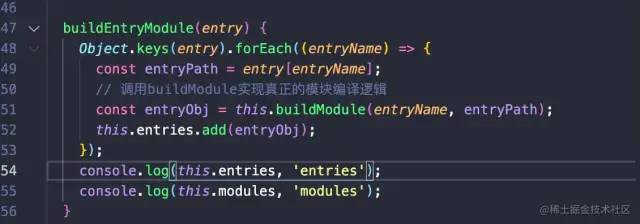 image.png

```java
Set {
  {
    id: './example/src/entry1.js',
    dependencies: Set { './example/src/module.js' },
    name: [ 'main' ],
    _source: 'const depModule = __webpack_require__("./example/src/module.js");\n' +
      '\n' +
      "console.log(depModule, 'dep');\n" +
      "console.log('This is entry 1 !');\n" +
      "const loader2 = '19Qingfeng';\n" +
      "const loader1 = 'https://github.com/19Qingfeng';"
  },
  {
    id: './example/src/entry2.js',
    dependencies: Set { './example/src/module.js' },
    name: [ 'second' ],
    _source: 'const depModule = __webpack_require__("./example/src/module.js");\n' +
      '\n' +
      "console.log(depModule, 'dep');\n" +
      "console.log('This is entry 2 !');\n" +
      "const loader2 = '19Qingfeng';\n" +
      "const loader1 = 'https://github.com/19Qingfeng';"
  }
} entries
Set {
  {
    id: './example/src/module.js',
    dependencies: Set {},
    name: [ 'main' ],
    _source: "const name = '19Qingfeng';\n" +
      'module.exports = {\n' +
      '  name\n' +
      '};\n' +
      "const loader2 = '19Qingfeng';\n" +
      "const loader1 = 'https://github.com/19Qingfeng';"
  },
  {
    id: './example/src/module.js',
    dependencies: Set {},
    name: [ 'second' ],
    _source: "const name = '19Qingfeng';\n" +
      'module.exports = {\n' +
      '  name\n' +
      '};\n' +
      "const loader2 = '19Qingfeng';\n" +
      "const loader1 = 'https://github.com/19Qingfeng';"
  }
} modules
复制代码
```

可以看到我们已经将`module.js`这个依赖如愿以偿加入到`modules`中了，同时它也经过`loader`的处理。但是我们发现它被重复加入了两次。

这是因为module.js这个模块被引用了两次，它被`entry1`和`entry2`都已进行了依赖，在进行递归编译时我们进行了两次`buildModule`相同模块。

让我们来处理下这个问题:

```java
    handleWebpackCompiler(moduleName, modulePath) {
       ...
        // 通过babel修改源代码中的require变成__webpack_require__语句
          node.callee = t.identifier('__webpack_require__');
          // 修改源代码中require语句引入的模块 全部修改变为相对于跟路径来处理
          node.arguments = [t.stringLiteral(moduleId)];
          // 转化为ids的数组 好处理
          const alreadyModules = Array.from(this.modules).map((i) => i.id);
          if (!alreadyModules.includes(moduleId)) {
            // 为当前模块添加require语句造成的依赖(内容为相对于根路径的模块ID)
            module.dependencies.add(moduleId);
          } else {
            // 已经存在的话 虽然不进行添加进入模块编译 但是仍要更新这个模块依赖的入口
            this.modules.forEach((value) => {
              if (value.id === moduleId) {
                value.name.push(moduleName);
              }
            });
          }
        }
      },
    });
    ...
    }
复制代码
```

这里在每一次代码分析的依赖转化中，首先判断`this.module`对象是否已经存在当前模块了（通过唯一的模块id路径判断）。

如果不存在则添加进入依赖中进行编译，如果该模块已经存在过了就证明这个模块已经被编译过了。所以此时我们不需要将它再次进行编译，我们仅仅需要更新这个模块所属的chunk，为它的`name`属性添加当前所属的`chunk`名称。

重新运行，让我们在来看看打印结果:

```java
Set {
  {
    id: './example/src/entry1.js',
    dependencies: Set { './example/src/module.js' },
    name: [ 'main' ],
    _source: 'const depModule = __webpack_require__("./example/src/module.js");\n' +
      '\n' +
      "console.log(depModule, 'dep');\n" +
      "console.log('This is entry 1 !');\n" +
      "const loader2 = '19Qingfeng';\n" +
      "const loader1 = 'https://github.com/19Qingfeng';"
  },
  {
    id: './example/src/entry2.js',
    dependencies: Set {},
    name: [ 'second' ],
    _source: 'const depModule = __webpack_require__("./example/src/module.js");\n' +
      '\n' +
      "console.log(depModule, 'dep');\n" +
      "console.log('This is entry 2 !');\n" +
      "const loader2 = '19Qingfeng';\n" +
      "const loader1 = 'https://github.com/19Qingfeng';"
  }
} entries
Set {
  {
    id: './example/src/module.js',
    dependencies: Set {},
    name: [ 'main', './module' ],
    _source: "const name = '19Qingfeng';\n" +
      'module.exports = {\n' +
      '  name\n' +
      '};\n' +
      "const loader2 = '19Qingfeng';\n" +
      "const loader1 = 'https://github.com/19Qingfeng';"
  }
} modules
复制代码
```

此时针对我们的“模块编译阶段”基本已经结束了，这一步我们对于所有模块从入口文件开始进行分析。

 *  从入口出发，读取入口文件内容调用匹配 `loader`处理入口文件。
 *  通过 `babel`分析依赖，并且同时将所有依赖的路径更换为相对于项目启动目录 `options.context`的路径。
 *  入口文件中如果存在依赖的话，递归上述步骤编译依赖模块。
 *  将每个依赖的模块编译后的对象加入 `this.modules`。
 *  将每个入口文件编译后的对象加入 `this.entries`。

# 编译完成阶段 

在上一步我们完成了模块之间的编译，并且为`module`和`entry`分别填充了内容。

在将所有模块递归编译完成后，我们需要根据上述的依赖关系，组合最终输出的`chunk`模块。

让我们来继续改造我们的`Compiler`吧:

```java
class Compiler {

    // ...
    buildEntryModule(entry) {
        Object.keys(entry).forEach((entryName) => {
          const entryPath = entry[entryName];
          // 调用buildModule实现真正的模块编译逻辑
          const entryObj = this.buildModule(entryName, entryPath);
          this.entries.add(entryObj);
          // 根据当前入口文件和模块的相互依赖关系，组装成为一个个包含当前入口所有依赖模块的chunk
          this.buildUpChunk(entryName, entryObj);
        });
        console.log(this.chunks, 'chunks');
    }
    
     // 根据入口文件和依赖模块组装chunks
      buildUpChunk(entryName, entryObj) {
        const chunk = {
          name: entryName, // 每一个入口文件作为一个chunk
          entryModule: entryObj, // entry编译后的对象
          modules: Array.from(this.modules).filter((i) =>
            i.name.includes(entryName)
          ), // 寻找与当前entry有关的所有module
        };
        // 将chunk添加到this.chunks中去
        this.chunks.add(chunk);
      }
      
      // ...
}
复制代码
```

这里，我们根据对应的入口文件通过每一个模块(`module`)的`name`属性查找对应入口的所有依赖文件。

我们先来看看`this.chunks`最终会输出什么:

```java
Set {
  {
    name: 'main',
    entryModule: {
      id: './example/src/entry1.js',
      dependencies: [Set],
      name: [Array],
      _source: 'const depModule = __webpack_require__("./example/src/module.js");\n' +
        '\n' +
        "console.log(depModule, 'dep');\n" +
        "console.log('This is entry 1 !');\n" +
        "const loader2 = '19Qingfeng';\n" +
        "const loader1 = 'https://github.com/19Qingfeng';"
    },
    modules: [ [Object] ]
  },
  {
    name: 'second',
    entryModule: {
      id: './example/src/entry2.js',
      dependencies: Set {},
      name: [Array],
      _source: 'const depModule = __webpack_require__("./example/src/module.js");\n' +
        '\n' +
        "console.log(depModule, 'dep');\n" +
        "console.log('This is entry 2 !');\n" +
        "const loader2 = '19Qingfeng';\n" +
        "const loader1 = 'https://github.com/19Qingfeng';"
    },
    modules: []
  }
} 
复制代码
```

这一步，我们得到了`Webpack`中最终输出的两个`chunk`。

它们分别拥有:

 *  `name`:当前入口文件的名称
 *  `entryModule`: 入口文件编译后的对象。
 *  `modules`: 该入口文件依赖的所有模块对象组成的数组，其中每一个元素的格式和 `entryModule`是一致的。

此时编译完成我们拼装`chunk`的环节就圆满完成。

# 输出文件阶段 

我们先放一下上一步所有编译完成后拼装出来的`this.chunks`。

## 分析原始打包输出结果 

这里，我把`webpack/core/index.js`中做了如下修改:

```java
- const webpack = require('./webpack');
+ const webpack = require('webpack')

...
复制代码
```

运用原本的`webpack`代替我们自己实现的`webpack`先进行一次打包。

运行`webpack/core/index.js`后，我们会在`webpack/src/build`中得到两个文件:`main.js`和`second.js`,我们以其中一个`main.js`来看看它的内容:

```java
(() => {
  var __webpack_modules__ = {
    './example/src/module.js': (module) => {
      const name = '19Qingfeng';

      module.exports = {
        name,
      };

      const loader2 = '19Qingfeng';
      const loader1 = 'https://github.com/19Qingfeng';
    },
  };
  // The module cache
  var __webpack_module_cache__ = {};

  // The require function
  function __webpack_require__(moduleId) {
    // Check if module is in cache
    var cachedModule = __webpack_module_cache__[moduleId];
    if (cachedModule !== undefined) {
      return cachedModule.exports;
    }
    // Create a new module (and put it into the cache)
    var module = (__webpack_module_cache__[moduleId] = {
      // no module.id needed
      // no module.loaded needed
      exports: {},
    });

    // Execute the module function
    __webpack_modules__[moduleId](module, module.exports, __webpack_require__);

    // Return the exports of the module
    return module.exports;
  }

  var __webpack_exports__ = {};
  // This entry need to be wrapped in an IIFE because it need to be isolated against other modules in the chunk.
  (() => {
    const depModule = __webpack_require__(
      /*! ./module */ './example/src/module.js'
    );

    console.log(depModule, 'dep');
    console.log('This is entry 1 !');

    const loader2 = '19Qingfeng';
    const loader1 = 'https://github.com/19Qingfeng';
  })();
})();

复制代码
```

> 这里我手动删除了打包生成后的多余注释，精简了代码。

我们来稍微分析一下原始打包生成的代码：

`webpack`打包后的代码内部定义了一个`__webpack_require__`的函数代替了`NodeJs`内部的`require`方法。

同时底部的

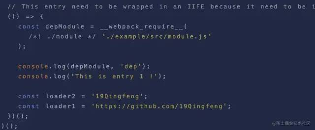 image.png

这块代码相比大家都很熟悉吧，这就是我们编译后的入口文件代码。同时顶部的代码是该入口文件依赖的所有模块定义的一个对象:

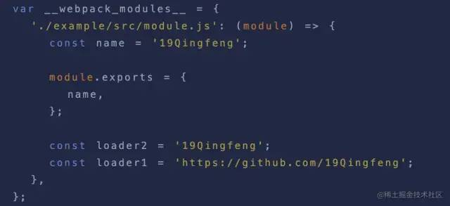 image.png

这里定义了一个`__webpack__modules`的对象，\*\*对象的`key`为该依赖模块相对于跟路径的相对路径，对象的`value`该依赖模块编译后的代码。\`

## 输出文件阶段 

接下里在分析完`webpack`原始打包后的代码之后，上我们来继续上一步。通过我们的`this.chunks`来尝试输出最终的效果吧。

让我们回到`Compiler`上的`run`方法中:

```java
   class Compiler {
   
   }
  // run方法å¯åŠ¨ç¼–译
  // 同时run方法接受外部传递的callback
  run(callback) {
    // 当调用run方式时 触发开始编译的plugin
    this.hooks.run.call();
    // 获取入口配置对象
    const entry = this.getEntry();
    // 编译入口文件
    this.buildEntryModule(entry);
    // 导出列表;之后将每个chunk转化称为单独的文件加入到输出列表assets中
    this.exportFile(callback);
  }
复制代码
```

我们在`buildEntryModule`模块编译完成之后，通过`this.exportFile`方法实现导出文件的逻辑。

让我们来一起看看`this.exportFile`方法:

```java
 // 将chunk加入输出列表中去
  exportFile(callback) {
    const output = this.options.output;
    // 根据chunks生成assets内容
    this.chunks.forEach((chunk) => {
      const parseFileName = output.filename.replace('[name]', chunk.name);
      // assets中 { 'main.js': '生成的字符串代码...' }
      this.assets.set(parseFileName, getSourceCode(chunk));
    });
    // 调用Plugin emit钩子
    this.hooks.emit.call();
    // 先判断目录是否存在 存在直接fs.write 不存在则首先创建
    if (!fs.existsSync(output.path)) {
      fs.mkdirSync(output.path);
    }
    // files中保存所有的生成文件名
    this.files = Object.keys(this.assets);
    // 将assets中的内容生成打包文件 写入文件系统中
    Object.keys(this.assets).forEach((fileName) => {
      const filePath = path.join(output.path, fileName);
      fs.writeFileSync(filePath, this.assets[fileName]);
    });
    // 结束之后触发钩子
    this.hooks.done.call();
    callback(null, {
      toJson: () => {
        return {
          entries: this.entries,
          modules: this.modules,
          files: this.files,
          chunks: this.chunks,
          assets: this.assets,
        };
      },
    });
  }
复制代码
```

`exportFile`做了如下几件事:

 *  首先获取配置参数的输出配置，迭代我们的`this.chunks`，将`output.filename`中的`[name]`替换称为对应的入口文件名称。同时根据`chunks`的内容为`this.assets`中添加需要打包生成的文件名和文件内容。
 *  将文件写入磁盘前调用`plugin`的`emit`钩子函数。
 *  判断`output.path`文件夹是否存在，如果不存在，则通过`fs`新建这个文件夹。
 *  将本次打包生成的所有文件名(`this.assets`的`key`值组成的数组)存放进入`files`中去。
 *  循环`this.assets`，将文件依次写入对应的磁盘中去。
 *  所有打包流程结束，触发`webpack`插件的`done`钩子。
 *  同时为`NodeJs Webpack APi`呼应，调用`run`方法中外部传入的`callback`传入两个参数。

总的来说，`this.assets`做的事情也比较简单，就是通过分析`chunks`得到`assets`然后输出对应的代码到磁盘中。

仔细看过上边代码，你会发现。`this.assets`这个`Map`中每一个元素的`value`是通过调用`getSourceCode(chunk)`方法来生成模块对应的代码的。

那么`getSourceCode`这个方法是如何根据`chunk`来生成我们最终编译后的代码呢？让我们一起来看看吧！

## `getSourceCode`方法 

首先我们来简单明确一下这个方法的职责，我们需要`getSourceCode`方法接受传入的`chunk`对象。从而返回该`chunk`的源代码。

废话不多说，其实这里我用了一个比较偷懒的办法，但是完全不妨碍你理解`Webpack`流程，上边我们分析过原本`webpack`打包后的代码仅仅只有入口文件和模块依赖是每次打包不同的地方，关于`require`方法之类都是相通的。

把握每次的不同点，我们直接先来看看它的实现方式:

```java
// webpack/utils/index.js

...


/**
 *
 *
 * @param {*} chunk
 * name属性入口文件名称
 * entryModule入口文件module对象
 * modules 依赖模块路径
 */
function getSourceCode(chunk) {
  const { name, entryModule, modules } = chunk;
  return `
  (() => {
    var __webpack_modules__ = {
      ${modules
        .map((module) => {
          return `
          '${module.id}': (module) => {
            ${module._source}
      }
        `;
        })
        .join(',')}
    };
    // The module cache
    var __webpack_module_cache__ = {};

    // The require function
    function __webpack_require__(moduleId) {
      // Check if module is in cache
      var cachedModule = __webpack_module_cache__[moduleId];
      if (cachedModule !== undefined) {
        return cachedModule.exports;
      }
      // Create a new module (and put it into the cache)
      var module = (__webpack_module_cache__[moduleId] = {
        // no module.id needed
        // no module.loaded needed
        exports: {},
      });

      // Execute the module function
      __webpack_modules__[moduleId](module, module.exports, __webpack_require__);

      // Return the exports of the module
      return module.exports;
    }

    var __webpack_exports__ = {};
    // This entry need to be wrapped in an IIFE because it need to be isolated against other modules in the chunk.
    (() => {
      ${entryModule._source}
    })();
  })();
  `;
}
...
复制代码
```

这段代码其实非常非常简单，远远没有你想象的多难！有点返璞归真的感觉是吗哈哈。

在`getSourceCode`方法中，我们通过组合而来的`chunk`获得对应的:

 *  `name`: 该入口文件对应输出文件的名称。
 *  `entryModule`: 存放该入口文件编译后的对象。
 *  `modules`:存放该入口文件依赖的所有模块的对象。

我们通过字符串拼接的方式去实现了`__webpack__modules`对象上的属性，同时也在底部通过`${entryModule._source}`拼接出入口文件的代码。

> 这里我们上文提到过为什么要将模块的`require`方法的路径转化为相对于跟路径(`context`)的路径，看到这里我相信为什么这么做大家都已经了然于胸了。因为我们最终实现的`__webpack_require__`方法全都是针对于模块跟路径的相对路径自己实现的`require`方法。

> 同时如果不太清楚`require`方法是如何转变称为`__webpack_require__`方法的同学可以重新回到我们的编译章节仔细复习熬～我们通过`babel`在`AST`转化阶段将`require`方法调用变成了`__webpack_require__`。

# 大功告成 

至此，让我们回到`webpack/core/index.js`中去。重新运行这个文件，你会发现`webpack/example`目录下会多出一个`build`目录。

 image.png

这一步我们就完美的实现属于我们自己的`webpack`。

实质上，我们对于实现一个简单版的`webpack`核心我还是希望大家可以在理解它的工作流的同时彻底理解`compiler`这个对象。

在之后的任何关于`webpack`相关底层开发中，真正做到对于`compiler`的用法了然于胸。了解`compiler`上的各种属性是如何影响到编译打包结果的。

让我们用一张流程图来进行一个完美的收尾吧:

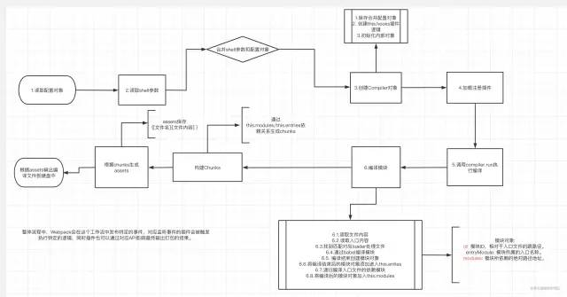 image.png

# 写在最后 

首先，感谢每一位可以看到这里的同学。

这篇文章相对有一定的知识门槛并且代码部分居多，敬佩每一位可以读到结尾的同学。

文章中对于实现一个简易版的`Webpack`在这里就要和大家告一段落了，这其实只是一个最基础版本的`webpack`工作流。

但是正是通过这样一个小🌰可以带我们真正入门`webpack`的核心工作流，希望这篇文章对于大家理解`webpack`时可以起到更好的辅助作用。

> 其实在理解清楚基础的工作流之后，针对于`loader`和`plugin`开发都是信手拈来的部分，文章中对于这两部分内容的开发介绍比较肤浅，后续我会分别更新有关`loader`和`plugin`的详细开发流程。有兴趣的同学可以及时关注😄。

> 文章中的代码你可以在这里下载\[11\]，这份简易版的`webpack`我也会持续在代码库中完善更多工作流的逻辑处理。

> 同时这里这里的代码我想强调的是源码流程的讲解，真实的webpack会比这里复杂很多很多。这里为了方便大家理解刻意进行了简化，但是核心工作流是和源码中基本一致的。
