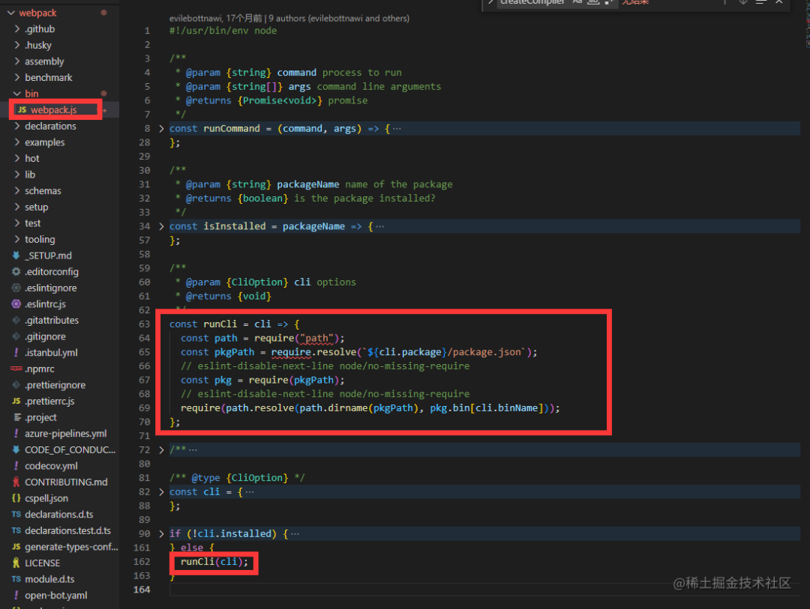
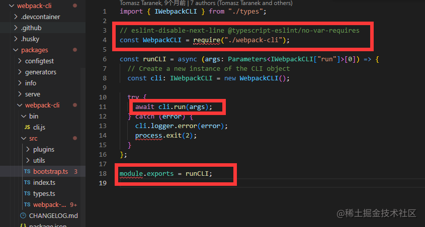
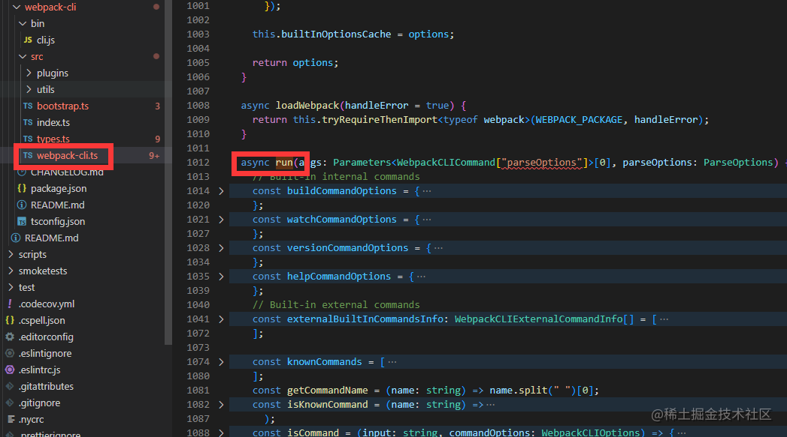
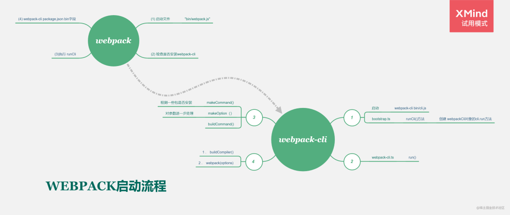
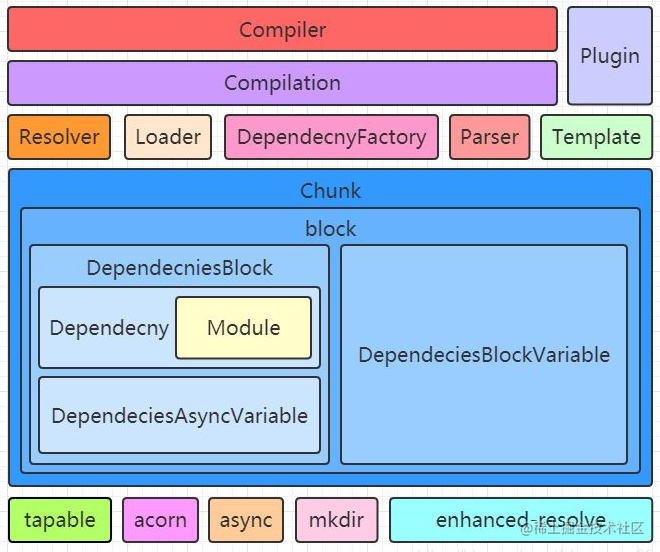
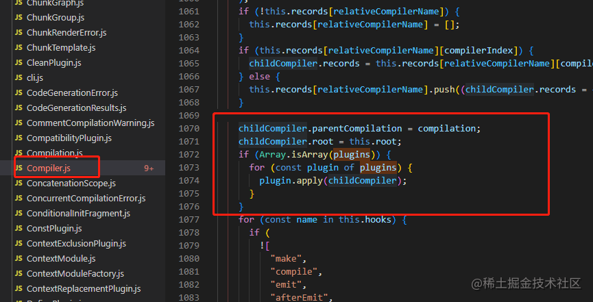
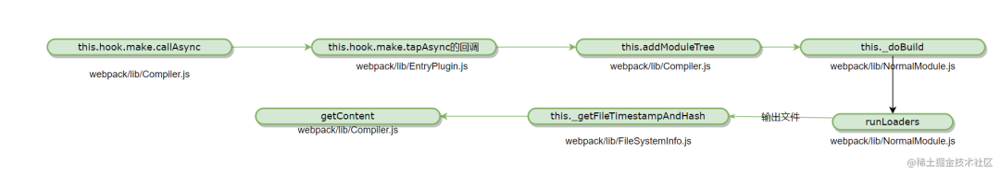
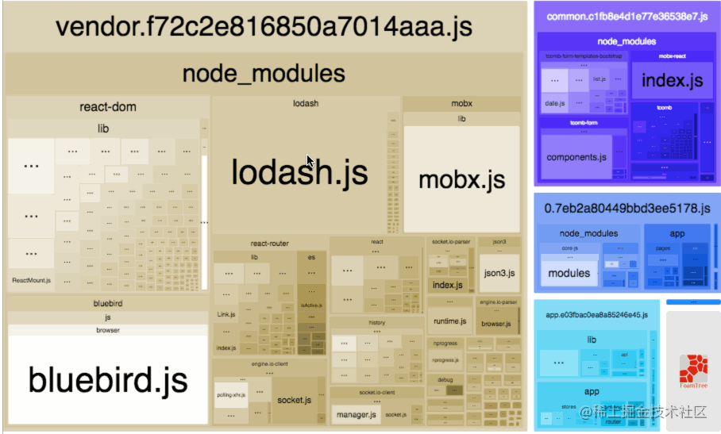

- [前言](#前言)
- [一、webpack的核心工作过程中的关键环节怎么样的？](#一webpack的核心工作过程中的关键环节怎么样的)
  - [1.1 梳理前置知识](#11-梳理前置知识)
  - [1.2 启动`webpack`都做了什么](#12-启动webpack都做了什么)
    - [启动流程总结](#启动流程总结)
    - [内部的运行机制](#内部的运行机制)
  - [1.3 整理一下Webpack 核心工作过程中的关键环节](#13-整理一下webpack-核心工作过程中的关键环节)
    - [一、初始化参数](#一初始化参数)
    - [二、 开始编译](#二-开始编译)
    - [三、 构建模块](#三-构建模块)
    - [四、 完成模块编译](#四-完成模块编译)
    - [五、 输出资源](#五-输出资源)
    - [六、 输出完成](#六-输出完成)
- [二、解析通过源码webpack的中的一些疑问](#二解析通过源码webpack的中的一些疑问)
- [三、简谈项目中webpack优化](#三简谈项目中webpack优化)
    - [一、编译提效](#一编译提效)
    - [二、打包提效](#二打包提效)
- [总结](#总结)


# 前言 

`webpack`作为模块打包工具，在前端界可以说是恶棍天使一般的存在，前端人对它大多数对它都是咬牙切齿的，以至于后面出现`vite`，以及刚刚出炉号称比`webpack`快700倍的`Turbopack`，日薄西山的`webpacK`俨然已经成为过气网红，但是在目前来说，很多公司老项目都还是用webpack体系进行打包，面试的时候，往往也是会提一嘴，你做过什么优化，`webpack`的一些原理和知识点好像还是必备， 早在两年前我就写过一篇文章《前端开发中常用的webpack优化和相关原理》，那会还是`webpack4`，后来2020年10月10号左右，`webpack5`横空出世，截止到今天2022年10月，`webpack`已经更新到`V5.75`，再次重新去“顺藤摸瓜”式的去粗读源码，温故知新，当然大家也可以带着下面的问题思考：

 *  1、webpack的构建流程是怎么样的？
 *  2、webpack-cli对于文件打包是必须的吗？
 *  3、webpack中loader先执行还是plugin先执行？
 *  4、webpack中 loader 的链式调用与执行顺序是怎么样的？
 *  5、 module.rules的loader的加载和传递流程是怎么样的呢？
 *  5、 webpack优化新的思考

# 一、webpack的核心工作过程中的关键环节怎么样的？ 

## 1.1 梳理前置知识 

从`webpack4`（2018年2月）开始它的`CLI`部分单独抽离在`webpack-cli` 模块中，接下来我们就带着源码一点点来探索，webpack的核心工作流程。  
注：本文下载的

> webpack源码版本为`"version": "5.75.0"`  
> webpack-cli源码版本为`"version": "4.10.0"`

通过 上篇文章《前端工程化基建探索（3）定制脚手架模板——前端新建项目的“反卷利器”》我们对cli脚手架有个基础知识储备，现在阅读起源码来，也稍微更有方向感，我们从`github`下载`webpack`源码到本地，直奔主题。

## 1.2 启动`webpack`都做了什么 

查看`webpack`启动文件，我们可以看到它首先做了一些判断是否安装了`webpack-cli`，如果不安装`webpack-cli`，程序运行就结束。这里我们重点关注 `runCli` 函数，调用它会执行`webpack-cli` 中`bin`目录下的`cli.js` 文件，后面的工作就交给`webpack-cli` 处理了。

接下来我们关注点转移到`webpack-cli` 源码，`webpack-cli`的启动文件，打开`webpack-cli/bin/cli.js`

```java
#!/usr/bin/env node

"use strict";

const importLocal = require("import-local");
const runCLI = require("../lib/bootstrap");

if (!process.env.WEBPACK_CLI_SKIP_IMPORT_LOCAL) {
  // Prefer the local installation of `webpack-cli`
  if (importLocal(__filename)) {
    return;
  }
}

process.title = "webpack";

runCLI(process.argv);
```

最终它去执行`await cli.run(args)`，用来处理命令行参数

 image.png

然后我们去看看 `require("./webpack-cli")` 里面的 `run()` 函数，这个run函数，足足有700多行代码（看完烧脑），总的来说是处理命令行，并通过调用`webpack`的核心函数，构建compiler 对象，最后再执行整个构建流程。

 image.png

> 结论：webpack-cli对于文件打包不是必需的，因为它只是处理命令行参数，我们也可以自行设计cli来处理参数，比如我们常见的 Vue/React框架也是没有使用webpack-cli

### 启动流程总结 

 webpack启动流程.png

### 内部的运行机制 

  
(图片来源：点击图片即可直达)

## 1.3 整理一下Webpack 核心工作过程中的关键环节 

### 一、初始化参数 

(1)从配置文件解析配置项，开始载入 `Webpack` 核心模块，传入配置选项，这部分工作由 `webpack-cli`处理

### 二、 开始编译 

(1)`run()`:编译的入口方法  
(2) `run`触发`compile`，接下来就是开始构建`options`中模块  
(3) 构建`compilation对象`。该对象负责组织整个编译过程，包含了每个构建环节所对应的方法对象内部保留了对compile对象的引用，并且存放所有modules， chunks，生成的assets以及最后用来生成最后JS的template。(4) compile中触发make事件并调用addEntry  
(5) 找到入口js文件，进行下一步的模块绑定

### 三、 构建模块 

(1) 解析入口js文件，通过对应的工厂方法创建模块，保存到`compilation对象`上(通过单例模式保证同样的模块只有一个实例)  
(2) 对`module`进行`build`了。包括调用`loader`处理源文件，使用 `acorn`生成`AST`并且遍历`AST`,遇到`requirt`等依赖时，创建依赖 `Dependency`加入依赖数组。  
(3) `module`已经`build`完毕，此时开始处理依赖的`module` 异步的对依赖的`module`进行`build`，如果依赖中仍有依赖，则循环处理其依赖

### 四、 完成模块编译 

(1) 调用`seal`方法封装，逐次对每个`module`和 `chunk`进行整理，生成编译后的源码，合并，拆分。每一个`chunk`对应一个入口文件。  
(2) 开始处理最后生成的js

### 五、 输出资源 

根据入口和模块之间的依赖关系，组装成一个个包含多个模块的`Chunk`，再把每个`Chunk` 转换成一个单独的文件加入到输出列表

(1)所有的`module，chunk`仍然保存的是通过一个个`require()`聚合起来的代码，需要通过`Template`产生最后带有`_webpack_require()`的格式  
(2)`MainTemplate`:处理入口文件的`module`, `ChunkTemplate`:处理非首屏，需异步加载的module  
(3)注意这里开始输出生产的`assets`，插件有机会最后修改`assets`

### 六、 输出完成 

在确定好输出内容后，根据配置确定输出的路径和文件名，把文件内容写入到文件系统。(1)不同的`dependencyTemplates`，如`CommonJs`,`AMD`... (2)生成好的`js`保存在`compilation.assets`中 (3)通过`emitAssets`将最终的`js`输出到`output`的`path`中

# 二、解析通过源码webpack的中的一些疑问 

> 2.1 webpack中loader先执行还是plugin先执行？

其实这个是一个伪命题，，单从字面上是不能判断执行顺序的，大家都知道`plugin` 负责`webpack`除了模块化打包外其他多样性的构建任务处理。，我们从源码上可以看到，当创建了 `Compiler` 对象过后，`Webpack` 就开始注册我们配置中的每一个插件，这样`webpack`在往后的生命周期里，都可以触发对应的`plugin` 插件钩子。

`loader`用于处理不同的文件类型，在编译静态资源个环节。我们继续查阅源码，创建完`Compilation` 对象过后，触发了一个叫作`make` 的钩子，`make`的工作就是根据`entry`配置找到入口模块，开始依次递归出所有依赖，形成依赖关系树，`buildModule`方法进行模块构建，这里执行具体的 `Loader`，处理特殊资源加载。

 image.png

> 2.2 webpack中 loader 的链式调用与执行顺序是怎么样的？

在webpack官网上有一句话：

`“ loader 总是从右到左被调用。有些情况下，loader 只关心 request 后面的 元数据(metadata)，并且忽略前一个 loader 的结果。在实际（从右到左）执行 loader 之前，会先 从左到右 调用 loader 上的`pitch`方法”`  
对于以下 `use` 配置：

```java
module.exports = {
  //...
  module: {
    rules: [
      {
        //...
        use: ['a-loader', 'b-loader', 'c-loader'],
      },
    ],
  },
};
```

将会发生这些步骤：

```java
|- a-loader `pitch`
  |- b-loader `pitch`
    |- c-loader `pitch`
      |- requested module is picked up as a dependency
    |- c-loader normal execution
  |- b-loader normal execution
|- a-loader normal execution
```

`module.rules`的`loader`的加载和传递流程是怎么样的呢？这里我们可以查阅源码`lib/rules/RuleSetCompiler.js`

这里列举了一两个通过源码查阅，来理解技术的方式，如果你有更多的疑问也可以一一通过源码去查阅理解。

# 三、简谈项目中webpack优化 

`webpack`优化，一提到这个问题，大家用心玩过`webpac`k的人都能道个一二三，但是怎么样系统的思考优化，或许很少人会去总结。

> 3.1 怎么去量化优化指标？

一切以结果为导向，优化到底优化了什么，怎么样量化（可视化、数据化），这个作为职场人重要的职业技能，优化，通常来说我们可以从时间和空间两个维度去考量：

（1）时间：比如编译和打包过程中的耗时情况，你从3分钟提速到1分钟，这是一个很好的时间参数优化，所以我们可以选择一些基于时间的分析工具或插件，来帮我们统耗时情况，当然你也可以自己卷一个工具，NPM上成熟的工具已经有很多例如： `speed-measure-webpack-plugin`

(2) 空间：这里通常指的就是输出的代码体积，你从10M压缩到1M，这是一个很巨大体积优化，我们可以通过产物内容分析工具`webpack-bundle-analyzer`

 image.png

可以直观分析打包出的文件包含哪些，大小占比如何，压缩后的大小。找到那些冗余的、可以被优化的依赖项。

> 3.2 定位优化方向

### 一、编译提效 

我们可以从开发场景，体验了`Vite`的丝滑后，`webpack`开发编译等待是个难受的，多的时候得3-5分钟，才能看到编译成功，要提升这一阶段的构建效率，大致可以分为三个方向

1.  减少执行编译的模块。
2.  提升单个模块构建的速度。
3.  并行构建以提升总体效率。

### 二、打包提效 

通常我们发布项目的时候打包也是也超级长的等待时间，我们可以回忆上面`webpack`的构建流程中的环节，大概可以分为两个方向：

1.  以提升当前任务工作效率为目标，压缩代码，压缩 `JS、css`、图片等静态资源
2.  以提升后续环节工作效率为目标，比如分模块打包（ `Split Chunks`），摇树（ `Tree Shaking`）

以上都有很成熟的插件和文章去执行`webpack`的优化了，这里就不再细做班门弄斧了。

# 总结 

本文主要是简单从几个小角度探索源码出发理解`webpack`核心特性，和简谈项目中`webpack`优化，如果你对`webpack`一些特性有想了解的，也可以通过带着问题和目标，去“顺藤摸瓜”式的去粗读源码，了解更多相关知识点，百尺竿头更进一步！