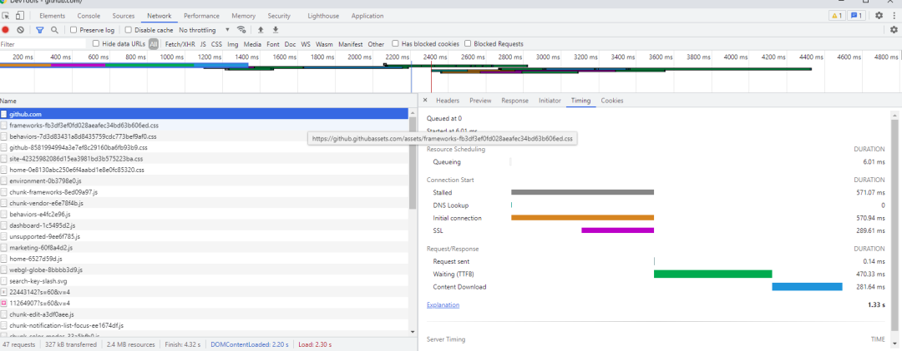
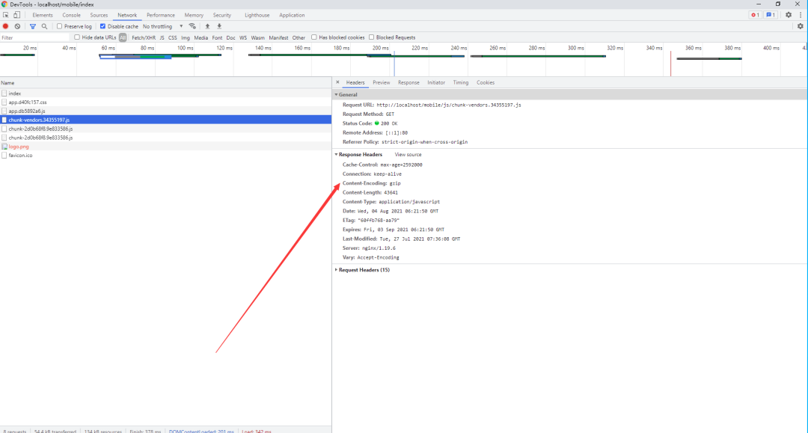
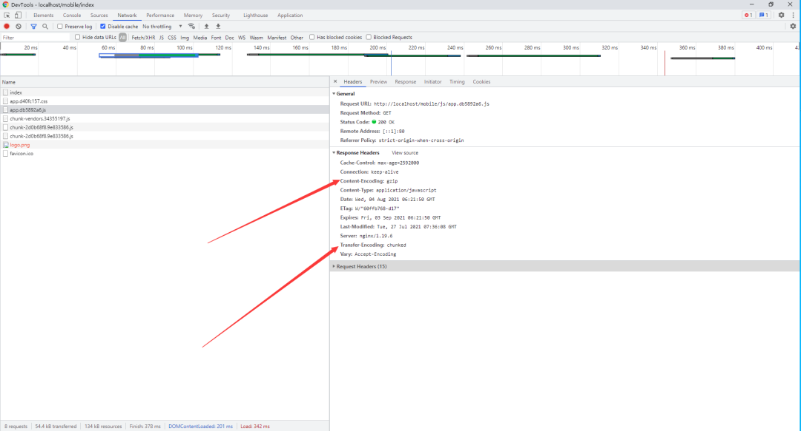
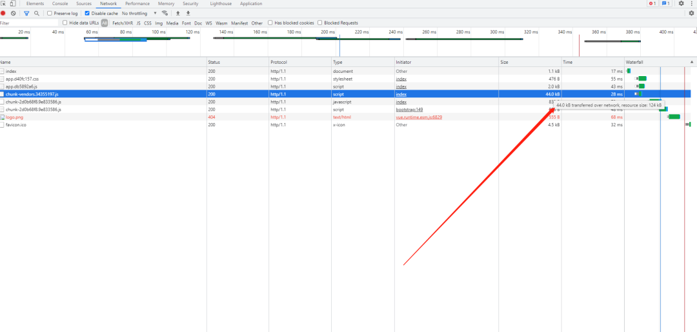

- [网页加载](#网页加载)
  - [gzip-减少加载体积](#gzip-减少加载体积)
  - [缓存控制-没有请求就是最好的请求](#缓存控制-没有请求就是最好的请求)
    - [协商缓存](#协商缓存)
      - [Last-Modified](#last-modified)
      - [Etag](#etag)
    - [强缓存](#强缓存)
    - [强制刷新](#强制刷新)
  - [长连接-减少握手次数](#长连接-减少握手次数)
  - [HTTP/2-更安全的 HTTP、更快的 HTTPS](#http2-更安全的-http更快的-https)
  - [HSTS-减少302重定向](#hsts-减少302重定向)
  - [Session Ticket-https会话复用](#session-ticket-https会话复用)

从一个前端的角度简单介绍一下页面加载的优化工作。

## 网页加载 

首先我们要看一下我们网页加载到底中间是个什么流程，那些东西比较耗费时间，比如我们访问github：



 *  Queued、Queueing：如果是 `HTTP/1.1`的话，会有 `队头阻塞`，浏览器对每个域名最多开 6 个并发连接。
 *  Stalled：浏览器要预先分配资源，调度连接。
 *  DNS Lookup：DNS解析域名。
 *  Initial connection、SSL：与服务器建立连接，TCP握手，当然你是https的话还有TLS握手。
 *  Request sent：服务器发送数据。
 *  TTFB：等待返回的数据，网络传输，也就是 `首字节响应时间`。
 *  Content Dowload：接收数据。

从图中可以看出从与服务器建立连接，到接收数据，这里的时间花费是非常多的，当然还有DNS解析，不过这里有本地缓存，所以基本没有时间。

### gzip-减少加载体积 

首先我们可以通过gzip对我们的`js`以及`css`进行压缩：vue.config.js：

```java
const CompressionWebpackPlugin = require('compression-webpack-plugin')

buildcfg = {
  productionGzipExtensions: ['js', 'css']
}
configureWebpack: (config) => {
  config.plugins.push(
    new CompressionWebpackPlugin({
      test: new RegExp('\\.(' + buildcfg.productionGzipExtensions.join('|') + ')$'),
      threshold: 8192,
      minRatio: 0.8
    })
  )
}
```

在nginx里开启gzip：

server模块：

```java
# 使用gzip实时压缩
gzip on;
gzip_min_length 1024;
gzip_buffers 4 16k;
gzip_comp_level 6;
gzip_types text/plain application/javascript application/x-javascript text/css application/xml text/javascript;
gzip_vary on;
gzip_disable "MSIE [1-6]\.";
# 使用gzip_static
gzip_static on;
```

这里简单说明一下吧， + `gzip_static`是会自动查找对应文件的`.gz`文件，这个的与`gzip`开启与否以及`gzip_types`等并没有关联，你可以理解为优先返会`.gz`文件。



\+ `gzip`的开启是针对于请求文件的实时压缩，这个是会消耗`cpu`的，比如说上面的请求文件的`Content-Length`大于`gzip_min_length`，就进行压缩返回。



总结一下就是你如果打包后有`.gz`文件，只需要开启`gzip_static`即可，如果没有那么得启用`gzip`实时压缩，不过我建议使用前者，另外gzip的适用于文本类型，图片之类的使用的话会适得其反，故`gzip_types`请适当设置。

想看gzip是否成功启用可以通过，查看返回的header头`Content-Encoding: gzip`，以及查看文件的size，这里可以看到我们原来文件的是124kb，而返回的gzip文件为44kb，压缩效率还是蛮大的：



### 缓存控制-没有请求就是最好的请求 

浏览器于服务器的缓存交互，细说起来可就多了，想了解完整的请看其他人整理的文章吧，我只是这里从配置上略说一下：

```java
location /mobile {
  alias   /usr/share/nginx/html/mobile/;
  try_files uriuri/ /mobile/index.html;
  if (request_filename ~ .*\.(htm|html)){
      add_header Cache-Control no-cache;
  }
  if (request_uri ~* /.*\.(js|css)) {
      # add_header Cache-Control max-age=2592000;
      expires 30d;
  }
  index  index.html;
}
```

#### 协商缓存 

##### Last-Modified 

我们的单页入口文件是`index.html`，这个文件呢决定了我们要加载的js以及css，故我们给html文件设置协商缓存`Cache-Control no-cache`，当我们首次加载时http的状态码为200，服务器会返回一个`Last-Modified`表示这个文件的最后修改时间，

再次刷新时浏览器会把这个修改时间通过`If-Modified-Since`发送给服务器，如果没有变动（Etag也会校验），那么服务器会返回304状态码，说我的文件没有变，你直接用缓存吧。

##### Etag 

HTTP协议解释`Etag`是`被请求变量的实体标记`，你可以理解为一个id，当文件变化了，这个id也会变化，这个和`Last-Modified`差不多，服务器会返回一个`Etag`，浏览器下次请求时会带上`If-None-Match`，进行对比返回，有些服务器的Etag计算不同，故在做分布式的时候可能会出问题，文件没改动不走缓存，当然你可以关闭这个只使用`Last-Modified`。

#### 强缓存 

我们的单页应用打包时webpack等工具是会根据文件的变化生成对应的js的，也就也是文件不变的话js的hash值不变，故我们在加载js等文件时可以使用强缓存，让浏览器在缓存时间类不进行请求，直接从缓存里面取值，

比如上面我们通过设置expires（Cache-Control也行，这个优先级更高）为30天，那么浏览器下此访问我们相同的缓存过的js和css时（缓存时间内），就直接从缓存里面拿（200 from cache），而不会请求我们的服务器。

注意：此方法是基于上述打包生成hash而言的，假如你生成的是1.js，2.js之类的，那么你修改了1.js里面的类容，打包出来的还是1.js，那么浏览器还是会从缓存里面拿，不会进行请求的。也就是说使用此方式需要确保你修改了文件打包后修改的hash值需要变动。

#### 强制刷新 

强缓存用得好的话是飞一般的感觉，但是如果在错误情况下使用就老是走浏览器缓存，如何清理这个呢，我们常用的方式是`Ctrl+F5`或者在浏览器控制台上把Disable cache给勾上，实际上这个是在请求文件时会自动加上一个header头`Cache-Control: no-cache`，也就是说我不要缓存，那么浏览器会老老实实的向服务器发出请求。

### 长连接-减少握手次数 

TCP握手以及TLS握手还是比较费时的，比如以前的http1.1之前的连接就是每一条都要进过TCP三次握手，超级费时，还好1.1默认使用了长连接，可以减少握手开销，但是假如你做大文件上传时会发现超过一定时间会断掉，这是由于`Nginx`默认的长连接时间为75s，超过了就会断开，

当你的网页确实要加载很多很多东西时可以适当把这个时间延长一点，以减少握手次数（keepalive\_requests可以限制keep alive最大请求数），至于大文件上传吗你可以选择分片上传，这里就不做介绍了。

server：

```java
keepalive_timeout 75;
keepalive_requests 100;
```

### HTTP/2-更安全的 HTTP、更快的 HTTPS 

现在很多网站都启用了`HTTP/2`，`HTTP/2`最大的一个优点是完全保持了与`HTTP/1`的兼容，HTTP/2 协议本身并不要求一定开启`SSL`，但浏览器要求一定要启用`SSL`才能使用`HTTP/2`，头部压缩、虚拟的“流”传输、多路复用等技术可以充分利用带宽，降低延迟，从而大幅度提高上网体验。Nginx开启相当简单：

```java
server {
  listen       443 ssl http2;
  ssl_certificate         /etc/nginx/conf.d/ssl/xxx.com.pem;
  ssl_certificate_key     /etc/nginx/conf.d/ssl/xxx.com.key;
  ssl_ciphers   ECDHE-ECDSA-AES256-GCM-SHA384:ECDHE-RSA-AES256-GCM-SHA384:ECDHE-RSA-AES128-GCM-SHA256:ECDHE-RSA-CHACHA20-POLY1305:ECDHE+AES128:!MD5:!SHA1; # 弃用不安全的加密套件
  ssl_prefer_server_ciphers   on; # 缓解 BEAST 攻击
}
```

### HSTS-减少302重定向 

现在大多数网站都是`https`的了，但是有个问题就是用户在输入网址时一般来说不会主动输入https，走的还是80端口，我们一般会在80端口进行`rewrite`重写：

```java
server{
  listen    80;
  server_name   test.com;
  rewrite ^(.*)https://host$1 permanent;
}
```

但这种重定向增加了网络成本，多出了一次请求，我想下次访问时直接访问`https`怎么处理？我们可以使用`HSTS`，80端口的不变，在443端口的server新增：

```java
add_header Strict-Transport-Security "max-age=15768000; includeSubDomains;";
```

这相当于告诉浏览器：我这个网站必须严格使用`HTTPS`协议，在在`max-age`时间内都不允许用`HTTP`，下次访问你就直接用`HTTPS`吧，那么浏览器只会在第一次访问时走80端口重定向，之后访问就直接是`HTTPS`的了（includeSubDomains指定的话那么说明此规则也适用于该网站的所有子域名）。

### Session Ticket-https会话复用 

我们知道https通信时，SSL握手会消耗大量时间，使用非对称加密保护会话密钥的生成。而真正传输的是通过对称加密进行通信传输。那么我们每次刷新都进行SSL握手太费时间了，既然双方都拿到会话密钥了，那么用这个密钥进行通信不就可以了，这就是会话复用。

服务器把密钥加密后生成session ticket发送给客户端，请求关闭后，如果客户端发起后续连接（超时时间内），下次客户端再和服务器建立`SSL`连接的时候，将此session ticket发送给服务器，服务器解开`session ticket`后拿出会话密钥进行加密通信。

```java
ssl_protocols               TLSv1.2 TLSv1.3; # 开启TLS1.2 以上的协议
ssl_session_timeout         5m; # 过期时间，分钟
ssl_session_tickets         on; # 开启浏览器
```
