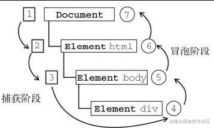
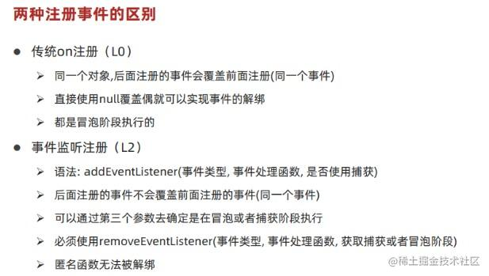
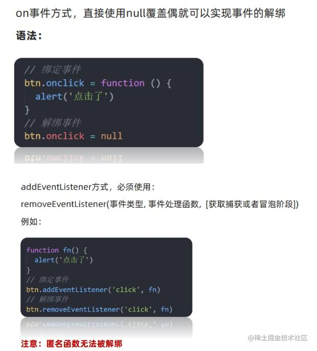
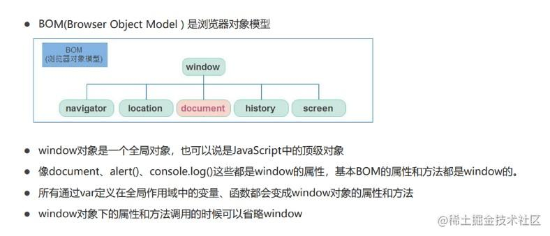
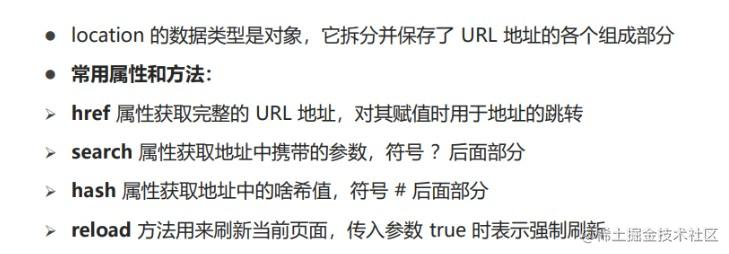
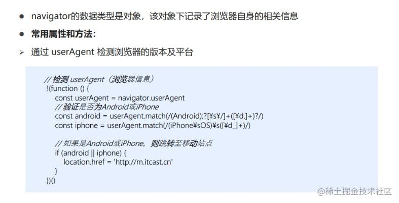
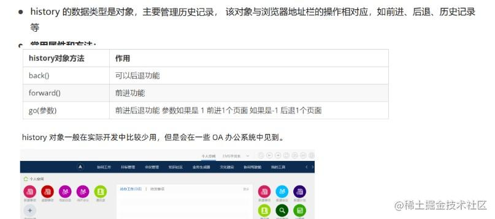
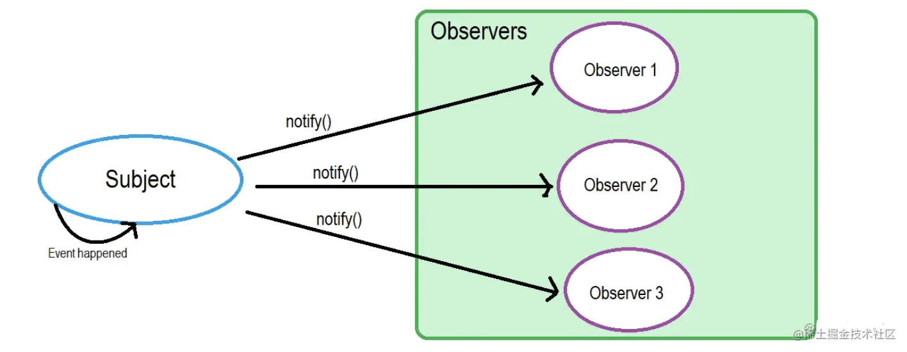

- [四、原型与继承](#四原型与继承)
  - [4.1说说面向对象的特性与特点](#41说说面向对象的特性与特点)
  - [4.2 说说你对工厂模式的理解](#42-说说你对工厂模式的理解)
  - [4.3 创建对象有哪几种方式？](#43-创建对象有哪几种方式)
  - [4.4 JS宿主对象和原生对象的区别](#44-js宿主对象和原生对象的区别)
  - [4.5 JavaScript 内置的常用对象有哪些？并列举该对象常用的方法？](#45-javascript-内置的常用对象有哪些并列举该对象常用的方法)
  - [4.6 说一下hasOwnProperty、instanceof方法](#46-说一下hasownpropertyinstanceof方法)
  - [4.7 什么是原型对象，说说对它的理解](#47-什么是原型对象说说对它的理解)
  - [4.8 什么是原型链](#48-什么是原型链)
  - [4.9 原型链的终点是什么？](#49-原型链的终点是什么)
  - [4.10 Js实现继承的方法](#410-js实现继承的方法)
    - [1.原型链继承](#1原型链继承)
    - [2.借用构造函数继承](#2借用构造函数继承)
    - [3.组合继承](#3组合继承)
    - [4.原型式继承](#4原型式继承)
    - [5.寄生式继承](#5寄生式继承)
    - [6.寄生组合继承](#6寄生组合继承)
    - [7.混入继承](#7混入继承)
    - [8. class继承](#8-class继承)
- [五、异步与事件循环](#五异步与事件循环)
  - [5.1. 异步编程的实现方式?](#51-异步编程的实现方式)
  - [5.2 并发与并行的区别？](#52-并发与并行的区别)
  - [5.3 setTimeout、setInterval、requestAnimationFrame的区别](#53-settimeoutsetintervalrequestanimationframe的区别)
  - [5.4. 什么是回调地狱？回调地狱会带来什么问题？](#54-什么是回调地狱回调地狱会带来什么问题)
  - [Promise语法](#promise语法)
  - [5.5. Promise是什么](#55-promise是什么)
  - [5.6 promise实例有哪些状态，怎么改变状态](#56-promise实例有哪些状态怎么改变状态)
  - [5.7 创建Promise实例有哪些方法](#57-创建promise实例有哪些方法)
  - [5.8 Promise有哪些实例方法](#58-promise有哪些实例方法)
  - [5.9 Promise有哪些静态方法](#59-promise有哪些静态方法)
  - [5.10 Promise.all、Promise.race、Promise.any的区别](#510-promiseallpromiseracepromiseany的区别)
  - [5.11 一个promise指定多个回调函数, 都会调用吗?](#511-一个promise指定多个回调函数-都会调用吗)
  - [5.12 改变 promise 状态和指定回调函数谁先谁后?](#512-改变-promise-状态和指定回调函数谁先谁后)
  - [5.13 promise.then()返回的新 promise 的结果状态由什么决定?](#513-promisethen返回的新-promise-的结果状态由什么决定)
  - [5.14 promise 如何串连多个操作任务?](#514-promise-如何串连多个操作任务)
  - [5.15 promise 异常传透是什么?](#515-promise-异常传透是什么)
  - [5.16 如何中断 promise 链?](#516-如何中断-promise-链)
  - [5.17 promise有什么缺点](#517-promise有什么缺点)
  - [async/await语法](#asyncawait语法)
  - [5.18 async 函数是什么](#518-async-函数是什么)
  - [5.19 async 函数的实现原理](#519-async-函数的实现原理)
  - [5.20 async函数的返回值](#520-async函数的返回值)
  - [5.21 await 到底在等待什么?](#521-await-到底在等待什么)
  - [5.22 什么是顶层await？](#522-什么是顶层await)
  - [5.23 如何用await让程序停顿指定的时间(休眠效果)](#523-如何用await让程序停顿指定的时间休眠效果)
  - [5.24 await的使用注意点](#524-await的使用注意点)
  - [5.25 async语法怎么捕获异常](#525-async语法怎么捕获异常)
  - [5.26 async/await对比Promise的优势](#526-asyncawait对比promise的优势)
  - [事件循环Event Loop](#事件循环event-loop)
  - [5.27 JS的执行机制(同步任务、异步任务)](#527-js的执行机制同步任务异步任务)
  - [5.28 什么是Event Loop](#528-什么是event-loop)
  - [5.29 宏任务与微任务的概念与区别](#529-宏任务与微任务的概念与区别)
  - [5.30 常见的宏任务与微任务分别有哪些](#530-常见的宏任务与微任务分别有哪些)
  - [5.31 事件循环Event Loop执行机制](#531-事件循环event-loop执行机制)
  - [5.32 为什么Js是单线程？](#532-为什么js是单线程)
  - [5.33 代码题易考点](#533-代码题易考点)
- [六、 ES6-ES2022新语法](#六-es6-es2022新语法)
  - [6.1 ES6(ES2015)](#61-es6es2015)
    - [1. 说说let和const](#1-说说let和const)
    - [2. let、const、var的区别](#2-letconstvar的区别)
    - [3. 解构赋值](#3-解构赋值)
    - [4. 字符串的新增方法](#4-字符串的新增方法)
    - [5. 展开运算符](#5-展开运算符)
    - [6. 数组新增的方法](#6-数组新增的方法)
    - [7. 对象新增方法](#7-对象新增方法)
    - [8.class类](#8class类)
    - [9. 模块化](#9-模块化)
    - [10. Symbol](#10-symbol)
    - [11. Iterator](#11-iterator)
    - [12. for...of..循环](#12-forof循环)
    - [13. Generator](#13-generator)
    - [14. Proxy和Reffect](#14-proxy和reffect)
    - [15. Set、Map、WeakSet、WeakMap](#15-setmapweaksetweakmap)
  - [6.2 ES2016](#62-es2016)
    - [1. 指数运算符](#1-指数运算符)
    - [2. Array.prototype.includes()方法](#2-arrayprototypeincludes方法)
  - [6.3 ES2017](#63-es2017)
    - [1. 对象新增方法](#1-对象新增方法)
    - [2. 字符串新增方法](#2-字符串新增方法)
  - [6.4 ES2018](#64-es2018)
    - [1. 异步迭代](#1-异步迭代)
    - [2.对象扩展运算符](#2对象扩展运算符)
    - [3. Promise.prototype.finally](#3-promiseprototypefinally)
  - [6.5 ES2019](#65-es2019)
    - [1. `try...catch`：语句中的`catch`允许不使用参数](#1-trycatch语句中的catch允许不使用参数)
    - [2. trimStart、trimLeft、trimEnd、trimRight](#2-trimstarttrimlefttrimendtrimright)
    - [3. Object.fromEntries](#3-objectfromentries)
  - [6.6 ES2020](#66-es2020)
    - [1. 动态导入](#1-动态导入)
    - [2. BigInt数据类型](#2-bigint数据类型)
    - [3. 空值合并运算符 ??](#3-空值合并运算符-)
    - [4. 可选链操作符 ?.](#4-可选链操作符-)
  - [6.7 ES2021](#67-es2021)
    - [1. String.prototype.replaceAll](#1-stringprototypereplaceall)
    - [2. 数值分隔符 \_](#2-数值分隔符-_)
    - [3. Promise.any()](#3-promiseany)
    - [4. 逻辑赋值操作符 \&\&= 、||= 、？？=](#4-逻辑赋值操作符---)
  - [6.8 ES2022](#68-es2022)
    - [1. class的扩展](#1-class的扩展)
    - [2. await在顶层使用](#2-await在顶层使用)
    - [3. Object.hasOwn()](#3-objecthasown)
    - [4. Array.prototype.at()](#4-arrayprototypeat)
- [七、 DOM](#七-dom)
  - [7.1说一下 DOM 事件流](#71说一下-dom-事件流)
  - [7.2 什么是事件冒泡（Event Bubbling）](#72-什么是事件冒泡event-bubbling)
  - [7.3 什么是事件捕获（Event Capturing）](#73-什么是事件捕获event-capturing)
  - [7.4 什么是事件委托](#74-什么是事件委托)
  - [7.5 什么是DOM](#75-什么是dom)
  - [7.6 DOM的常用操作](#76-dom的常用操作)
    - [(1)创建节点](#1创建节点)
    - [(2)获取节点](#2获取节点)
    - [(3)更新节点](#3更新节点)
    - [(4)添加节点](#4添加节点)
    - [(5)删除节点](#5删除节点)
  - [7.7 什么是DOM树](#77-什么是dom树)
  - [7.8 什么是DOM对象，什么是document对象](#78-什么是dom对象什么是document对象)
  - [7.9 L0和L2注册事件的区别](#79-l0和l2注册事件的区别)
  - [7.10 怎么解绑事件](#710-怎么解绑事件)
  - [7.11 addEventListener 的第三个参数有什么用](#711-addeventlistener-的第三个参数有什么用)
  - [7.12 常用DOM事件](#712-常用dom事件)
  - [7.13 怎么阻止事件冒泡、阻止默认事件？](#713-怎么阻止事件冒泡阻止默认事件)
  - [7.14 DOM的类型有哪几种？](#714-dom的类型有哪几种)
  - [7.15 DOM种获取坐标的属性有哪些，它们有什么不同？](#715-dom种获取坐标的属性有哪些它们有什么不同)
  - [7.16 DOM种元素视图尺寸的属性有哪些？](#716-dom种元素视图尺寸的属性有哪些)
  - [7.17 如何判断元素是否在可视区域](#717-如何判断元素是否在可视区域)
    - [getBoundingClientRect](#getboundingclientrect)
  - [7.18 IntersectionObserver](#718-intersectionobserver)
  - [7.19 如何遍历输出页面中的所有元素](#719-如何遍历输出页面中的所有元素)
    - [createNodeIterator](#createnodeiterator)
  - [7.20 什么是BOM对象](#720-什么是bom对象)
    - [(1) location对象的常用方法](#1-location对象的常用方法)
    - [(2) navigator对象 (获取浏览器平台和版本数据)](#2-navigator对象-获取浏览器平台和版本数据)
    - [(3) histroy对象 （管理浏览器历史记录）](#3-histroy对象-管理浏览器历史记录)
- [八、其他类型问题补充](#八其他类型问题补充)
  - [8.1 简单说说你对观察者模式的理解](#81-简单说说你对观察者模式的理解)
  - [8.2 简单说说你对发布订阅模式的理解](#82-简单说说你对发布订阅模式的理解)
  - [8.3 观察者模式与发布订阅的区别](#83-观察者模式与发布订阅的区别)
  - [8.4 说说你对正则表达式的理解](#84-说说你对正则表达式的理解)
  - [8.5 如何判断当前的Js代码是否在浏览器环境中运行](#85-如何判断当前的js代码是否在浏览器环境中运行)
- [](#)

# 四、原型与继承 

## 4.1说说面向对象的特性与特点 

 *  封装性
 *  继承性
 *  多态性

面向对象编程具有灵活、代码可复用、容易维护和开发的有点、更适合多人合作的大型软件项目

## 4.2 说说你对工厂模式的理解 

工厂模式是用来创建对象的一种最常用的设计模式，不暴露创建对象的具体逻辑，而是将将逻辑封装在一个函数中，那么这个函数就可以被视为一个工厂

其就像工厂一样重复的产生类似的产品，工厂模式只需要我们传入正确的参数，就能生产类似的产品

## 4.3 创建对象有哪几种方式？ 

1.  字面量的形式直接创建对象
2.  函数方法
    
    1.  工厂模式，工厂模式的主要工作原理是用函数来封装创建对象的细节，从而通过调用函数来达到复用的目的。
    2.  构造函数模式
    3.  原型模式
    4.  构造函数模式+原型模式，这是创建自定义类型的最常见方式。
    5.  动态原型模式
    6.  寄生构造函数模式
3.  class创建

## 4.4 JS宿主对象和原生对象的区别 

`原生对象`

“`独立于宿主环境的 ECMAScript 实现提供的对象`”

包含：Object、Function、Array、String、Boolean、Number、Date、RegExp、Error、EvalError、RangeError、ReferenceError、SyntaxError、TypeError、URIError

`内置对象`

开发者不必明确实例化内置对象，它已被内部实例化了

同样是“独立于宿主环境”。而 ECMA-262 只定义了两个内置对象，即 Global 和 Math

`宿主对象`

BOM 和 DOM 都是宿主对象。因为其对于不同的“宿主”环境所展示的内容不同。其实说白了就是，ECMAScript 官方未定义的对象都属于宿主对象，因为其未定义的对象大多数是自己通过 ECMAScript 程序创建的对象

## 4.5 JavaScript 内置的常用对象有哪些？并列举该对象常用的方法？ 

Number 数值对象，数值常用方法

 *  Number.toFixed( ) 采用定点计数法格式化数字
 *  Number.toString( ) 将—个数字转换成字符串
 *  Number.valueOf( ) 返回原始数值

String 字符串对象，字符串常用方法

 *  Length 获取字符串的长度
 *  split()将一个字符串切割数组
 *  concat() 连接字符串
 *  indexOf()返回一个子字符串在原始字符串中的索引值。如果没有找到，则返回固定值 -1
 *  lastIndexOf() 从后向前检索一个字符串
 *  slice() 抽取一个子串

Boolean 布尔对象，布尔常用方法

 *  Boolean.toString() 将布尔值转换成字符串
 *  Boolean.valueOf() Boolean 对象的原始值的布尔值

Array 数组对象，数组常用方法

 *  join() 将一个数组转成字符串。返回一个字符串
 *  reverse() 将数组中各元素颠倒顺序
 *  delete 运算符只能删除数组元素的值，而所占空间还在，总长度没变(arr.length)
 *  shift()删除数组中第一个元素，返回删除的那个值，并将长度减 1
 *  pop()删除数组中最后一个元素，返回删除的那个值，并将长度减 1
 *  unshift() 往数组前面添加一个或多个数组元素，长度会改变
 *  push() 往数组结尾添加一个或多个数组元素，长度会改变
 *  concat() 连接数组
 *  slice() 切割数组，返回数组的一部分
 *  splice()插入、删除或替换数组的元素
 *  toLocaleString() 把数组转换成局部字符串
 *  toString()将数组转换成一个字符串
 *  forEach()遍历所有元素
 *  every()判断所有元素是否都符合条件
 *  sort()对数组元素进行排序
 *  map()对元素重新组装，生成新数组
 *  filter()过滤符合条件的元素
 *  find() 查找 返回满足提供的测试函数的第一个元素的值。否则返回 undefined。
 *  some() 判断是否有一个满足条件 ，返回布尔值
 *  fill() 填充数组
 *  flat() 数组扁平化

Function 函数对象，函数常用方法

 *  Function.arguments 传递给函数的参数
 *  Function.apply() 将函数作为一个对象的方法调用
 *  Function.call() 将函数作为对象的方法调用
 *  Function.caller 调用当前函数的函数
 *  Function.length 已声明的参数的个数
 *  Function.prototype 对象类的原型
 *  Function.toString() 把函数转换成字符串

Object 基础对象，对象常用方法

 *  Object 含有所有 JavaScript 对象的特性的超类
 *  Object.constructor 对象的构造函数
 *  Object.hasOwnProperty( ) 检查属性是否被继承
 *  Object.isPrototypeOf( ) 一个对象是否是另一个对象的原型
 *  Object.propertyIsEnumerable( ) 是否可以通过 for/in 循环看到属性
 *  Object.toLocaleString( ) 返回对象的本地字符串表示
 *  Object.toString( ) 定义一个对象的字符串表示
 *  Object.valueOf( ) 指定对象的原始值

Date 日期时间对象，日期常用方法

 *  Date.getFullYear() 返回 Date 对象的年份字段
 *  Date.getMonth() 返回 Date 对象的月份字段
 *  Date.getDate() 返回一个月中的某一天
 *  Date.getDay() 返回一周中的某一天
 *  Date.getHours() 返回 Date 对象的小时字段
 *  Date.getMinutes() 返回 Date 对象的分钟字段
 *  Date.getSeconds() 返回 Date 对象的秒字段
 *  Date.getMilliseconds() 返回 Date 对象的毫秒字段
 *  Date.getTime() 返回 Date 对象的毫秒表示

Math 数学对象，数学常用方法

 *  Math 对象是一个`静态对象`
 *  Math.PI 圆周率
 *  Math.abs() 绝对值
 *  Math.ceil() 向上取整(整数加 1，小数去掉)
 *  Math.floor() 向下取整(直接去掉小数)
 *  Math.round() 四舍五入
 *  Math.pow(x，y) 求 x 的 y 次方
 *  Math.sqrt() 求平方根

RegExp 正则表达式对象，正则常用方法

 *  RegExp.exec() 检索字符串中指定的值。返回找到的值，并确定其位置。
 *  RegExp.test( ) 检索字符串中指定的值。返回 true 或 false。
 *  RegExp.toString( ) 把正则表达式转换成字符串
 *  RegExp.globa 判断是否设置了 "g" 修饰符
 *  RegExp.ignoreCase 判断是否设置了 "i" 修饰符
 *  RegExp.lastIndex 用于规定下次匹配的起始位置
 *  RegExp.source 返回正则表达式的匹配模式

Error 异常对象

 *  Error.message 设置或返回一个错误信息(字符串)
 *  Error.name 设置或返回一个错误名
 *  Error.toString( ) 把 Error 对象转换成字符串

## 4.6 说一下hasOwnProperty、instanceof方法 

hasOwnProperty() 方法会返回一个布尔值，指示对象自身属性中是否具有指定的属性（也就是，是否有指定的键）。

instanceof 运算符用于检测构造函数的 `prototype` 属性是否出现在某个实例对象的原型链上。

## 4.7 什么是原型对象，说说对它的理解 

构造函数的内部的 prototype 属性指向的对象，就是构造函数的原型对象。

原型对象包含了可以由该构造函数的所有实例共享的属性和方法。当使用构造函数新建一个实例对象后，在这个对象的内部将包含一个指针(proto)，这个指针指向构造函数的 原型对象，在 ES5 中这个指针被称为对象的原型。

## 4.8 什么是原型链 

原型链是一种查找规则

当访问一个对象的属性时，如果这个对象内部不存在这个属性，那么它就会去它的原型对象里找这个属性，这个原型对象又会有自己的原型，于是就这样一直找下去，这种链式查找过程称之为原型链

## 4.9 原型链的终点是什么？ 

原型链的尽头是null。也就是Object.prototype.proto

## 4.10 Js实现继承的方法 

### 1.原型链继承 

关键：子类构造函数的原型为父类构造函数的实例对象

缺点：1、子类构造函数无法向父类构造函数传参。

　　　2、所有的子类实例共享着一个原型对象，一旦原型对象的属性发生改变，所有子类的实例对象都会收影响

　　　3、如果要给子类的原型上添加方法，必须放在Son.prototype = new Father()语句后面

```java
   function Father(name) {
      this.name = name
    }
    Father.prototype.showName = function () {
      console.log(this.name);
    }
    function Son(age) {
      this.age = 20
    }
    // 原型链继承,将子函数的原型绑定到父函数的实例上,子函数可以通过原型链查找到复函数的原型,实现继承
    Son.prototype = new Father()
    // 将Son原型的构造函数指回Son, 否则Son实例的constructor会指向Father
    Son.prototype.constructor = Son
    Son.prototype.showAge = function () {
      console.log(this.age);
    }
    let son = new Son(20, '刘逍') // 无法向父构造函数里传参
    // 子类构造函数的实例继承了父类构造函数原型的属性,所以可以访问到父类构造函数原型里的showName方法
    // 子类构造函数的实例继承了父类构造函数的属性,但是无法传参赋值,所以是this.name是undefined
    son.showName() // undefined
    son.showAge()  // 20
```

### 2.借用构造函数继承 

关键：用 .call() 和 .apply()方法,在子类构造函数中,调用父类构造函数

缺点：1、只继承了父类构造函数的属性，没有继承父类原型的属性。

　　　2、无法实现函数复用，如果父类构造函数里面有一个方法，会导致每一个子类实例上面都有相同的方法。

```java
function Father(name) {
      this.name = name
    }
    Father.prototype.showName = function () {
      console.log(this.name);
    }
    function Son(name, age) {
      Father.call(this, name) // 在Son中借用了Father函数,只继承了父类构造函数的属性，没有继承父类原型的属性。
      // 相当于 this.name = name
      this.age = age
    }
    let s = new Son('刘逍', 20) // 可以给父构造函数传参
    console.log(s.name); // '刘逍'
    console.log(s.showName); // undefined
```

### 3.组合继承 

关键：原型链继承+借用构造函数继承

缺点：1、使用组合继承时，父类构造函数会被调用两次，子类实例对象与子类的原型上会有相同的方法与属性，浪费内存。

```java
   function Father(name) {
      this.name = name
      this.say = function () {
        console.log('hello,world');
      }
    }
    Father.prototype.showName = function () {
      console.log(this.name);
    }
    function Son(name, age) {
      Father.call(this, name) //借用构造函数继承
      this.age = age
    }
    // 原型链继承
    Son.prototype = new Father()  // Son实例的原型上,会有同样的属性,父类构造函数相当于调用了两次
    // 将Son原型的构造函数指回Son, 否则Son实例的constructor会指向Father
    Son.prototype.constructor = Son
    Son.prototype.showAge = function () {
      console.log(this.age);
    }
    let p = new Son('刘逍', 20) // 可以向父构造函数里传参
    // 也继承了父函数原型上的方法
    console.log(p);
    p.showName() // '刘逍'
    p.showAge()  // 20
```

### 4.原型式继承 

关键：创建一个函数，将要继承的对象通过参数传递给这个函数，最终返回一个对象，它的隐式原型指向传入的对象。 (Object.create()方法的底层就是原型式继承)

缺点：只能继承父类函数原型对象上的属性和方法，无法给父类构造函数传参

```java
   function createObj(obj) {
      function F() { }   // 声明一个构造函数
      F.prototype = obj   //将这个构造函数的原型指向传入的对象
      F.prototype.construct = F   // construct属性指回子类构造函数
      return new F        // 返回子类构造函数的实例
    }
    function Father() {
      this.name = '刘逍'
    }
    Father.prototype.showName = function () {
      console.log(this.name);
    }
    const son = createObj(Father.prototype)
    son.showName() // undefined  继承了原型上的方法,但是没有继承构造函数里的name属性
```

### 5.寄生式继承 

关键：在原型式继承的函数里，给继承的对象上添加属性和方法，增强这个对象

缺点：只能继承父类函数原型对象上的属性和方法，无法给父类构造函数传参

```java
   function createObj(obj) {
      function F() { }
      F.prototype = obj
      F.prototype.construct = F
      F.prototype.age = 20  // 给F函数的原型添加属性和方法,增强对象
      F.prototype.showAge = function () {
        console.log(this.age);
      }
      return new F
    }
    function Father() {
      this.name = '刘逍'
    }
    Father.prototype.showName = function () {
      console.log(this.name);
    }
    const son = createObj(Father.prototype)
    son.showName() // undefined
    son.showAge()  // 20
```

### 6.寄生组合继承 

关键：原型式继承 + 构造函数继承

Js最佳的继承方式，只调用了一次父类构造函数

```java
   function Father(name) {
      this.name = name
      this.say = function () {
        console.log('hello,world');
      }
    }
    Father.prototype.showName = function () {
      console.log(this.name);
    }
    function Son(name, age) {
      Father.call(this, name)
      this.age = age
    }
    Son.prototype = Object.create(Father.prototype) // Object.create方法返回一个对象，它的隐式原型指向传入的对象。
    Son.prototype.constructor = Son
    const son = new Son('刘逍', 20)
    console.log(son.prototype.name); // 原型上已经没有name属性了,所以这里会报错
```

### 7.混入继承 

关键：利用Object.assign的方法多个父类函数的原型拷贝给子类原型

```java
 function Father(name) {
      this.name = name
    }
    Father.prototype.showName = function () {
      console.log(this.name);
    }
​
    function Mather(color) {
      this.color = color
    }
    Mather.prototype.showColor = function () {
      console.log(this.color);
    }
​
    function Son(name, color, age) {
      // 调用两个父类函数
      Father.call(this, name)
      Mather.call(this, color)
      this.age = age
    }
    Son.prototype = Object.create(Father.prototype)
    Object.assign(Son.prototype, Mather.prototype)  // 将Mather父类函数的原型拷贝给子类函数
    const son = new Son('刘逍', 'red', 20)
    son.showColor()  // red
```

### 8. class继承 

关键：class里的extends和super关键字，继承效果与寄生组合继承一样

```java
   class Father {
      constructor(name) {
        this.name = name
      }
      showName() {
        console.log(this.name);
      }
    }
    class Son extends Father {  // 子类通过extends继承父类
      constructor(name, age) {
        super(name)    // 调用父类里的constructor函数,等同于Father.call(this,name)
        this.age = age
      }
      showAge() {
        console.log(this.age);
      }
    }
    const son = new Son('刘逍', 20)
    son.showName()  // '刘逍'
    son.showAge()   // 20
```

# 五、异步与事件循环 

## 5.1. 异步编程的实现方式? 

JavaScript中的异步机制可以分为以下几种：

 *  回调函数 的方式，使用回调函数的方式有一个缺点是，多个回调函数嵌套的时候会造成回调函数地狱，上下两层的回调函数间的代码耦合度太高，不利于代码的可维护。
 *  Promise 的方式，使用 Promise 的方式可以将嵌套的回调函数作为链式调用。但是使用这种方法，有时会造成多个 then 的链式调用，可能会造成代码的语义不够明确。
 *  generator 的方式，它可以在函数的执行过程中，将函数的执行权转移出去，在函数外部还可以将执行权转移回来。当遇到异步函数执行的时候，将函数执行权转移出去，当异步函数执行完毕时再将执行权给转移回来。因此在 generator 内部对于异步操作的方式，可以以同步的顺序来书写。使用这种方式需要考虑的问题是何时将函数的控制权转移回来，因此需要有一个自动执行 generator 的机制，比如说 co 模块等方式来实现 generator 的自动执行。
 *  async 函数 的方式，async 函数是 generator 和 promise 实现的一个自动执行的语法糖，它内部自带执行器，当函数内部执行到一个 await 语句的时候，如果语句返回一个 promise 对象，那么函数将会等待 promise 对象的状态变为 resolve 后再继续向下执行。因此可以将异步逻辑，转化为同步的顺序来书写，并且这个函数可以自动执行。

## 5.2 并发与并行的区别？ 

 *  并发是宏观概念，我分别有任务 A 和任务 B，在一段时间内通过任务间的切换完成了这两个任务，这种情况就可以称之为并发。
 *  并行是微观概念，假设 CPU 中存在两个核心，那么我就可以同时完成任务 A、B。同时完成多个任务的情况就可以称之为并行。

## 5.3 setTimeout、setInterval、requestAnimationFrame的区别 

 *  setTimeout

执行该语句时，是立即把当前定时器代码推入事件队列，当定时器在事件列表中满足设置的时间值时将传入的函数加入任务队列，之后的执行就交给任务队列负责。但是如果此时任务队列不为空，则需等待，所以执行定时器内代码的时间可能会大于设置的时间。

返回值`timeoutID`是一个正整数，表示定时器的编号。这个值可以传递给[`clearTimeout()`][clearTimeout]来取消该定时器。

 *  setInterval

重复调用一个函数或执行一个代码片段，每次都精确的隔一段时间推入一个事件（但是，事件的执行时间不一定就不准确，还有可能是这个事件还没执行完毕，下一个事件就来了）。它返回一个 `interval ID`，该 ID 唯一地标识时间间隔，因此你可以稍后通过调用 [`clearInterval()`][clearInterval] 来移除定时器。

技术上，`clearTimeout()` 和 `clearInterval()`可以互换。但是，为了避免混淆，不要混用取消定时函数。

 *  requestAnimationFrame

是JS实现动画的一种方式，它告诉浏览器——你希望执行一个动画，并且要求浏览器在下次重绘之前调用指定的回调函数更新动画。该方法需要传入一个回调函数作为参数，该回调函数会在浏览器下一次重绘之前执行

## 5.4. 什么是回调地狱？回调地狱会带来什么问题？ 

回调函数的层层嵌套，就叫做回调地狱。回调地狱会造成代码可复用性不强，可阅读性差，可维护性(迭代性差)，扩展性差等等问题。

## Promise语法 

## 5.5. Promise是什么 

Promise是异步编程的一种解决方案，它是一个对象，可以获取异步操作的消息，他的出现大大改善了异步编程的困境，避免了地狱回调，它比传统的解决方案回调函数和事件更合理和更强大。

promise本身只是一个容器,真正异步的是它的两个回调resolve()和reject()

promise本质 不是控制 异步代码的执行顺序（无法控制） ， 而是控制异步代码结果处理的顺序

## 5.6 promise实例有哪些状态，怎么改变状态 

（1）Promise的实例有三个状态:

 *  Pending（进行中）
 *  Resolved（已完成）
 *  Rejected（已拒绝）

当把一件事情交给promise时，它的状态就是Pending，任务完成了状态就变成了Resolved、没有完成失败了就变成了Rejected。

如何改变 promise 的状态

 *  resolve(value): 如果当前是 pending 就会变为 resolved
 *  reject(error): 如果当前是 pending 就会变为 rejected
 *  抛出异常: 如果当前是 pending 就会变为 rejected

注意：一旦从进行状态变成为其他状态就永远不能更改状态了。

## 5.7 创建Promise实例有哪些方法 

 *  new Promise((resolve,reject)=>\{ ... \})

一般情况下都会使用`new Promise()`来创建promise对象，但是也可以使用`promise.resolve`和`promise.reject`这两个方法：

 *  Promise.resolve

`Promise.resolve(value)`的返回值也是一个promise对象，可以对返回值进行.then调用，代码如下：

```java
Promise.resolve(11).then(function(value){
  console.log(value); // 打印出11
});
```

 *  Promise.reject

`Promise.reject` 也是`new Promise`的快捷形式，也创建一个promise对象。代码如下：

```java
Promise.reject(new Error(“出错了！！”));
```

## 5.8 Promise有哪些实例方法 

then

`then`方法可以接受两个回调函数作为参数。第一个回调函数是Promise对象的状态变为`resolved`时调用，第二个回调函数是Promise对象的状态变为`rejected`时调用。其中第二个参数可以省略。 `then`方法返回的是一个新的Promise实例（不是原来那个Promise实例）。因此可以采用链式写法，即`then`方法后面再调用另一个then方法。

catch

该方法相当于`then`方法的第二个参数，指向`reject`的回调函数。不过`catch`方法还有一个作用，就是在执行`resolve`回调函数时，如果出现错误，抛出异常，不会停止运行，而是进入`catch`方法中。

finally

`finally`方法用于指定不管 Promise 对象最后状态如何，都会执行的操作。该方法是 ES2018 引入标准的。

下面是一个例子，服务器使用 Promise 处理请求，然后使用`finally`方法关掉服务器。

```java
server.listen(port)
  .then(function () {
    // ...
  })
  .finally(server.stop);
```

`finally`方法的回调函数不接受任何参数，这意味着没有办法知道，前面的 Promise 状态到底是`fulfilled`还是`rejected`。这表明，`finally`方法里面的操作，应该是与状态无关的，不依赖于 Promise 的执行结果。

## 5.9 Promise有哪些静态方法 

all

`all`方法可以完成并发任务， 它接收一个数组，数组的每一项都是一个`promise`对象，返回一个[`Promise`][Promise]实例。当数组中所有的`promise`的状态都达到`resolved`的时候，`all`方法的状态就会变成`resolved`，如果有一个状态变成了`rejected`，那么`all`方法的状态就会变成`rejected`。

race

`race`方法和`all`一样，接受的参数是一个每项都是`promise`的数组，但是与`all`不同的是，当最先执行完的事件执行完之后，就直接返回该`promise`对象的值。如果第一个`promise`对象状态变成`resolved`，那自身的状态变成了`resolved`；反之第一个`promise`变成`rejected`，那自身状态就会变成`rejected`。

any

它接收一个数组，数组的每一项都是一个`promise`对象，该方法会返回一个新的 `promise`，数组内的任意一个 `promise` 变成了`resolved`状态，那么由该方法所返回的 `promise` 就会变成`resolved`状态。如果数组内的 `promise` 状态都是`rejected`，那么该方法所返回的 `promise` 就会变成`rejected`状态，

resolve、reject

用来生成对应状态的Promise实例

## 5.10 Promise.all、Promise.race、Promise.any的区别 

all： 成功的时候返回的是一个结果数组，而失败的时候则返回最先被reject失败状态的值。

race： 哪个结果获得的快，就返回那个结果，不管结果本身是成功状态还是失败状态。

any： 返回最快的成功结果，如果全部失败就返回失败结果。

## 5.11 一个promise指定多个回调函数, 都会调用吗? 

都会调用，成功状态放在then的第一个参数里调用

```java
let p2 = new Promise((resolve, reject) => {
    resolve(1)
})
p2.then(value => {
    console.log('第一个', value)
})
p2.then(value => {
    console.log('第二个', value)
})
```

失败状态放在then的第二个参数里调用

```java
let p3 = new Promise((resolve, reject) => {
    reject(2)
})
p3.then(
        ()=>{},
        value => {console.log('第一个', value)}
    )
p3.then(
        ()=>{},
        value => {console.log('第二个', value)}
    )
```

## 5.12 改变 promise 状态和指定回调函数谁先谁后? 

1.  都有可能, 正常情况下是先指定回调再改变状态, 但也可以先改状态再指定回调
2.  如何先改状态再指定回调?
    
     *  在执行器中直接调用 resolve()/reject()
     *  延迟更长时间才调用 then()
3.  什么时候才能得到数据?
    
     *  如果先指定的回调, 那当状态发生改变时, 回调函数就会调用, 得到数据
     *  如果先改变的状态, 那当指定回调时, 回调函数就会调用, 得到数据

## 5.13 promise.then()返回的新 promise 的结果状态由什么决定? 

1.  简单表达: 由 then()指定的回调函数执行的结果决定
2.  详细表达:
    
     *  如果抛出异常, 新 promise 变为 rejected, 参数为抛出的异常
     *  如果返回的是非 promise 的任意值, 新 promise 变为 resolved, value 为返回的值
     *  如果返回的是另一个新 promise, 此 promise 的结果就会成为新 promise 的结果

## 5.14 promise 如何串连多个操作任务? 

 *  promise 的 then()返回一个新的 promise, 可以开成 then()的链式调用
 *  通过 then 的链式调用串连多个同步/异步任务

## 5.15 promise 异常传透是什么? 

Promise 对象的错误具有“冒泡”性质，会一直向后传递，直到被捕获为止。也就是说，错误总是会被下一个`catch`语句捕获。

 *  当使用 promise 的 then 链式调用时, 可以在最后指定失败的回调,
 *  前面任何操作出了异常, 都会传到最后失败的回调中处理

## 5.16 如何中断 promise 链? 

 *  当使用 promise 的 then 链式调用时, 在中间中断, 不再调用后面的回调函数。 在回调函数中返回一个 pendding 状态的 promise 对象

## 5.17 promise有什么缺点 

代码层面

 *  无法取消Promise，一旦新建它就会立即执行，无法中途取消。
 *  如果不设置回调函数，Promise内部抛出的错误，不会反应到外部。
 *  当处于pending状态时，无法得知目前进展到哪一个阶段（刚刚开始还是即将完成）。

语法层面

 *  Promise虽然摆脱了回调地狱，但是then的链式调⽤也会带来额外的阅读负担
 *  Promise传递中间值⾮常麻烦
 *  Promise的调试很差，由于没有代码块，你不能在⼀个返回表达式的箭头函数中设置断点，如果你在⼀个.then代码块中使⽤调试器的步进(step-over)功能，调试器并不会进⼊后续的.then代码块，因为调试器只能跟踪同步代码的每⼀步。

## async/await语法 

## 5.18 async 函数是什么 

 *  一句话概括： 它就是 Generator 函数的语法糖，也就是处理异步操作的另一种`高级写法`

## 5.19 async 函数的实现原理 

async 函数的实现原理，就是将 Generator 函数和自动执行器，包装在一个函数里。

```java
async function fn(args) {
  // ...
}
​
// 等同于
​
function fn(args) {
  return spawn(function* () {  // spawn函数就是自动执行器
    // ...
  });
}
```

## 5.20 async函数的返回值 

`async`函数返回一个 Promise 对象。

`async`函数内部`return`语句返回的值，会成为`then`方法回调函数的参数。

`async`函数内部抛出错误，会导致返回的 Promise 对象变为`reject`状态。抛出的错误对象会被`catch`方法回调函数接收到。

## 5.21 await 到底在等待什么? 

await 等待的是一个表达式，这个表达式的计算结果是 Promise 对象或者其它值（换句话说，就是没有特殊限定）。await 不仅仅用于等 Promise 对象，它可以等任意表达式的结果，所以，await 后面实际是可以接普通函数调用或者直接量的。

await 表达式的运算结果取决于它等的是什么。

 *  如果它等到的不是一个 Promise 对象，那 await 表达式的运算结果就是它等到的东西。
 *  如果它等到的是一个 Promise 对象，await 就忙起来了，它会阻塞后面的代码，等着 Promise 对象 resolve，然后得到 resolve 的值，作为 await 表达式的运算结果。

## 5.22 什么是顶层await？ 

从 ES2022 开始，允许在模块的顶层独立使用`await`命令，使得上面那行代码不会报错了。它的主要目的是使用`await`解决模块异步加载的问题。

```java
import { AsyncFun } from 'module'
await AsyncFun()
console.log(123)
```

## 5.23 如何用await让程序停顿指定的时间(休眠效果) 

JavaScript 一直没有休眠的语法，但是借助`await`命令就可以让程序停顿指定的时间

```java
function sleep(interval) {
  return new Promise(resolve => {
    setTimeout(resolve, interval);
  })
}
​
// 用法
async function one2FiveInAsync() {
  for(let i = 1; i <= 5; i++) {
    console.log(i);
    await sleep(1000);
  }
}
​
one2FiveInAsync();
```

## 5.24 await的使用注意点 

1.  `await`命令后面的`Promise`对象，运行结果可能是`rejected`，所以最好把`await`命令放在`try...catch`代码块中。
2.  多个`await`命令后面的异步操作，如果不存在继发关系，最好让它们同时触发。
3.  `await`命令只能用在`async`函数之中，如果用在普通函数，就会报错。
4.  async 函数可以保留运行堆栈。

## 5.25 async语法怎么捕获异常 

`async`函数内部的异常可以通过 `.catch()`或者 `try`/`catch`来捕获,区别是

 *  try/catch 能捕获所有异常,try语句抛出错误后会执行catch语句，try语句内后面的内容不会执行
 *  catch（）只能捕获异步方法中reject错误，并且catch语句之后的语句会继续执行

```java
async函数错误捕获，以登录功能为例
      async function getCatch () {
        await new Promise(function (resolve, reject) {
          reject(new Error('登录失败'))
        }).catch(error => {
          console.log(error)  // .catch（）能捕获到错误信息
        })
        console.log('登录成功') //  但是成功信息也会执行
      }
      
     async function getCatch () {
        try {
          await new Promise(function (resolve, reject) {
            reject(new Error('登录失败'))
          })
          console.log('登录成功')  // try抛出错误之后，就不会执行这条语句
        } catch (error) {
          console.log(error)  //  catch语句能捕获到错误信息
        }
      }
```

## 5.26 async/await对比Promise的优势 

 *  代码读起来更加同步，Promise虽然摆脱了回调地狱，但是then的链式调⽤也会带来额外的阅读负担
 *  Promise传递中间值⾮常麻烦，⽽async/await⼏乎是同步的写法，⾮常优雅
 *  错误处理友好，async/await可以⽤成熟的try/catch，Promise的错误捕获⾮常冗余
 *  调试友好，Promise的调试很差，由于没有代码块，你不能在⼀个返回表达式的箭头函数中设置断点，如果你在⼀个.then代码块中使⽤调试器的步进(step-over)功能，调试器并不会进⼊后续的.then代码块，因为调试器只能跟踪同步代码的每⼀步。

## 事件循环Event Loop 

## 5.27 JS的执行机制(同步任务、异步任务) 

JS是一门单线程语言，单线程就意味着，所有的任务需要排队，前一个任务结束，才会执行下一个任务。这样所导致的问题是：如果JS执行的时间过长，这样就会造成页面的渲染不连贯，导致页面渲染加载阻塞的觉。为了解决这个问题，JS中出现了同步和异步。

同步任务：即主线程上的任务，按照顺序由上⾄下依次执⾏，当前⼀个任务执⾏完毕后，才能执⾏下⼀个任务。

异步任务：不进⼊主线程，⽽是进⼊任务队列的任务，执行完毕之后会产生一个回调函数,并且通知主线程。当主线程上的任务执行完后，就会调取最早通知自己的回调函数，使其进入主线程中执行。

## 5.28 什么是Event Loop 

 *  事件循环Event Loop又叫事件队列，两者是一个概念

事件循环指的是js代码所在运行环境（浏览器、nodejs）编译器的一种解析执行规则。事件循环不属于js代码本身的范畴，而是属于js编译器的范畴，在js中讨论事件循环是没有意义的。换句话说，js代码可以理解为是一个人在公司中具体做的事情， 而 事件循环 相当于是公司的一种规章制度。 两者不是一个层面的概念。

## 5.29 宏任务与微任务的概念与区别 

为了协调任务有条不紊地在主线程上执行，页面进程引入了 消息队列 和 事件循环机制，渲染进程内部也会维护多个消息队列，比如延迟执行队列和普通的消息队列。然后主线程采用一个 `for` 循环，不断地从这些任务队列中取出任务并执行任务。这些消息队列中的任务就称为 宏任务。

微任务是一个需要异步执行的回调函数，执行时机是在主函数执行结束之后、当前宏任务结束之前。当 JS 执行一段脚本（一个宏任务）的时候，V8 会为其创建一个全局执行上下文，在创建全局执行上下文的同时，V8 引擎也会在内部创建一个 微任务队列。也就是说 每个宏任务都关联了一个微任务队列。

## 5.30 常见的宏任务与微任务分别有哪些 

<table> 
 <thead> 
  <tr> 
   <th>任务（代码）</th> 
   <th>宏/微 任务</th> 
   <th>环境</th> 
  </tr> 
 </thead> 
 <tbody> 
  <tr> 
   <td> </td> 
   <td>宏任务</td> 
   <td>浏览器</td> 
  </tr> 
  <tr> 
   <td>事件</td> 
   <td>宏任务</td> 
   <td>浏览器</td> 
  </tr> 
  <tr> 
   <td>网络请求（Ajax）</td> 
   <td>宏任务</td> 
   <td>浏览器</td> 
  </tr> 
  <tr> 
   <td>setTimeout() 定时器</td> 
   <td>宏任务</td> 
   <td>浏览器/Node</td> 
  </tr> 
  <tr> 
   <td>fs.readFile() 读取文件</td> 
   <td>宏任务</td> 
   <td>Node</td> 
  </tr> 
  <tr> 
   <td>Promise.then()</td> 
   <td>微任务</td> 
   <td>浏览器/Node</td> 
  </tr> 
  <tr> 
   <td>async/await</td> 
   <td>微任务</td> 
   <td>浏览器/Node</td> 
  </tr> 
 </tbody> 
</table>

## 5.31 事件循环Event Loop执行机制 

1.进入到script标签,就进入到了第一次事件循环.

2.遇到同步代码，立即执行

3.遇到宏任务,放入到宏任务队列里.

4.遇到微任务,放入到微任务队列里.

5.执行完所有同步代码

6.执行微任务代码

7.微任务代码执行完毕，本次队列清空

8.寻找下一个宏任务，重复步骤1

## 5.32 为什么Js是单线程？ 

Js是单线程，但是浏览器是多线程。单线程是为了避免UI操作混乱，所有和UI操作相关的开发语言都应该是单线程。

## 5.33 代码题易考点 

1.  promise本身是一个同步的代码，只有它后面调用的then()方法里面的回调才是微任务
2.  then方法需要Promise里的resolve传值才会执行
3.  await右边的表达式还是会立即执行,表达式之后的代码才是微任务, await微任务可以转换成等价的promise微任务分析
4.  script标签本身是一个`宏任务`， 当页面出现多个script标签的时候，浏览器会把script标签作为宏任务来解析

# 六、 ES6-ES2022新语法 

## 6.1 ES6(ES2015) 

### 1. 说说let和const 

let:

 *  声明变量
 *  没有变量提升
 *  不可重复声明
 *  具有块级作用域
 *  声明变量后可以在使用时赋值

const:

 *  只读常量
 *  没有变量提升
 *  不可重复声明
 *  具有块级作用域
 *  声明变量后必须立马赋值

### 2. let、const、var的区别 

（1）块级作用域： 块作用域由 `{ }`包括，let和const具有块级作用域，var不存在块级作用域。块级作用域解决了ES5中的两个问题：

 *  内层变量可能覆盖外层变量
 *  用来计数的循环变量泄露为全局变量

（2）变量提升： var存在变量提升，let和const不存在变量提升，即在变量只能在声明之后使用，否在会报错。

（3）给全局添加属性： 浏览器的全局对象是window，Node的全局对象是global。var声明的变量为全局变量，并且会将该变量添加为全局对象的属性，但是let和const不会。

（4）重复声明： var声明变量时，可以重复声明变量，后声明的同名变量会覆盖之前声明的遍历。const和let不允许重复声明变量。

（5）暂时性死区： 在使用let、const命令声明变量之前，该变量都是不可用的。这在语法上，称为暂时性死区。使用var声明的变量不存在暂时性死区。

（6）初始值设置： 在变量声明时，var 和 let 可以不用设置初始值。而const声明变量必须设置初始值。

（7）指针指向： let和const都是ES6新增的用于创建变量的语法。 let创建的变量是可以更改指针指向（可以重新赋值）。但const声明的变量是不允许改变指针的指向。

<table> 
 <thead> 
  <tr> 
   <th><strong>区别</strong></th> 
   <th><strong>var</strong></th> 
   <th><strong>let</strong></th> 
   <th><strong>const</strong></th> 
  </tr> 
 </thead> 
 <tbody> 
  <tr> 
   <td>是否有块级作用域</td> 
   <td>×</td> 
   <td>✔️</td> 
   <td>✔️</td> 
  </tr> 
  <tr> 
   <td>是否存在变量提升</td> 
   <td>✔️</td> 
   <td>×</td> 
   <td>×</td> 
  </tr> 
  <tr> 
   <td>是否添加全局属性</td> 
   <td>✔️</td> 
   <td>×</td> 
   <td>×</td> 
  </tr> 
  <tr> 
   <td>能否重复声明变量</td> 
   <td>✔️</td> 
   <td>×</td> 
   <td>×</td> 
  </tr> 
  <tr> 
   <td>是否存在暂时性死区</td> 
   <td>×</td> 
   <td>✔️</td> 
   <td>✔️</td> 
  </tr> 
  <tr> 
   <td>是否必须设置初始值</td> 
   <td>×</td> 
   <td>×</td> 
   <td>✔️</td> 
  </tr> 
  <tr> 
   <td>能否改变指针指向</td> 
   <td>✔️</td> 
   <td>✔️</td> 
   <td>×</td> 
  </tr> 
 </tbody> 
</table>

### 3. 解构赋值 

对象解构

 *  形式：`const { x, y } = { x: 1, y: 2 }`
 *  默认：`const { x, y = 2 } = { x: 1 }`
 *  改名：`const { x, y: z } = { x: 1, y: 2 }`

数组解构

 *  规则：数据结构具有`Iterator接口`可采用数组形式的解构赋值
 *  形式：`const [x, y] = [1, 2]`
 *  默认：`const [x, y = 2] = [1]`

函数参数解构

 *  数组解构：`function Func([x = 0, y = 1]) {}`
 *  对象解构：`function Func({ x = 0, y = 1 } = {}) {}`

应用场景:

 *  交换变量值：`[x, y] = [y, x]`
 *  返回函数多个值：`const [x, y, z] = Func()`
 *  定义函数参数：`Func([1, 2])`
 *  提取JSON数据：`const { name, version } = packageJson`
 *  定义函数参数默认值：`function Func({ x = 1, y = 2 } = {}) {}`
 *  遍历Map结构：`for (let [k, v] of Map) {}`
 *  输入模块指定属性和方法：`const { readFile, writeFile } = require("fs")`

注意点

 *  匹配模式：只要等号两边的模式相同，左边的变量就会被赋予对应的值
 *  解构赋值规则：只要等号右边的值不是对象或数组，就先将其转为对象
 *  解构默认值生效条件：属性值严格等于`undefined`
 *  解构遵循匹配模式
 *  解构不成功时变量的值等于`undefined`
 *  `undefined`和`null`无法转为对象，因此无法进行解构

### 4. 字符串的新增方法 

includes

返回布尔值，表示是否找到了参数字符串。

startsWith

返回布尔值，表示参数字符串是否在原字符串的头部。

endsWith

返回布尔值，表示参数字符串是否在原字符串的尾部。

repeat

`repeat`方法返回一个新字符串，表示将原字符串重复`n`次

### 5. 展开运算符 

（2）数组扩展运算符

数组的扩展运算符可以将一个数组转为用逗号分隔的参数序列，且每次只能展开一层数组。

```java
const arr = [1, 2, 3, 4, 5, 6]
const newArr = [...arr] // 复制数组
const arr1 = ['two', 'three'];const arr2 = ['one', ...arr1] // 合并数组
console.log(Math.max.call(null, ...arr)) // 将数组中的每一项作为参数使用
```

\*\* (3) rest(剩余)参数\*\*

扩展运算符被用在函数形参上时，它还可以把一个分离的参数序列整合成一个数组：

```java
function mutiple(...args) {
  let result = 1;
  for (var val of args) {
    result *= val;
  }
  return result;
}
mutiple(1, 2, 3, 4) // 24
```

### 6. 数组新增的方法 

Array.from()

将类数组或者可迭代对象创建为一个新的数组，不改变原数组并返回这个新数组

Array.of()

创建一个具有可变数量参数的新数组实例，示例代码如下：

```java
Array.of(1) // [1]
Array.of(true, 1, '刘逍') // [true, 1, '刘逍']
```

findIndex

根据给定的回调函数，找到匹配的第一个元素的索引，找不到返回-1

find

根据给定的回调函数，找到匹配的第一个元素，找不到返回undefined

fill

将给定值填充数组，示例代码如下：

```java
const arr = [1, 2, 3, 4]
// 将给定值填充索引1-3
arr.fill('逍', 1, 3) // [ 1, '逍', '逍', 4 ]
```

keys

返回一个可迭代的对象，其内容为数组的key，示例代码如下：

```java
const arr = [1, true, '逍']
const keys = arr.keys()
for (const i of keys) {
  console.log(i) // 遍历结果 0 1 2
}
```

values

返回一个可迭代的对象，其内容为数组的valu\*，示例代码如下：

```java
const arr = [1, true, '逍']
const values = arr.values()
for (const i of values) {
  console.log(i) // 遍历结果 1 true 逍
}
```

entries

返回一个可迭代的对象，其内容是一个数组，索引0为原数组的元素，1为原数组该位置的值，示例代码如下：

```java
const arr = [1, true, '逍']
​
const iterator = arr.entries()
console.log(Array.from(iterator)) // [ [ 0, 1 ], [ 1, true ], [ 2, '逍' ] ]
```

### 7. 对象新增方法 

Object.is() (用于解决NaN ≠= NaN，+0 === -0的问题)

用于比较两个值是否相等，用于解决NaN ≠= NaN，+0 === -0的问题，示例代码如下：

```java
console.log(NaN === NaN) // false
console.log(+0 === -0) // true
​
console.log(Object.is(NaN, NaN)) // true
console.log(Object.is(+0, -0)) // false
```

Object.assign()

将所有可枚举属性的值从一个或多个源对象复制到目标对象，并返回目标对象，示例代码如下：

```java
const person = Object.assign({}, { name: '刘逍' }, { age: 18 })
console.log(person) // { name: '刘逍', age: 18 }
```

Object.getPrototypeOf()

获取原型对象；

Object.setPrototypeOf()

设置原型对象。

### 8.class类 

JS里的类就是构造函数的语法糖

基本用法

1.  类里面有个constructor函数,可以接收传递过来的参数,同时返回实例对象
2.  constructor函数只要new生成实例时,就会自动调用这个函数,如果我们不写这个函数,类也会自动生成这个函数
3.  公共属性放在constructor中，公共方法直接在类里面写函数声明,会自动添加至原型对象中
4.  class类没有变量提升,所以必须先定义类,才能通过类实例化对象
5.  super()调用父类里的constructor方法,可以向里面传参,就等于Father.call(this,x,y)，super 必须在子类的this前面调用
6.  class里面的方法的this指向的是调用者,如果调用者不是类的实例,就需要改变this的指向

```java
class Person {
  constructor(age) {
    // 属性
    this.myName = '刘逍'
    this.age = age
  }
  // 静态方法
  static print() {
    console.log()
  }
  // 访问器
  get myName() {
    console.log('getter')
    return this.myName
  }
  set myName(v) {
    console.log('setter' + v)
  }
  setName(v) {
    this.myName = v
  }
}
```

关键词

constructor

`constructor()`方法是类的默认方法，通过`new`命令生成对象实例时，自动调用该方法。一个类必须有`constructor()`方法，如果没有显式定义，一个空的`constructor()`方法会被默认添加。

super

`super`这个关键字，既可以当作函数使用，也可以当作对象使用。

`super`作为函数调用时，代表父类的构造函数。子类的构造函数必须执行一次`super`函数。`super`虽然代表了父类`A`的构造函数，但是返回的是子类`B`的实例

`super`作为对象时，在普通方法中，指向父类的原型对象；在静态方法中，指向父类。

getter、setter

在“类”的内部可以使用`get`和`set`关键字，对某个属性设置存值函数和取值函数，拦截该属性的存取行为。

static

如果在一个方法前，加上`static`关键字，就表示该方法不会被实例继承，而是直接通过类来调用，这就称为“静态方法”。

\# 私有属性

`ES2022`正式为`class`添加了私有属性，方法是在属性名之前使用`#`表示。私有属性只能在类的内部使用（`this.#count`）。如果在类的外部使用，就会报错。

### 9. 模块化 

ES6中允许我们使用export导出模块，使用import引入模块

### 10. Symbol 

ES6 引入了一种新的原始数据类型`Symbol`，表示独一无二的值。它属于 JavaScript 语言的原生数据类型之一

Symbol 值通过`Symbol()`函数生成。这就是说，对象的属性名现在可以有两种类型，一种是原来就有的字符串，另一种就是新增的 Symbol 类型。凡是属性名属于 Symbol 类型，就都是独一无二的，可以保证不会与其他属性名产生冲突。

### 11. Iterator 

Iterator即迭代器，它是一种接口，为各种不同的数据结构提供了统一的访问机制，换句话说，只要有任何数据结构部署了迭代接口，就可以使用统一的方式的来遍历它。

实现可迭代接口的数据结构，一般都自身实现或继承了以`Symbol.iterator`属性的，就属于可迭代对象。`Symbol.iterator`属性本身是一个函数，就是当前数据结构默认的遍历器生成函数。

一个包含`next()`方法的对象，才可以称为一个迭代对象。`next()`对象的会有返回一个对象，对象中包含两个值，如下所示：

 *  `value`：迭代器返回的任何`JavaScript`值。`done`为`true`时可省略。
 *  `done`：一个布尔值，为`false`时表示迭代未停止，为`true`时立即停止迭代器，且可以省略`value`的值。

Iterator 的作用有三个：

1.  为各种数据结构，提供一个统一的、简便的访问接口；
2.  使得数据结构的成员能够按某种次序排列；
3.  ES6 创造了一种新的遍历命令`for...of`循环，Iterator 接口主要供`for...of`消费。

### 12. for...of..循环 

`for...of`循环，作为遍历所有数据结构的统一的方法。

一个数据结构只要部署了`Symbol.iterator`属性，就被视为具有 iterator 接口，就可以用`for...of`循环遍历它的成员。也就是说，`for...of`循环内部调用的是数据结构的`Symbol.iterator`方法。

`for...of`循环可以使用的范围包括数组、Set 和 Map 结构、某些类似数组的对象（比如`arguments`对象、DOM NodeList 对象）、后文的 Generator 对象，以及字符串。

### 13. Generator 

Generator是ES2015中提供的一种异步编程解决方案，定义Generator函数在`function`关键字和函数名中间使用`*`星号，函数内部使用`yield`关键字定义不同的状态。

async的底层就是Generator函数

### 14. Proxy和Reffect 

Proxy 可以理解成，在目标对象之前架设一层“拦截”，外界对该对象的访问，都必须先通过这层拦截，因此提供了一种机制，可以对外界的访问进行过滤和改写。Proxy 这个词的原意是代理，用在这里表示由它来“代理”某些操作，可以译为“代理器”。

Proxy对象用于创建一个代理对象，从而实现基本操作的拦截和自定义，基本操作包含13种，如下表所示：

<table> 
 <thead> 
  <tr> 
   <th>拦截 ⽅法</th> 
   <th>触发⽅式</th> 
  </tr> 
 </thead> 
 <tbody> 
  <tr> 
   <td><code>get(target, propKey, receiver)</code></td> 
   <td>读取某个属性</td> 
  </tr> 
  <tr> 
   <td><code>set(target, propKey, value, receiver)</code></td> 
   <td>写⼊某个属性</td> 
  </tr> 
  <tr> 
   <td><code>has(target, propKey)</code></td> 
   <td><code>in</code>操作符</td> 
  </tr> 
  <tr> 
   <td><code>deleteProperty(target, propKey)</code></td> 
   <td><code>delete</code>操作符</td> 
  </tr> 
  <tr> 
   <td><code>getPrototypeOf(target)</code></td> 
   <td><code>Object.getPropertypeOf()</code></td> 
  </tr> 
  <tr> 
   <td><code>setPrototypeOf(target, proto)</code></td> 
   <td><code>Object.setPrototypeOf()</code></td> 
  </tr> 
  <tr> 
   <td><code>isExtensible(target)</code></td> 
   <td><code>Object.isExtensible()</code></td> 
  </tr> 
  <tr> 
   <td><code>preventExtensions(target)</code></td> 
   <td><code>Object.preventExtensions()</code></td> 
  </tr> 
  <tr> 
   <td><code>getOwnPropertyDescriptor(target, propKey)</code></td> 
   <td><code>Object.getOwnPropertyDescriptor()</code></td> 
  </tr> 
  <tr> 
   <td><code>defineProperty(target, propKey, propDesc)</code></td> 
   <td><code>Object.defineProperty()</code></td> 
  </tr> 
  <tr> 
   <td><code>ownKeys(target)</code></td> 
   <td><code>Object.keys()</code> 、<code>Object.getOwnPropertyNames()</code>、<code>Object.getOwnPropertySymbols()</code></td> 
  </tr> 
  <tr> 
   <td><code>apply(target, thisArg, args)</code></td> 
   <td>调⽤⼀个函数</td> 
  </tr> 
  <tr> 
   <td><code>construct(target, args)</code></td> 
   <td>⽤ new 调⽤⼀个函数</td> 
  </tr> 
 </tbody> 
</table>

Vue3就是基于`Proxy`进行编写的

Reflect是ECMAScript2015提供的一个对象，它提供了一些拦截JavaScript操作的静态方法，这些方法与Proxy中的`handlers`中的方法一致。

Reflect并不是一个构造函数，也就是说它不能够被实例化。

`Proxy`对象中的每一个拦截操作（例如：`get`、`delete`等）,内部都对应的调用了`Reflect`的方法。它提供的静态方法与Proxy中的`handlers`中的方法名称都一致

### 15. Set、Map、WeakSet、WeakMap 

`Set`、`Map`、`WeakSet`、`WeakMap`是ES2015中新增的几个对象：

set类似于数组，但是成员的值都是唯一的，没有重复的值。

`Set`本身是一个构造函数，用来生成 Set 数据结构。

`Set`和`WeakSet`与数组类似，准确的它他们是集合，这两者的区别就是`Set`可以存储任何数据类型，而`WeakSet`只能存储对象的引用，而且是弱引用；

`Set`对象在实际开发中最常见的就是实现数据去重，示例代码如下：

```java
const arr = [1, 2, 2, 3, 4, 3, 5]
const set = new Set(arr)
// set对象可以使用 ... 展开 所有项
console.log([...set]) // [ 1, 2, 3, 4, 5 ]
```

map类似于对象，也是键值对的集合，但是“键”的范围不限于字符串，各种类型的值（包括对象）都可以当作键。也就是说，Object 结构提供了“字符串—值”的对应，Map 结构提供了“值—值”的对应，是一种更完善的 Hash 结构实现。如果你需要“键值对”的数据结构，Map 比 Object 更合适。

`Map`和`WeakMap`与对象类似，存储方式是键值对形式的，这两者的区别`Map`的键值对都是可以是任意的而`WeakMap`键必须是对象的引用而值可以是任意类型的。

## 6.2 ES2016 

### 1. 指数运算符 

ES2016中新增指数`**`，也叫幂运算符，与Math.pow()有着一样的功能，示例代码如下：

```java
console.log(2 ** 10 === Math.pow(2, 10)) // true
```

### 2. Array.prototype.includes()方法 

在ES2016中在数组原型上增加了`includes()`方法，该方法用于判断一个数组中是否包含指定的值，返回一个布尔值，示例代码如下：

```java
const arr = [1, 2, 3, 4, 5, NaN]
console.log(arr.indexOf(NaN)) // -1
console.log(arr.includes(NaN)) // true
```

值得注意的是使用`includes()`时`NaN`与`NaN`、`+0`与`-0`是相等的。

## 6.3 ES2017 

### 1. 对象新增方法 

 *  `Object.values()`：返回一个给定对象自身的所有可枚举属性值的数组；
 *  `Object.entries()`：返回一个给定对象自身可枚举属性的键值对数组；
 *  `Object.getOwnPropertyDescriptors()`：返回给定对象所有自有属性的属性描述符。

### 2. 字符串新增方法 

 *  `padStart()`：在字符串开头填充空格；
 *  `padEnd()`：在字符串结尾填充空格；

## 6.4 ES2018 

### 1. 异步迭代 

在ES2018中新增了`for await...of`语句，该用于可以遍历异步可迭代对象

### 2.对象扩展运算符 

对象的扩展运算符(...)用于取出参数对象中的所有可遍历属性，拷贝到当前对象之中。

```java
let bar = { a: 1, b: 2 };
let baz = { ...bar }; // { a: 1, b: 2 }
```

上述方法实际上等价于:

```java
let bar = { a: 1, b: 2 };
let baz = Object.assign({}, bar); // { a: 1, b: 2 }
```

`Object.assign`方法用于对象的合并，将源对象`（source）`的所有可枚举属性，复制到目标对象`（target）`。`Object.assign`方法的第一个参数是目标对象，后面的参数都是源对象。(如果目标对象与源对象有同名属性，或多个源对象有同名属性，则后面的属性会覆盖前面的属性)

### 3. Promise.prototype.finally 

`finally()`方法会返回一个`Promise`对象，当promise的状态变更，不管是变成`rejected`或者`fulfilled`，最终都会执行`finally()`的回调。

## 6.5 ES2019 

### 1. `try...catch`：语句中的`catch`允许不使用参数 

### 2. trimStart、trimLeft、trimEnd、trimRight 

 *  `String.prototype.trimStart`：用于去除字符串左边的空格；
 *  `String.prototype.trimLeft`：它是`trimStart`的别名
 *  `String.prototype.trimEnd`：用于去除字符串右边的空格；
 *  `String.prototype.trimRight`：它是`trimEnd`的别名

### 3. Object.fromEntries 

`Object.fromEntries()`方法把键值对列表转换为一个对象，是`Object.entries()`方法的反操作

## 6.6 ES2020 

### 1. 动态导入 

动态导入，也就是我们需要该模块的时候才会进行加载，这可以减少开销和页面加载时间，示例代码如下：

```java
import('/modules/my-module.js').then(module => {
  // Do something with the module.
})
```

动态导入使用`import()`方法，它返回一个Promise。

在ES2020中，还为`import`增加一个`meta`对象，该对象给JavaScript模块暴露了特定上下文的元数据属性的对象。

### 2. BigInt数据类型 

BigInt的出现时解决JavaScript中允许的最大数字是`2**53-1`的问题，`BigInt` 可以表示任意大的整数。

### 3. 空值合并运算符 ?? 

该运算符与逻辑或运算符类似。其计算规则为，只要左运算元为`null`或者`undefined`，则返回右运算元，否则返回左运算元。而逻辑或运算符只有左运算元转换为`boolean`类型后为`false`，就返回右运算元。

### 4. 可选链操作符 ?. 

`?.` 操作符的功能类似于 `.` 链式操作符，不同之处在于，在引用为空 ([nullish][] ) ([`null`][null] 或者 [`undefined`][undefined]) 的情况下不会引起错误，该表达式短路返回值是 `undefined`。

当我们访问某个属性时，只要有一处不存在，就会返回`undefind`，不会报错。

```java
var A = {}
​
// console.log(A.a.b) // 报错
​
console.log(A.a?.b) // undefined
```

可选链操作符也可用于对象下方法的调用，示例代码如下：

```java
var obj = {}
​
// 如果存在 obj.fun() 这个方法，下面则会直接调用，如果不存在则会返回undefined
obj.fun?.A()
```

## 6.7 ES2021 

### 1. String.prototype.replaceAll 

`replaceAll()`方法返回一个新字符串，新字符串的内容是经过替换的，实例代码如下：

```java
const str = '刘逍'
const newStr = str.replaceAll('逍', '小')
console.log(newStr) // 刘小
```

### 2. 数值分隔符 \_ 

严格意义上讲数值分隔符(`_`)并不属于一个运算符，其作用就是使数字更加利于阅读，例如下面的代码

```java
console.log(1_0000_0000) // 100000000
```

### 3. Promise.any() 

ES2021中新增的`Promise.any()`方法，它接受的参数和与`promise.all()`是一致的，唯一不同的是，`Promise.any()`方法接受的可迭代对象中没有一个promise成功（即所有的promises都失败/拒绝），就返回一个失败的promise和AggregateError类型的实例。

### 4. 逻辑赋值操作符 &&= 、||= 、？？= 

```java
const [f1, f2, f3] = [true, false]
f1 &&= '逍' // 等同于 str = str && '逍'
f2 ||= '逍' // 等同于 str = str || '逍'
f3 ??= '逍' // 等同于 str = str ?? '逍'
```

## 6.8 ES2022 

### 1. class的扩展 

在ES2022中允许我们并不在`constructor`中定义类的成员，示例代码如下：

```java
class C {
  myName = '刘逍'
}
/* 两者是一致的 */
class C {
  constructor() {
    myName = '刘逍'
  }
}
```

ES2022中允许我们使用`#`开头命名的变量作为类的私有成员

### 2. await在顶层使用 

在ES2022中新增了允许在顶层使用`await`，在顶层可以不适用`async`函数进行包裹，示例代码如下：

```java
import { AsyncFun } from 'module'
await AsyncFun()
console.log(123)
```

### 3. Object.hasOwn() 

`Object.hasOwn()`方法用于判断某个对象上是否具有某个属性，示例代码如下：

```java
const person = {
  name: '刘逍',
  age: 18,
}
console.log(Object.hasOwn(person, 'name')) // true
console.log(Object.hasOwn(person, 'sex')) // false
```

### 4. Array.prototype.at() 

ES2022中新增的`at()`方法，它的作用是获取数组中的某个成员，它的参数是数组的索引，与直接使用索引的方式不同，它允许我们传递负值，等同于从后面倒数，示例代码如下：

```java
const arr = [1, 2, 3, 4, 5, 6]
console.log(arr.at(-1)) // 6
// 等同于 arr[arr.length - 1]
```

# 七、 DOM 

## 7.1说一下 DOM 事件流 

⼜称为事件传播，是⻚⾯中接收事件的顺序。DOM2级事件规定的事件流包括了3个阶段：

 *  事件捕获阶段（capture phase）
 *  处于⽬标阶段（target phase）
 *  事件冒泡阶段（bubbling phase）



如上图所示，事件流的触发顺序是：

1.  事件捕获阶段，为截获事件提供了机会
2.  实际的⽬标元素接收到事件
3.  事件冒泡阶段，可在这个阶段对事件做出响应

## 7.2 什么是事件冒泡（Event Bubbling） 

事件开始由最具体的元素（⽂档中嵌套层次最深的那个节点）接收到后，开始逐级向上传播到较为不具体的节点。

```java
<html>
  
  <head> 
    <title>Document</title> 
  </head>
  
  <body> 
    <button>按钮</button> 
  </body> 
  
</html>
```

如果点击了上面页面代码中的 `<button>` 按钮，那么该 `click` 点击事件会沿着 DOM 树向上逐级传播，在途经的每个节点上都会发生，具体顺序如下：

1.  button 元素
2.  body 元素
3.  html 元素
4.  document 对象

## 7.3 什么是事件捕获（Event Capturing） 

事件开始由较为不具体的节点接收后，然后开始逐级向下传播到最具体的元素上。

事件捕获的最大作用在于：事件在到达预定⽬标之前就可以捕获到它。

如果仍以上面那段 HTML 代码为例，当点击按钮后，在事件捕获的过程中，document 对象会首先接收到这个 `click` 事件，然后再沿着 DOM 树依次向下，直到 `<button>`。具体顺序如下：

1.  document 对象
2.  html 元素
3.  body 元素
4.  button 元素

## 7.4 什么是事件委托 

事件委托，就是利用了事件冒泡的机制，在较上层位置的元素上添加一个事件监听函数，来管理该元素及其所有子孙元素上的某一类的所有事件。

适用场景：在绑定大量事件的时候，可以选择事件委托

优点

 *  事件委托可以减少事件注册数量，节省内存占⽤!
 *  当新增⼦元素时，⽆需再次做事件绑定，因此非常适合动态添加元素 (vue解析模板时, 会对新创建的元素, 额外进行绑定的)

## 7.5 什么是DOM 

DOM就是文档对象模型 ，是用来呈现以及与任意 `HTML` 和或`XML` 文档交互的API

它提供了对文档的结构化的表述，并定义了一种方式可以使从程序中对该结构进行访问，从而改变文档的结构，样式和内容

## 7.6 DOM的常用操作 

### (1)创建节点 

createElement

创建新元素，接受一个参数，即要创建元素的标签名

```java
const divEl = document.createElement("div");
```

createTextNode

创建一个文本节点

```java
const textEl = document.createTextNode("content");
```

createDocumentFragment

用来创建一个文档碎片，它表示一种轻量级的文档，主要是用来存储临时节点，然后把文档碎片的内容一次性添加到`DOM`中

```java
const fragment = document.createDocumentFragment();
```

当请求把一个`DocumentFragment` 节点插入文档树时，插入的不是 `DocumentFragment`自身，而是它的所有子孙节点

createAttribute

创建属性节点，可以是自定义属性

```java
const dataAttribute = document.createAttribute('custom');
consle.log(dataAttribute);
```

### (2)获取节点 

querySelector

传入任何有效的`css` 选择器，即可选中单个 `DOM`元素（首个）：

```java
document.querySelector('.element')
document.querySelector('#element')
document.querySelector('div')
document.querySelector('[name="username"]')
document.querySelector('div + p > span')
```

如果页面上没有指定的元素时，返回 `null`

querySelectorAll

返回一个包含节点子树内所有与之相匹配的`Element`节点列表，如果没有相匹配的，则返回一个空节点列表

```java
const notLive = document.querySelectorAll("p");
```

需要注意的是，该方法返回的是一个 `NodeList`的静态实例，它是一个静态的“快照”，而非“实时”的查询

关于获取`DOM`元素的方法还有如下，就不一一述说

```java
document.getElementById('id属性值');返回拥有指定id的对象的引用
document.getElementsByClassName('class属性值');返回拥有指定class的对象集合
document.getElementsByTagName('标签名');返回拥有指定标签名的对象集合
document.getElementsByName('name属性值'); 返回拥有指定名称的对象结合
document/element.querySelector('CSS选择器');  仅返回第一个匹配的元素
document/element.querySelectorAll('CSS选择器');   返回所有匹配的元素
document.documentElement;  获取页面中的HTML标签
document.body; 获取页面中的BODY标签
document.all[''];  获取页面中的所有元素节点的对象集合型
```

### (3)更新节点 

innerHTML

不但可以修改一个`DOM`节点的文本内容，还可以直接通过`HTML`片段修改`DOM`节点内部的子树

```java
// 获取<p id="p">...</p >
var p = document.getElementById('p');
// 设置文本为abc:
p.innerHTML = 'ABC'; // <p id="p">ABC</p >
// 设置HTML:
p.innerHTML = 'ABC <span style="color:red">RED</span> XYZ';
// <p>...</p >的内部结构已修改
```

innerText、textContent

自动对字符串进行`HTML`编码，保证无法设置任何`HTML`标签

```java
// 获取<p id="p-id">...</p >
var p = document.getElementById('p-id');
// 设置文本:
p.innerText = '<script>alert("Hi")</script>';
// HTML被自动编码，无法设置一个<script>节点:
// <p id="p-id"><script>alert("Hi")</script></p >
```

两者的区别在于读取属性时，`innerText`不返回隐藏元素的文本，而`textContent`返回所有文本

style

`DOM`节点的`style`属性对应所有的`CSS`，可以直接获取或设置。遇到`-`需要转化为驼峰命名

```java
// 获取<p id="p-id">...</p >
const p = document.getElementById('p-id');
// 设置CSS:
p.style.color = '#ff0000';
p.style.fontSize = '20px'; // 驼峰命名
p.style.paddingTop = '2em';
```

### (4)添加节点 

innerHTML

如果这个DOM节点是空的，例如，`<div></div>`，那么，直接使用`innerHTML = '<span>child</span>'`就可以修改`DOM`节点的内容，相当于添加了新的`DOM`节点

如果这个DOM节点不是空的，那就不能这么做，因为`innerHTML`会直接替换掉原来的所有子节点

appendChild

把一个子节点添加到父节点的最后一个子节点

如果是获取`DOM`元素后再进行添加操作，这个`js`节点是已经存在当前文档树中，因此这个节点首先会从原先的位置删除，再插入到新的位置

如果动态添加新的节点，则先创建一个新的节点，然后插入到指定的位置

insertBefore

把子节点插入到指定的位置，使用方法如下：

```java
parentElement.insertBefore(newElement, referenceElement)
```

子节点会插入到`referenceElement`之前

setAttribute

添加一个属性节点，如果元素中已有该属性改变属性值

```java
const div = document.getElementById('id')
div.setAttribute('class', 'white');//第一个参数属性名，第二个参数属性值。
```

### (5)删除节点 

removeChild

删除一个节点，首先要获得该节点本身以及它的父节点，然后，调用父节点的`removeChild`把自己删掉

```java
// 拿到待删除节点:
const self = document.getElementById('to-be-removed');
// 拿到父节点:
const parent = self.parentElement;
// 删除:
const removed = parent.removeChild(self);
removed === self; // true
```

删除后的节点虽然不在文档树中了，但其实它还在内存中，可以随时再次被添加到别的位置

## 7.7 什么是DOM树 

以 HTMLDocument 为根节点，其余节点为子节点，组织成一个树的数据结构的表示就是 DOM树。

DOM树直接体现了标签与标签之间的关系

## 7.8 什么是DOM对象，什么是document对象 

DOM对象是浏览器根据html标签生成的Js对象

docement对象是DOM里提供的一个对象，它提供的属性和方法都是用来访问和操作网页内容的

## 7.9 L0和L2注册事件的区别 



## 7.10 怎么解绑事件 



## 7.11 addEventListener 的第三个参数有什么用 

addEventListener有三个参数：

```java
element.addEventListener(event, function, useCapture)
```

<table> 
 <thead> 
  <tr> 
   <th>参数</th> 
   <th>描述</th> 
  </tr> 
 </thead> 
 <tbody> 
  <tr> 
   <td>event</td> 
   <td>必须。字符串，指定事件名。 <strong>注意:</strong> 不要使用 "on" 前缀。 例如，使用 "click" ,而不是使用 "onclick"。 <strong>提示：</strong> 所有 HTML DOM 事件，可以查看我们完整的 <a href="https://link.juejin.cn?target=http%3A%2F%2Fwww.runoob.com%2Fjsref%2Fdom-obj-event.html" title="https://link.juejin.cn?target=http%3A%2F%2Fwww.runoob.com%2Fjsref%2Fdom-obj-event.html">HTML DOM Event 对象参考手册</a>。</td> 
  </tr> 
  <tr> 
   <td>function</td> 
   <td>必须。指定要事件触发时执行的函数。 当事件对象会作为第一个参数传入函数。 事件对象的类型取决于特定的事件。例如， "click" 事件属于 MouseEvent(鼠标事件) 对象。</td> 
  </tr> 
  <tr> 
   <td>useCapture</td> 
   <td>可选。布尔值，指定事件是否在捕获或冒泡阶段执行。 可能值:true - 事件句柄在捕获阶段执行（即在事件捕获阶段调用处理函数）false- false- 默认。事件句柄在冒泡阶段执行（即表示在事件冒泡的阶段调用事件处理函数）</td> 
  </tr> 
 </tbody> 
</table>

## 7.12 常用DOM事件 

 *  鼠标事件
    
     *  鼠标单击 click
     *  鼠标双击 dblclick
     *  鼠标移入/移出
        
         *  mouseover/mouseout : 支持冒泡
         *  mouseenter/mouseleave： 不支持冒泡
     *  鼠标移动 mousemove
     *  鼠标按下 mousedown
     *  鼠标松开 mouseup
 *  键盘事件
    
     *  input : 键盘输入
     *  keydwon : 键盘按下
     *  focus: 成为焦点
     *  blur: 失去焦点
 *  页面事件
    
     *  scroll ： 页面滚动
     *  resize：页面大小变化

## 7.13 怎么阻止事件冒泡、阻止默认事件？ 

阻止事件冒泡

e.stopPropagation\*\*()

阻止默认事件,3种方式

```java
e.preventDefault();//谷歌及IE8以上
window.event.returnValue = false; //IE8及以下
return false; //无兼容问题（但不能用于节点直接onclick绑定函数）
```

## 7.14 DOM的类型有哪几种？ 

12种

```java
元素节点            　　Node.ELEMENT_NODE(1)
属性节点            　　Node.ATTRIBUTE_NODE(2)
文本节点            　　Node.TEXT_NODE(3)
CDATA节点             Node.CDATA_SECTION_NODE(4)
实体引用名称节点    　　 Node.ENTRY_REFERENCE_NODE(5)
实体名称节点        　　Node.ENTITY_NODE(6)
处理指令节点        　　Node.PROCESSING_INSTRUCTION_NODE(7)
注释节点            　 Node.COMMENT_NODE(8)
文档节点            　 Node.DOCUMENT_NODE(9)
文档类型节点        　　Node.DOCUMENT_TYPE_NODE(10)
文档片段节点        　　Node.DOCUMENT_FRAGMENT_NODE(11)
DTD声明节点            Node.NOTATION_NODE(12)
```

## 7.15 DOM种获取坐标的属性有哪些，它们有什么不同？ 

<table> 
 <thead> 
  <tr> 
   <th>属性</th> 
   <th>说明</th> 
   <th>兼容性</th> 
  </tr> 
 </thead> 
 <tbody> 
  <tr> 
   <td>offsetX</td> 
   <td>以当前的目标元素左上角为原点，定位x轴坐标</td> 
   <td>除Mozilla外都兼容</td> 
  </tr> 
  <tr> 
   <td>offsetY</td> 
   <td>以当前的目标元素左上角为原点，定位y轴坐标</td> 
   <td>除Mozilla外都兼容</td> 
  </tr> 
  <tr> 
   <td>clientX</td> 
   <td>以浏览器可视窗口左上角为原点，定位x轴坐标</td> 
   <td>都兼容</td> 
  </tr> 
  <tr> 
   <td>clientY</td> 
   <td>以浏览器可视窗口左上角为原点，定位y轴坐标</td> 
   <td>都兼容</td> 
  </tr> 
  <tr> 
   <td>pageX</td> 
   <td>以doument对象左上角为原点，定位x轴坐标</td> 
   <td>除IE外都兼容</td> 
  </tr> 
  <tr> 
   <td>pageY</td> 
   <td>以doument对象左上角为原点，定位y轴坐标</td> 
   <td>除IE外都兼容</td> 
  </tr> 
  <tr> 
   <td>screenX</td> 
   <td>以计算机屏幕左上顶角为原点，定位x轴坐标(多屏幕会影响)</td> 
   <td>全兼容</td> 
  </tr> 
  <tr> 
   <td>screenY</td> 
   <td>以计算机屏幕左上顶角为原点，定位y轴坐标</td> 
   <td>全兼容</td> 
  </tr> 
  <tr> 
   <td>layerX</td> 
   <td>最近的绝对定位的父元素（如果没有，则为 document 对象）左上顶角为元素，定位 x 轴坐标</td> 
   <td>Mozilla 和 Safari</td> 
  </tr> 
  <tr> 
   <td>layerY</td> 
   <td>最近的绝对定位的父元素（如果没有，则为 document 对象）左上顶角为元素，定位 y 轴坐标</td> 
   <td>Mozilla 和 Safari</td> 
  </tr> 
 </tbody> 
</table>

## 7.16 DOM种元素视图尺寸的属性有哪些？ 

<table> 
 <thead> 
  <tr> 
   <th>属性</th> 
   <th>说明</th> 
  </tr> 
 </thead> 
 <tbody> 
  <tr> 
   <td>offsetLeft</td> 
   <td>获取当前元素到定位父节点的left方向的距离</td> 
  </tr> 
  <tr> 
   <td>offsetTop</td> 
   <td>获取当前元素到定位父节点的top方向的距离</td> 
  </tr> 
  <tr> 
   <td>offsetWidth</td> 
   <td>获取当前元素 width + 左右padding + 左右border-width</td> 
  </tr> 
  <tr> 
   <td>offsetHeight</td> 
   <td>获取当前元素 height + 上下padding + 上下border-width</td> 
  </tr> 
  <tr> 
   <td>clientWidth</td> 
   <td>获取当前元素 width + 左右padding</td> 
  </tr> 
  <tr> 
   <td>clientHeight</td> 
   <td>获取当前元素 height + 上下padding</td> 
  </tr> 
  <tr> 
   <td>scrollWidth</td> 
   <td>当前元素内容真实的宽度，内容不超出盒子宽度时为盒子的clientWidth</td> 
  </tr> 
  <tr> 
   <td>scrollHeight</td> 
   <td>当前元素内容真实的高度，内容不超出盒子高度时为盒子的clientHeight</td> 
  </tr> 
 </tbody> 
</table>

## 7.17 如何判断元素是否在可视区域 

### getBoundingClientRect 

`Element.getBoundingClientRect()` 方法返回元素的大小及其相对于视口的位置。返回的是一个对象，对象里有这8个属性：`left，right，top，bottom，width，height，x，y`

## 7.18 IntersectionObserver 

`IntersectionObserver`接口 提供了一种异步观察目标元素与其祖先元素或顶级文档视窗([viewport][])交叉状态的方法。祖先元素与视窗([viewport][])被称为根(root)

通俗点说就是：`IntersectionObserver`是用来监听某个元素与视口的`交叉状态`的。

## 7.19 如何遍历输出页面中的所有元素 

### createNodeIterator 

使用`createNodeIterator`对页面中所有元素进行遍历输出呢？

```java
const body = document.getElementsByTagName('body')[0]
    const it = document.createNodeIterator(body)
    let root = it.nextNode()
    while(root) {
        console.log(root)
        root = it.nextNode()
    }
```

## 7.20 什么是BOM对象 



### (1) location对象的常用方法 



### (2) navigator对象 (获取浏览器平台和版本数据) 



### (3) histroy对象 （管理浏览器历史记录） 



# 八、其他类型问题补充 

## 8.1 简单说说你对观察者模式的理解 

观察者模式定义了对象间的一种一对多的依赖关系，当一个对象的状态发生改变时，所有依赖于它的对象都将得到通知，并自动更新

观察者模式属于行为型模式，行为型模式关注的是对象之间的通讯，观察者模式就是观察者和被观察者之间的通讯



例如生活中，我们可以用报纸期刊的订阅来形象的说明，当你订阅了一份报纸，每天都会有一份最新的报纸送到你手上，有多少人订阅报纸，报社就会发多少份报纸

报社和订报纸的客户就形成了一对多的依赖关系

## 8.2 简单说说你对发布订阅模式的理解 

发布-订阅是一种消息范式，消息的发送者（称为发布者）不会将消息直接发送给特定的接收者（称为订阅者）。而是将发布的消息分为不同的类别，无需了解哪些订阅者（如果有的话）可能存在

同样的，订阅者可以表达对一个或多个类别的兴趣，只接收感兴趣的消息，无需了解哪些发布者存在

## 8.3 观察者模式与发布订阅的区别 

 *  在观察者模式中，观察者是知道Subject的，Subject一直保持对观察者进行记录。然而，在发布订阅模式中，发布者和订阅者不知道对方的存在。它们只有通过消息代理进行通信。
 *  在发布订阅模式中，组件是松散耦合的，正好和观察者模式相反。
 *  观察者模式大多数时候是同步的，比如当事件触发，Subject就会去调用观察者的方法。而发布-订阅模式大多数时候是异步的（使用消息队列）

## 8.4 说说你对正则表达式的理解 

正则表达式是一种用来匹配字符串的强有力的武器

它的设计思想是用一种描述性的语言定义一个规则，凡是符合规则的字符串，我们就认为它“匹配”了，否则，该字符串就是不合法的

在 `JavaScript`中，正则表达式也是对象，构建正则表达式有两种方式：

1.  字面量创建，其由包含在斜杠之间的模式组成

```java
const re = /\d+/g;
```

1.  调用`RegExp`对象的构造函数

```java
const re = new RegExp("\d+","g");
​
const rul = "\d+"
const re1 = new RegExp(rul,"g");
```

使用构建函数创建，第一个参数可以是一个变量，遇到特殊字符\`\`需要使用`\`进行转义

## 8.5 如何判断当前的Js代码是否在浏览器环境中运行 

如果Javascript在浏览器环境中运行，则会有一个全局对象：`window`。因此，可以通过以下方式判断环境：

```java
typeof window.self ！== "undefined";
 // 在web worker或者sevice worker下是无法获取到windows全局变量， 所以需要通过self变量判断
```

#  


[Link 1]: https://juejin.cn/post/7147654075599978532
[2022]: https://juejin.cn/post/7149438206419664927
[2022_CSS]: https://juejin.cn/post/7149716216167268366
[2022_HTML]: https://juejin.cn/post/7150109570609152014
[2022_JS_]: https://juejin.cn/post/7150462512817782815
[2022 1]: https://juejin.cn/post/7151221875224346637
[2022_Vue]: https://juejin.cn/post/7151597651719356446
[2022_Vue 1]: https://juejin.cn/post/7151604799077613599
[2022_Vue3_TS]: https://juejin.cn/post/7160962909332307981
[2022_Node_webpack]: https://juejin.cn/post/7161292246526984228
[2022_git]: https://juejin.cn/post/7161584249898795045
[clearTimeout]: https://link.juejin.cn?target=https%3A%2F%2Fdeveloper.mozilla.org%2Fzh-CN%2Fdocs%2FWeb%2FAPI%2FclearTimeout
[clearInterval]: https://link.juejin.cn?target=https%3A%2F%2Fdeveloper.mozilla.org%2Fzh-CN%2Fdocs%2FWeb%2FAPI%2FclearInterval
[Promise]: https://link.juejin.cn?target=https%3A%2F%2Fdeveloper.mozilla.org%2Fzh-CN%2Fdocs%2FWeb%2FJavaScript%2FReference%2FGlobal_Objects%2FPromise
[nullish]: https://link.juejin.cn?target=https%3A%2F%2Fdeveloper.mozilla.org%2Fzh-CN%2Fdocs%2FGlossary%2FNullish
[null]: https://link.juejin.cn?target=https%3A%2F%2Fdeveloper.mozilla.org%2Fzh-CN%2Fdocs%2FWeb%2FJavaScript%2FReference%2FOperators%2Fnull
[undefined]: https://link.juejin.cn?target=https%3A%2F%2Fdeveloper.mozilla.org%2Fzh-CN%2Fdocs%2FWeb%2FJavaScript%2FReference%2FGlobal_Objects%2Fundefined
[viewport]: https://link.juejin.cn?target=https%3A%2F%2Fdeveloper.mozilla.org%2Fzh-CN%2Fdocs%2FGlossary%2FViewport