- [Vue-Router 路由](#vue-router-路由)
  - [1. 对前端路由的理解](#1-对前端路由的理解)
  - [2. VueRouter是什么, 有那些组件](#2-vuerouter是什么-有那些组件)
  - [3. `$route` 和`$router` 的区别](#3-route-和router-的区别)
  - [4. 路由开发的优缺点](#4-路由开发的优缺点)
  - [5. VueRouter的使用方式](#5-vuerouter的使用方式)
  - [6. vue-router 路由模式有几种？](#6-vue-router-路由模式有几种)
    - [前端路由原理](#前端路由原理)
    - [Hash模式](#hash模式)
    - [History模式](#history模式)
    - [为什么history模式下路由跳转会报404](#为什么history模式下路由跳转会报404)
  - [7. 路由跳转有那些方式](#7-路由跳转有那些方式)
    - [编程式导航使用的方法以及常用的方法](#编程式导航使用的方法以及常用的方法)
  - [8. Vue-router跳转和location.href有什么区别](#8-vue-router跳转和locationhref有什么区别)
  - [9. 如何获取页面的hash变化](#9-如何获取页面的hash变化)
  - [10. 路由的传参方式](#10-路由的传参方式)
    - [声明式导航传参](#声明式导航传参)
    - [编程式导航传参](#编程式导航传参)
  - [11. params和query的区别](#11-params和query的区别)
  - [12. 路由配置项常用的属性及作用](#12-路由配置项常用的属性及作用)
  - [13. 路由重定向和404](#13-路由重定向和404)
  - [14. Vue-router 导航守卫有哪些](#14-vue-router-导航守卫有哪些)
  - [15. Vue-router 路由钩子在生命周期的体现](#15-vue-router-路由钩子在生命周期的体现)
- [Vuex](#vuex)
  - [1. 什么Vuex ,谈谈你对它的理解？](#1-什么vuex-谈谈你对它的理解)
  - [2. Vuex各模块在核心流程中的主要功能：](#2-vuex各模块在核心流程中的主要功能)
  - [2.1 简述Vuex的数据传输流程](#21-简述vuex的数据传输流程)
  - [3. vuex中有几个核心属性，分别是什么？](#3-vuex中有几个核心属性分别是什么)
  - [4. Vuex中action和mutation的区别](#4-vuex中action和mutation的区别)
  - [5. vuex的getter的作用](#5-vuex的getter的作用)
  - [6. Vuex 和 localStorage 的区别](#6-vuex-和-localstorage-的区别)
  - [7. Vuex页面刷新时丢失怎么处理](#7-vuex页面刷新时丢失怎么处理)
  - [8. Vuex和单纯的全局对象有什么区别？](#8-vuex和单纯的全局对象有什么区别)
  - [9. Redux(react的) 和 Vuex 有什么区别，它们的共同思想](#9-reduxreact的-和-vuex-有什么区别它们的共同思想)
  - [10. 为什么要用 Vuex 或者 Redux](#10-为什么要用-vuex-或者-redux)
  - [11. 为什么 Vuex 的 mutation 中不能做异步操作？](#11-为什么-vuex-的-mutation-中不能做异步操作)
  - [12. Vuex的严格模式是什么,有什么作用，如何开启？](#12-vuex的严格模式是什么有什么作用如何开启)
  - [13. 如何在组件中批量使用Vuex的getter属性](#13-如何在组件中批量使用vuex的getter属性)
  - [14. 如何在组件中重复使用Vuex的mutation](#14-如何在组件中重复使用vuex的mutation)
  - [15. Vuex的辅助函数怎么用](#15-vuex的辅助函数怎么用)
    - [mapState](#mapstate)
    - [mapGetters](#mapgetters)
    - [mapMutations](#mapmutations)
    - [mapActions](#mapactions)
- [Vue面试题补充](#vue面试题补充)
  - [1.怎样理解 Vue 的单向数据流？](#1怎样理解-vue-的单向数据流)
  - [2.在什么阶段才能访问操作DOM？](#2在什么阶段才能访问操作dom)
  - [3. 父组件可以监听到子组件的生命周期吗？](#3-父组件可以监听到子组件的生命周期吗)
  - [4.Vue 怎么用 vm.$set() 解决对象新增属性不能响应的问题 ？](#4vue-怎么用-vmset-解决对象新增属性不能响应的问题-)
  - [5. 请说下封装 vue 组件的过程](#5-请说下封装-vue-组件的过程)
  - [6. 讲一下组件的命名规范](#6-讲一下组件的命名规范)
  - [7.scoped作用与原理](#7scoped作用与原理)
  - [8. 第一次加载页面会触发哪几个钩子函数？](#8-第一次加载页面会触发哪几个钩子函数)
  - [9. Vue中如何扩展一个组件](#9-vue中如何扩展一个组件)
  - [10. 如果让你从零开始写一个vue路由，说说你的思路](#10-如果让你从零开始写一个vue路由说说你的思路)
  - [11. 从0到1自己构架一个vue项目，说说有哪些步骤、哪些重要插件、目录结构你会怎么组织](#11-从0到1自己构架一个vue项目说说有哪些步骤哪些重要插件目录结构你会怎么组织)
  - [12. 实际工作中，你总结的vue最佳实践有哪些？](#12-实际工作中你总结的vue最佳实践有哪些)
    - [编码风格方面：](#编码风格方面)
    - [性能方面：](#性能方面)
    - [安全：](#安全)
  - [13. 说说从 template 到 render 处理过程(compiler的工作原理)](#13-说说从-template-到-render-处理过程compiler的工作原理)
  - [14. Vue实例挂载的过程中发生了什么?](#14-vue实例挂载的过程中发生了什么)
  - [15. 组件中的name属性有什么用？](#15-组件中的name属性有什么用)
  - [16 . 怎么在组件中监听路由参数的变化？](#16--怎么在组件中监听路由参数的变化)
  - [17. beforeDestroy钩子的作用](#17-beforedestroy钩子的作用)
  - [18. 说说在vue中踩过的坑](#18-说说在vue中踩过的坑)
  - [19. is这个特性你用过吗？是怎么用的？](#19-is这个特性你用过吗是怎么用的)
  - [20. Vue 项目进行 SEO 优化](#20-vue-项目进行-seo-优化)
  - [21. 后端接口还没有开发好，怎么使用mock数据](#21-后端接口还没有开发好怎么使用mock数据)
  - [22. vue动画怎么实现](#22-vue动画怎么实现)
  - [23. Vue初始化过程中（new Vue(options)）都做了什么？](#23-vue初始化过程中new-vueoptions都做了什么)
  - [24. vue中data的属性可以和methods中方法同名吗，为什么？](#24-vue中data的属性可以和methods中方法同名吗为什么)
  - [25. 什么是函数式组件？](#25-什么是函数式组件)
  - [26. Vue2怎么内部监听生命周期钩子(hook)](#26-vue2怎么内部监听生命周期钩子hook)

# Vue-Router 路由 

## 1. 对前端路由的理解 

在前端技术早期，一个 url 对应一个页面，如果要从 A 页面切换到 B 页面，那么必然伴随着页面的刷新。这个体验并不好，不过在最初也是无奈之举——用户只有在刷新页面的情况下，才可以重新去请求数据。

后来，改变发生了——Ajax 出现了，它允许人们在不刷新页面的情况下发起请求；与之共生的，还有“不刷新页面即可更新页面内容”这种需求。在这样的背景下，出现了 SPA（单页面应用）。

SPA极大地提升了用户体验，它允许页面在不刷新的情况下更新页面内容，使内容的切换更加流畅。但是在 SPA 诞生之初，人们并没有考虑到“定位”这个问题——在内容切换前后，页面的 URL 都是一样的，这就带来了两个问题：

 *  SPA 其实并不知道当前的页面“进展到了哪一步”。可能在一个站点下经过了反复的“前进”才终于唤出了某一块内容，但是此时只要刷新一下页面，一切就会被清零，必须重复之前的操作、才可以重新对内容进行定位——SPA 并不会“记住”你的操作。
 *  由于有且仅有一个 URL 给页面做映射，这对 SEO 也不够友好，搜索引擎无法收集全面的信息

为了解决这个问题，前端路由出现了。

前端路由可以帮助我们在仅有一个页面的情况下，“记住”用户当前走到了哪一步——为 SPA 中的各个视图匹配一个唯一标识。这意味着用户前进、后退触发的新内容，都会映射到不同的 URL 上去。此时即便他刷新页面，因为当前的 URL 可以标识出他所处的位置，因此内容也不会丢失。

那么如何实现这个目的呢？首先要解决两个问题：

 *  当用户刷新页面时，浏览器会默认根据当前 URL 对资源进行重新定位（发送请求）。这个动作对 SPA 是不必要的，因为我们的 SPA 作为单页面，无论如何也只会有一个资源与之对应。此时若走正常的请求-刷新流程，反而会使用户的前进后退操作无法被记录。
 *  单页面应用对服务端来说，就是一个URL、一套资源，那么如何做到用“不同的URL”来映射不同的视图内容呢？

从这两个问题来看，服务端已经完全救不了这个场景了。所以要靠咱们前端自力更生，不然怎么叫“前端路由”呢？作为前端，可以提供这样的解决思路：

 *  拦截用户的刷新操作，避免服务端盲目响应、返回不符合预期的资源内容。把刷新这个动作完全放到前端逻辑里消化掉。
 *  感知 URL 的变化。这里不是说要改造 URL、凭空制造出 N 个 URL 来。而是说 URL 还是那个 URL，只不过我们可以给它做一些微小的处理——这些处理并不会影响 URL 本身的性质，不会影响服务器对它的识别，只有我们前端感知的到。一旦我们感知到了，我们就根据这些变化、用 JS 去给它生成不同的内容。

## 2. VueRouter是什么, 有那些组件 

 *  Vue Router 是官方的路由管理器。它和 Vue.js 的核心深度集成，路径和组件的映射关系, 让构建单页面应用变得易如反掌。
 *  router-link 实质上最终会渲染成a链接
 *  router-view 子级路由显示
 *  keep-alive 包裹组件缓存

## 3. `$route` 和`$router` 的区别 

 *  $route 是“路由信息对象”，包括 path，params，hash，query，fullPath，matched，name 等路由信息参数
 *  $router 是“路由实例”对象包括了路由的跳转方法，钩子函数等。

## 4. 路由开发的优缺点 

优点：

 *  整体不刷新页面，用户体验更好
 *  数据传递容易, 开发效率高

缺点：

 *  开发成本高(需要学习专门知识)
 *  首次加载会比较慢一点。不利于seo

## 5. VueRouter的使用方式 

1.  使用Vue.use( )将VueRouter插入
2.  创建路由规则
3.  创建路由对象
4.  将路由对象挂到 Vue 实例上
5.  设置路由挂载点

## 6. vue-router 路由模式有几种？ 

hash模式、history模式、Abstract模式

### 前端路由原理 

前端路由的核心，就在于改变视图的同时不会向后端发出请求；而是加载路由对应的组件

vue-router就是将组件映射到路由, 然后渲染出来的。并实现了三种模式

Hash模式、History模式以及Abstract模式。默认Hash模式

hash模式

是指 url 尾巴后的 \# 号以及后面的字符。hash 虽然出现在url中，但不会被包括在http请求中，对后端完全没有影响，因此改变hash不会被重新加载页面。

history 模式

URL 就像正常的 url, 不过这种模式要玩好，还需要后台配置支持。因为我们的应用是个单页客户端应用，如果后台没有正确的配置，当用户在浏览器直接访问 `http://oursite.com/user/id` 就会返回 404，这就不好看了

Abstract模式

支持所有javascript运行模式。vue-router 自身会对环境做校验，如果发现没有浏览器的 API，路由会自动强制进入 abstract 模式。在移动端原生环境中也是使用 abstract 模式。

修改路由模式: 在实例化路由对象时, 传入mode选项和值修改

### Hash模式 

原理 基于浏览器的hashchange事件，地址变化时，通过window.location.hash 获取地址上的hash值；并通过构造Router类，配置routes对象设置hash值与对应的组件内容。

优点

1.  hash值会出现在URL中, 但是不会被包含在Http请求中, 因此hash值改变不会重新加载页面
2.  hash改变会触发hashchange事件, 能控制浏览器的前进后退
3.  兼容性好

缺点

1.  地址栏中携带\#，不美观
2.  只可修改 \# 后面的部分，因此只能设置与当前 URL 同文档的 URL
3.  hash有体积限制，故只可添加短字符串
4.  设置的新值必须与原来不一样才会触发hashchange事件，并将记录添加到栈中
5.  每次URL的改变不属于一次http请求，所以不利于SEO优化

### History模式 

原理

基于HTML5新增的pushState()和replaceState()两个api，以及浏览器的popstate事件，地址变化时，通过window.location.pathname找到对应的组件。并通过构造Router类，配置routes对象设置pathname值与对应的组件内容。

优点

1.  没有\#，更加美观
2.  pushState() 设置的新 URL 可以是与当前 URL 同源的任意 URL
3.  pushState() 设置的新 URL 可以与当前 URL 一模一样，这样也会把记录添加到栈中
4.  pushState() 通过 stateObject 参数可以添加任意类型的数据到记录中
5.  pushState() 可额外设置 title 属性供后续使用
6.  浏览器的进后退能触发浏览器的popstate事件，获取window.location.pathname来控制页面的变化

缺点

1.  URL的改变属于http请求，借助history.pushState实现页面的无刷新跳转，因此会重新请求服务器。所以前端的 URL 必须和实际向后端发起请求的 URL 一致。如果用户输入的URL回车或者浏览器刷新或者分享出去某个页面路径，用户点击后，URL与后端配置的页面请求URL不一致，则匹配不到任何静态资源，就会返回404页面。所以需要后台配置支持，覆盖所有情况的候选资源，如果 URL 匹配不到任何静态资源，则应该返回app 依赖的页面或者应用首页。
2.  兼容性差，特定浏览器支持

### 为什么history模式下路由跳转会报404 

1.  URL的改变属于http请求，借助history.pushState实现页面的无刷新跳转，因此会重新请求服务器
2.  所以前端的 URL 必须和实际向后端发起请求的 URL 一致

## 7. 路由跳转有那些方式 

1、this.$router.push()跳转到指定的url，并在history中添加记录，点击回退返回到上一个页面

2、this.$router.replace()跳转到指定的url，但是history中不会添加记录，点击回退到上上个页面

3、this.$router.go(n)向前或者后跳转n个页面，n可以是正数也可以是负数

### 编程式导航使用的方法以及常用的方法 

 *  路由跳转 ： this.$router.push()
 *  路由替换 : this.$router.replace()
 *  后退： this.$router.back()
 *  前进 ：this.$router.forward()

## 8. Vue-router跳转和location.href有什么区别 

 *  使用 `location.href= /url`来跳转，简单方便，但是刷新了页面；
 *  使用 `history.pushState( /url )` ，无刷新页面，静态跳转；
 *  引进 router ，然后使用 `router.push( /url )` 来跳转，使用了 `diff` 算法，实现了按需加载，减少了 dom 的消耗。其实使用 router 跳转和使用 `history.pushState()` 没什么差别的，因为vue-router就是用了 `history.pushState()` ，尤其是在history模式下。

## 9. 如何获取页面的hash变化 

（1）监听$route的变化

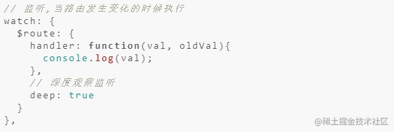

（2）window.location.hash读取\#值

window.location.hash 的值可读可写，读取来判断状态是否改变，写入时可以在不重载网页的前提下，添加一条历史访问记录。

## 10. 路由的传参方式 

### 声明式导航传参 

在 router-link 上的 to 属性传值,

1.  /path?参数名=值
    
     *  接收传递过来的值: $route.query.参数名
2.  /path/值/值 –> 需要路由对象提前配置 path: “/path/参数名”
    
     *  接收传递过来的值: $route.params.参数名

### 编程式导航传参 

this.$router.push( ) 可以不参数,根据传的值自动匹配是path还是name

因为使用path会自动忽略params ,所以会出现两种组合

(1) name+params 方式传参

A页面传参

```java
this.$router.push({
    name: 'xxx', // 跳转的路由
    params: {
      id: id   // 发送的参数
    }
})
```

B页面接收传参：

this.$route.params.id

(2) path+query 方式传参

A页面传参

```java
this.$router.push({
    path: '/xxx', // 跳转的路由
    query: {
      id: id    // 发送的参数
    }
})
```

B页面接参：

this.$route.query.id

params 和query 方式传参的区别

1.  写法上不同
2.  地址栏不同
3.  刷新方式不同

## 11. params和query的区别 

用法：query要用path来引入，params要用name来引入，接收参数都是类似的，分别是 `this.$route.query.name` 和 `this.$route.params.name` 。

url地址显示：query更加类似于ajax中get传参，params则类似于post，说的再简单一点，前者在浏览器地址栏中显示参数，后者则不显示

注意：query刷新不会丢失query里面的数据 params刷新会丢失 params里面的数据。

## 12. 路由配置项常用的属性及作用 

路由配置参数：

path : 跳转路径 component : 路径相对于的组件 name:命名路由 children:子路由的配置参数(路由嵌套) props:路由解耦 redirect : 重定向路由

## 13. 路由重定向和404 

路由重定向

1.  匹配path后, 强制切换到另一个目标path上
2.  redirect 是设置要重定向到哪个路由路径
3.  网页默认打开, 匹配路由"/", 强制切换到"/find"上
4.  redirect配置项, 值为要强制切换的路由路径
5.  强制重定向后, 还会重新来数组里匹配一次规则

404页面

1.  如果路由hash值, 没有和数组里规则匹配
2.  path: ' \* ' (任意路径)
3.  默认给一个404页面
4.  如果路由未命中任何规则, 给出一个兜底的404页面

## 14. Vue-router 导航守卫有哪些 

 *  全局守卫：beforeEach、beforeResolve、afterEach
 *  路由独享的守卫：beforeEnter
 *  组件内的守卫：beforeRouteEnter、beforeRouteUpdate、beforeRouteLeave

## 15. Vue-router 路由钩子在生命周期的体现 

 *  ### Vue-Router导航守卫 

有的时候，需要通过路由来进行一些操作，比如最常见的登录权限验证，当用户满足条件时，才让其进入导航，否则就取消跳转，并跳到登录页面让其登录。 为此有很多种方法可以植入路由的导航过程：全局的，单个路由独享的，或者组件级的

1. 全局路由钩子

vue-router全局有三个路由钩子;

 *  router.beforeEach 全局前置守卫 进入路由之前
 *  router.beforeResolve 全局解析守卫（2.5.0+）在 beforeRouteEnter 调用之后调用
 *  router.afterEach 全局后置钩子 进入路由之后

具体使用∶

 *  beforeEach（判断是否登录了，没登录就跳转到登录页）

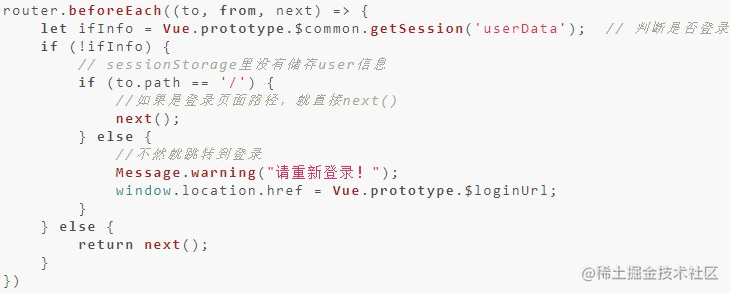

 *  afterEach （跳转之后滚动条回到顶部）

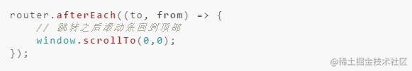

2. 单个路由独享钩子

beforeEnter 如果不想全局配置守卫的话，可以为某些路由单独配置守卫，有三个参数∶ to、from、next

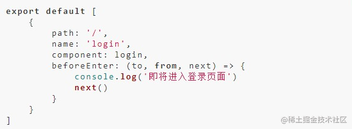

3. 组件内钩子

beforeRouteUpdate、beforeRouteEnter、beforeRouteLeave

这三个钩子都有三个参数∶to、from、next

 *  beforeRouteEnter∶ 进入组件前触发
 *  beforeRouteUpdate∶ 当前地址改变并且改组件被复用时触发，举例来说，带有动态参数的路径foo/∶id，在 /foo/1 和 /foo/2 之间跳转的时候，由于会渲染同样的foa组件，这个钩子在这种情况下就会被调用
 *  beforeRouteLeave∶ 离开组件被调用

注意点，beforeRouteEnter组件内还访问不到this，因为该守卫执行前组件实例还没有被创建，需要传一个回调给 next来访问，例如：

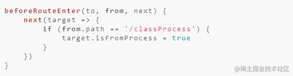

 *  ### Vue路由钩子在生命周期函数的体现 

1. 完整的路由导航解析流程（不包括其他生命周期）

 *  触发进入其他路由。
 *  调用要离开路由的组件守卫beforeRouteLeave
 *  调用局前置守卫∶ beforeEach
 *  在重用的组件里调用 beforeRouteUpdate
 *  调用路由独享守卫 beforeEnter。
 *  解析异步路由组件。
 *  在将要进入的路由组件中调用 beforeRouteEnter
 *  调用全局解析守卫 beforeResolve
 *  导航被确认。
 *  调用全局后置钩子的 afterEach 钩子。
 *  触发DOM更新（mounted）。
 *  执行beforeRouteEnter 守卫中传给 next 的回调函数

2. 触发钩子的完整顺序

路由导航、keep-alive、和组件生命周期钩子结合起来的，触发顺序，假设是从a组件离开，第一次进入b组件∶

 *  beforeRouteLeave：路由组件的组件离开路由前钩子，可取消路由离开。
 *  beforeEach：路由全局前置守卫，可用于登录验证、全局路由loading等。
 *  beforeEnter：路由独享守卫
 *  beforeRouteEnter：路由组件的组件进入路由前钩子。
 *  beforeResolve：路由全局解析守卫
 *  afterEach：路由全局后置钩子
 *  beforeCreate：组件生命周期，不能访问this。
 *  created;组件生命周期，可以访问this，不能访问dom。
 *  beforeMount：组件生命周期
 *  deactivated：离开缓存组件a，或者触发a的beforeDestroy和destroyed组件销毁钩子。
 *  mounted：访问/操作dom。
 *  activated：进入缓存组件，进入a的嵌套子组件（如果有的话）。
 *  执行beforeRouteEnter回调函数next。

3. 导航行为被触发到导航完成的整个过程

 *  导航行为被触发，此时导航未被确认。
 *  在失活的组件里调用离开守卫 beforeRouteLeave。
 *  调用全局的 beforeEach守卫。
 *  在重用的组件里调用 beforeRouteUpdate 守卫(2.2+)。
 *  在路由配置里调用 beforeEnteY。
 *  解析异步路由组件（如果有）。
 *  在被激活的组件里调用 beforeRouteEnter。
 *  调用全局的 beforeResolve 守卫（2.5+），标示解析阶段完成。
 *  导航被确认。
 *  调用全局的 afterEach 钩子。
 *  非重用组件，开始组件实例的生命周期：beforeCreate&created、beforeMount&mounted
 *  触发 DOM 更新。
 *  用创建好的实例调用 beforeRouteEnter守卫中传给 next 的回调函数。
 *  导航完成

# Vuex 

## 1. 什么Vuex ,谈谈你对它的理解？ 

1.  首先vuex的出现是为了解决web组件化开发的过程中，各组件之间传值的复杂和混乱的问题
2.  将我们在多个组件中需要共享的数据放到state中，
3.  要获取或格式化数据需要使用getters，
4.  改变state中的数据，可以使用mutation，但是只能包含同步的操作，在具体组件里面调用的方式`this.$store.commit('xxxx')`
5.  Action也是改变state中的数据，不过是提交的mutation，并且可以包含异步操作，在组件中的调用方式`this.$store.dispatch('xxx')`； 在actions里面使用的commit('调用mutation')

Vuex 是一个专为 Vue.js应用程序开发的状态管理模式。它采用集中式存储管理应用的所有组件的状态，并以相应的规则保证状态以一种可预测的方式发生变化。Vuex 也集成到 Vue 的官方调试工具 devtools extension，提供了诸如零配置的 time-travel 调试、状态快照导入导出等高级调试功能。

## 2. Vuex各模块在核心流程中的主要功能： 

`Vue Components`∶ Vue组件。HTML页面上，负责接收用户操作等交互行为，执行dispatch方法触发对应action进行回应。

`dispatch`∶操作行为触发方法，是唯一能执行action的方法。

`actions`∶ 操作行为处理模块。负责处理Vue Components接收到的所有交互行为。包含同步/异步操作，支持多个同名方法，按照注册的顺序依次触发。向后台API请求的操作就在这个模块中进行，包括触发其他action以及提交mutation的操作。该模块提供了Promise的封装，以支持action的链式触发。

`commit`∶状态改变提交操作方法。对mutation进行提交，是唯一能执行mutation的方法。

`mutations`∶状态改变操作方法。是Vuex修改state的唯一推荐方法，其他修改方式在严格模式下将会报错。该方法只能进行同步操作，且方法名只能全局唯一。操作之中会有一些hook暴露出来，以进行state的监控等。

`state`∶ 页面状态管理容器对象。集中存储Vuecomponents中data对象的零散数据，全局唯一，以进行统一的状态管理。页面显示所需的数据从该对象中进行读取，利用Vue的细粒度数据响应机制来进行高效的状态更新。

`getters`∶ state对象读取方法。图中没有单独列出该模块，应该被包含在了render中，Vue Components通过该方法读取全局state对象。

## 2.1 简述Vuex的数据传输流程 

当组件进行数据修改的时候我们需要调用dispatch来触发actions里面的方法。actions里面的每个方法中都会有一个commit方法，当方法执行的时候会通过commit来触发mutations里面的方法进行数据的修改。mutations里面的每个函数都会有一个state参数，这样就可以在mutations里面进行state的数据修改，当数据修改完毕后，会传导给页面。页面的数据也会发生改变

## 3. vuex中有几个核心属性，分别是什么？ 

一共有5个核心属性，分别是:

 *  `state`唯一数据源,Vue 实例中的 data 遵循相同的规则
 *  `mutation`更改 Vuex 的 store 中的状态的唯一方法是提交 mutation,非常类似于事件,通过store.commit 方法触发
 *  `action`action 类似于 mutation，不同在于action 提交的是 mutation，而不是直接变更状态，action 可以包含任意异步操作
 *  `module` 由于使用单一状态树，应用的所有状态会集中到一个比较大的对象。当应用变得非常复杂时，store 对象就有可能变得相当臃肿。为了解决以上问题，Vuex 允许我们将 store 分割成模块（module）。

```java
const moduleA = {
  state: () => ({ ... }),
  mutations: { ... },
  actions: { ... },
  getters: { ... }
}
​
const moduleB = {
  state: () => ({ ... }),
  mutations: { ... },
  actions: { ... }
}
​
const store = new Vuex.Store({
  modules: {
    a: moduleA,
    b: moduleB
  }
})
​
store.state.a // -> moduleA 的状态
store.state.b // -> moduleB 的状态
```

 *  `getters` 可以认为是 store 的计算属性,就像计算属性一样，getter 的返回值会根据它的依赖被缓存起来，且只有当它的依赖值发生了改变才会被重新计算。Getter 会暴露为 store.getters 对象，你可以以属性的形式访问这些值.

```java
const store = new Vuex.Store({
  state: {
    todos: [
      { id: 1, text: '...', done: true },
      { id: 2, text: '...', done: false }
    ]
  },
  getters: {
    doneTodos: state => {
      return state.todos.filter(todo => todo.done)
    }
  }
})
​
store.getters.doneTodos // -> [{ id: 1, text: '...', done: true }]
```

## 4. Vuex中action和mutation的区别 

`mutation`中的操作是一系列的同步函数，用于修改state中的变量的的状态。当使用vuex时需要通过commit来提交需要操作的内容。mutation 非常类似于事件：每个 mutation 都有一个字符串的 事件类型 (type) 和 一个 回调函数 (handler)。这个回调函数就是实际进行状态更改的地方，并且它会接受 state 作为第一个参数：

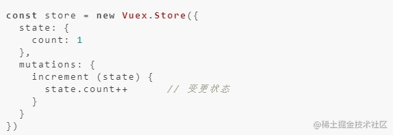

当触发一个类型为 increment 的 mutation 时，需要调用此函数：

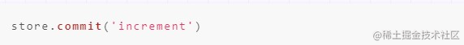

而`action`类似于mutation，不同点在于：

 *  action 可以包含任意异步操作。
 *  action 提交的是 mutation，而不是直接变更状态。

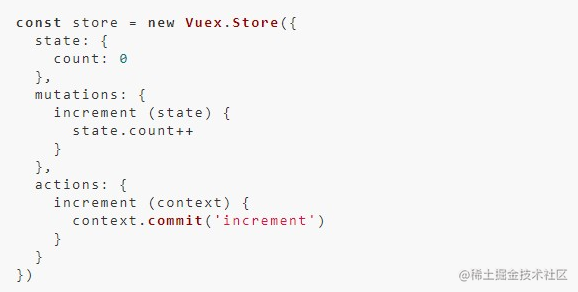

`action`函数接受一个与 store 实例具有相同方法和属性的 context 对象，因此你可以调用 context.commit 提交一个 mutation，或者通过 context.state 和 context.getters 来获取 state 和 getters。 所以，两者的不同点如下：

 *  mutation专注于修改State，理论上是修改State的唯一途径；action 用来处理业务代码、异步请求。
 *  mutation：必须同步执行；action ：可以异步，但不能直接操作State。
 *  在视图更新时，先触发actions，actions再触发mutation
 *  mutation的参数是state，它包含store中的数据；store的参数是context，它是 state 的父级，包含 state、getters

## 5. vuex的getter的作用 

`getter`有点类似 Vue.js 的计算属性，当我们需要从 store 的 state 中派生出一些状态，那么我们就需要使用 getter，getter 会接收 state 作为第 一个参数，而且 getter 的返回值会根据它的依赖被缓存起来，只有 getter 中的依赖值（state 中的某个需要派生状态的值）发生改变的时候才会被重新计算。

## 6. Vuex 和 localStorage 的区别 

（1） 最重要的区别

 *  vuex存储在内存中
 *  localstorage 则以文件的方式存储在本地，只能存储字符串类型的数据，存储对象需要 JSON的stringify和parse方法进行处理。 读取内存比读取硬盘速度要快

（2）应用场景

 *  Vuex 是一个专为 Vue.js 应用程序开发的状态管理模式。它采用集中式存储管理应用的所有组件的状态，并以相应的规则保证状态以一种可预测的方式发生变化。vuex用于组件之间的传值。
 *  localstorage是本地存储，是将数据存储到浏览器的方法，一般是在跨页面传递数据时使用 。
 *  Vuex能做到数据的响应式，localstorage不能

（3）永久性

刷新页面时vuex存储的值会丢失，localstorage不会。

注意： 对于不变的数据确实可以用localstorage可以代替vuex，但是当两个组件共用一个数据源（对象或数组）时，如果其中一个组件改变了该数据源，希望另一个组件响应该变化时，localstorage无法做到，原因就是上面的最重要的区别。

## 7. Vuex页面刷新时丢失怎么处理 

用sessionstorage 或者 localstorage 存储数据

存储： sessionStorage.setItem( '名', JSON.stringify(值) ) 使用： sessionStorage.getItem('名') ---得到的值为字符串类型，用JSON.parse()去引号；

## 8. Vuex和单纯的全局对象有什么区别？ 

 *  Vuex 的状态存储是响应式的。当 Vue 组件从 store 中读取状态的时候，若 store 中的状态发生变化，那么相应的组件也会相应地得到高效更新。
 *  不能直接改变 store 中的状态。改变 store 中的状态的唯一途径就是显式地提交 (commit) mutation。这样可以方便地跟踪每一个状态的变化，从而能够实现一些工具帮助更好地了解我们的应用。

## 9. Redux(react的) 和 Vuex 有什么区别，它们的共同思想 

（1）Redux 和 Vuex区别

 *  Vuex改进了Redux中的Action和Reducer函数，以mutations变化函数取代Reducer，无需switch，只需在对应的mutation函数里改变state值即可
 *  Vuex由于Vue自动重新渲染的特性，无需订阅重新渲染函数，只要生成新的State即可
 *  Vuex数据流的顺序是∶View调用store.commit提交对应的请求到Store中对应的mutation函数->store改变（vue检测到数据变化自动渲染）

通俗点理解就是，vuex 弱化 dispatch，通过commit进行 store状态的一次更变;取消了action概念，不必传入特定的 action形式进行指定变更;弱化reducer，基于commit参数直接对数据进行转变，使得框架更加简易;

（2）共同思想

 *  单—的数据源
 *  变化可以预测

本质上：redux与vuex都是对mvvm思想的服务，将数据从视图中抽离的一种方案; 形式上：vuex借鉴了redux，将store作为全局的数据中心，进行mode管理;

## 10. 为什么要用 Vuex 或者 Redux 

由于传参的方法对于多层嵌套的组件将会非常繁琐，并且对于兄弟组件间的状态传递无能为力。我们经常会采用父子组件直接引用或者通过事件来变更和同步状态的多份拷贝。以上的这些模式非常脆弱，通常会导致代码无法维护。

所以需要把组件的共享状态抽取出来，以一个全局单例模式管理。在这种模式下，组件树构成了一个巨大的"视图"，不管在树的哪个位置，任何组件都能获取状态或者触发行为。

另外，通过定义和隔离状态管理中的各种概念并强制遵守一定的规则，代码将会变得更结构化且易维护。

## 11. 为什么 Vuex 的 mutation 中不能做异步操作？ 

 *  Vuex中所有的状态更新的唯一途径都是mutation，异步操作通过 Action 来提交 mutation实现，这样可以方便地跟踪每一个状态的变化，从而能够实现一些工具帮助更好地了解我们的应用。
 *  每个mutation执行完成后都会对应到一个新的状态变更，这样devtools就可以打个快照存下来，然后就可以实现 time-travel 了。如果mutation支持异步操作，就没有办法知道状态是何时更新的，无法很好的进行状态的追踪，给调试带来困难。

## 12. Vuex的严格模式是什么,有什么作用，如何开启？ 

在严格模式下，无论何时发生了状态变更且不是由mutation函数引起的，将会抛出错误。这能保证所有的状态变更都能被调试工具跟踪到。

在Vuex.Store 构造器选项中开启,如下

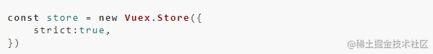

## 13. 如何在组件中批量使用Vuex的getter属性 

使用`mapGetters`辅助函数, 利用对象展开运算符将getter混入computed 对象中

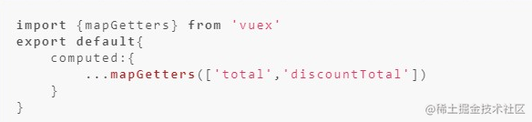

## 14. 如何在组件中重复使用Vuex的mutation 

使用`mapMutations`辅助函数,在组件中这么使用

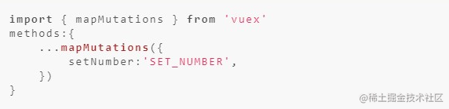

然后调用`this.setNumber(10)`相当调用`this.$store.commit('SET_NUMBER',10)`

## 15. Vuex的辅助函数怎么用 

比如当一个组件需要获取多个状态时候，将这些状态都声明为计算属性会有些重复和冗余。为了解决这个问题，我们可以使用 `mapState`辅助函数帮助我们生成计算属性，让你少按几次键。

### mapState 

```java
import { mapState } from 'vuex'
 
export default {
  // ...
  computed:{
     ...mapState({
         // 箭头函数可使代码更简练
         count: state => state.count,
         // 传字符串参数 'count' 等同于 `state => state.count`
         countAlias: 'count',
 
         // 为了能够使用 `this` 获取局部状态，必须使用常规函数
         countPlusLocalState (state) {
             return state.count + this.localCount
         }
  	})
  }
}
```

定义的属性名与state中的名称相同时，可以传入一个数组

```java
//定义state
const state={
    count:1,
}
 
//在组件中使用辅助函数
computed:{
    ...mapState(['count'])
}
```

### mapGetters 

```java
computed:{
    ...mapGetters({
      // 把 `this.doneCount` 映射为 `this.$store.getters.doneTodosCount`
      doneCount: 'doneTodosCount'
    })
}
```

当属性名与getters中定义的相同时，可以传入一个数组

总结：

 *  mapState与mapGetters都用computed来进行映射
 *  在组件中映射完成后，通过this.映射属性名进行使用

### mapMutations 

```java
methods:{
    ...mapMutations({
        add: 'increment' // 将 `this.add()` 映射为 `this.$store.commit('increment')`
    })
}
```

当属性名与mapMutatios中定义的相同时，可以传入一个数组

```java
methods:{
    ...mapMutations([
        'increment', // 将 `this.increment()` 映射为 `this.$store.commit('increment')`
 
        // `mapMutations` 也支持载荷：
        'incrementBy' // 将 `this.incrementBy(amount)` 映射为 `this.$store.commit('incrementBy', amount)`
    ]),
}
```

### mapActions 

```java
mathods:{
    ...mapActions({
        add: 'increment' // 将 `this.add()` 映射为 `this.$store.dispatch('increment')`
    })
}
```

当属性名与mapActios中定义的相同时，可以传入一个数组

```java
methods:{
    ...mapActions([
        'increment', // 将 `this.increment()` 映射为 `this.$store.dispatch('increment')`	
        // `mapActions` 也支持载荷：
        'incrementBy' // 将 `this.incrementBy(amount)` 映射为 `this.$store.dispatch('incrementBy', amount)`
    ]),
}
```

总结

 *  mapMutations与mapActios都在methods中进行映射
 *  映射之后变成一个方法

# Vue面试题补充 

## 1.怎样理解 Vue 的单向数据流？ 

所有的 prop 都使得其父子 prop 之间形成了一个单向下行绑定：父级 prop 的更新会向下流动到子组件中，但是反过来则不行。这样会防止从子组件意外改变父级组件的状态，从而导致你的应用的数据流向难以理解。

额外的，每次父级组件发生更新时，子组件中所有的 prop 都将会刷新为最新的值。这意味着你不应该在一个子组件内部改变 prop。如果你这样做了，Vue 会在浏览器的控制台中发出警告。子组件想修改时，只能通过 $emit 派发一个自定义事件，父组件接收到后，由父组件修改。

有两种常见的试图改变一个 prop 的情形 :

 *  这个 prop 用来传递一个初始值；这个子组件接下来希望将其作为一个本地的 prop 数据来使用。 在这种情况下，最好定义一个本地的 data 属性并将这个 prop 用作其初始值：

```java
props: ['initialCounter'],
data: function () {
  return {
    counter: this.initialCounter
  }
}
```

 *  这个 prop 以一种原始的值传入且需要进行转换。 在这种情况下，最好使用这个 prop 的值来定义一个计算属性

```java
props: ['size'],
computed: {
  normalizedSize: function () {
    return this.size.trim().toLowerCase()
  }
}
```

## 2.在什么阶段才能访问操作DOM？ 

在钩子函数 mounted 被调用前，Vue 已经将编译好的模板挂载到页面上，所以在 mounted 中可以访问操作 DOM。

## 3. 父组件可以监听到子组件的生命周期吗？ 

比如有父组件 Parent 和子组件 Child，如果父组件监听到子组件挂载 mounted 就做一些逻辑处理，可以通过以下写法实现：

```java
// Parent.vue
<Child @mounted="doSomething"/>
    
// Child.vue
mounted() {
  this.$emit("mounted");
}
```

以上需要手动通过 $emit 触发父组件的事件，更简单的方式可以在父组件引用子组件时通过 @hook 来监听即可，如下所示：

```java
//  Parent.vue
<Child @hook:mounted="doSomething" ></Child>
​
doSomething() {
   console.log('父组件监听到 mounted 钩子函数 ...');
},
    
//  Child.vue
mounted(){
   console.log('子组件触发 mounted 钩子函数 ...');
},    
    
// 以上输出顺序为：
// 子组件触发 mounted 钩子函数 ...
// 父组件监听到 mounted 钩子函数 ...    
```

当然 @hook 方法不仅仅是可以监听 mounted，其它的生命周期事件，例如：created，updated 等都可以监听。

## 4.Vue 怎么用 vm.$set() 解决对象新增属性不能响应的问题 ？ 

```java
export function set (target: Array<any> | Object, key: any, val: any): any {
  // target 为数组  
  if (Array.isArray(target) && isValidArrayIndex(key)) {
    // 修改数组的长度, 避免索引>数组长度导致splcie()执行有误
    target.length = Math.max(target.length, key)
    // 利用数组的splice变异方法触发响应式  
    target.splice(key, 1, val)
    return val
  }
  // key 已经存在，直接修改属性值  
  if (key in target && !(key in Object.prototype)) {
    target[key] = val
    return val
  }
  const ob = (target: any).__ob__
  // target 本身就不是响应式数据, 直接赋值
  if (!ob) {
    target[key] = val
    return val
  }
  // 对属性进行响应式处理
  defineReactive(ob.value, key, val)
  ob.dep.notify()
  return val
}
```

我们阅读以上源码可知，vm.$set 的实现原理是：

 *  如果目标是数组，直接使用数组的 splice 方法触发相应式；
 *  如果目标是对象，会先判读属性是否存在、对象是否是响应式，最终如果要对属性进行响应式处理，则是通过调用 defineReactive 方法进行响应式处理（ defineReactive 方法就是 Vue 在初始化对象时，给对象属性采用 Object.defineProperty 动态添加 getter 和 setter 的功能所调用的方法）

## 5. 请说下封装 vue 组件的过程 

> 有复用的地方就有封装
> 
> （js如此，vue也是如此）

 *  1.先分析需求：确定业务需求，把页面中可以复用的结构，样式以及功能
    
     *  找出业务需求中存在复用的地方
 *  2.具体步骤：Vue.component 或者在new Vue配置项components中, 定义组件名, 可以在props中接受给组件传的参数和值，子组件修改好数据后，想把数据传递给父组件。可以采用$emit方法

## 6. 讲一下组件的命名规范 

 *  给组件命名有两种方式(在Vue.Component/components时)，一种是使用链式命名"my-component"，一种是使用大驼峰命名"MyComponent"，
 *  因为要遵循W3C规范中的自定义组件名 (字母全小写且必须包含一个连字符)，避免和当前以及未来的 HTML 元素相冲突

## 7.scoped作用与原理 

 *  作用：组件css作用域，避免`子组件`内部的css样式被`父组件`覆盖
    
     *  默认情况下，如果子组件和父组件css选择器权重相同，优先加载父组件css样式
 *  原理：给元素添加一个自定义属性 v-data-xxxxx
    
     *  `一针见血答案`： 通过属性选择题来提高css权重值

## 8. 第一次加载页面会触发哪几个钩子函数？ 

四个钩子

 *  beforeCreate,
 *  created,
 *  beforeMount,
 *  mounted 这几个钩子函数

## 9. Vue中如何扩展一个组件 

1.  常见的组件扩展方法有：mixins，slots，extends等
2.  混入mixins是分发 Vue 组件中可复用功能的非常灵活的方式。混入对象可以包含任意组件选项。当组件使用混入对象时，所有混入对象的选项将被混入该组件本身的选项。

```java
// 复用代码：它是一个配置对象，选项和组件里面一样
const mymixin = {
   methods: {
      dosomething(){}
   }
}
// 全局混入：将混入对象传入
Vue.mixin(mymixin)
​
// 局部混入：做数组项设置到mixins选项，仅作用于当前组件
const Comp = {
   mixins: [mymixin]
}
​
```

1.  插槽主要用于vue组件中的内容分发，也可以用于组件扩展。如果要精确分发到不同位置可以使用具名插槽，如果要使用子组件中的数据可以使用作用域插槽。
2.  组件选项中还有一个不太常用的选项extends，也可以起到扩展组件的目的
3.  混入的数据和方法不能明确判断来源且可能和当前组件内变量产生命名冲突，vue3中引入的composition api，可以很好解决这些问题，利用独立出来的响应式模块可以很方便的编写独立逻辑并提供响应式的数据，然后在setup选项中组合使用，增强代码的可读性和维护性

## 10. 如果让你从零开始写一个vue路由，说说你的思路 

一个SPA应用的路由需要解决的问题是页面跳转内容改变同时不刷新，同时路由还需要以插件形式存在，所以：

1.  首先我会定义一个`createRouter`函数，返回路由器实例，实例内部做几件事：
    
     *  保存用户传入的配置项
     *  监听hash或者popstate事件
     *  回调里根据path匹配对应路由
2.  将router定义成一个Vue插件，即实现install方法，内部做两件事：
    
     *  实现两个全局组件：router-link和router-view，分别实现页面跳转和内容显示
     *  定义两个全局变量： r o u t e 和 route和 route和router，组件内可以访问当前路由和路由器实例

## 11. 从0到1自己构架一个vue项目，说说有哪些步骤、哪些重要插件、目录结构你会怎么组织 

1.  从0创建一个项目我大致会做以下事情：项目构建、引入必要插件、代码规范、提交规范、常用库和组件
2.  目前vue3项目我会用vite或者create-vue创建项目
3.  接下来引入必要插件：路由插件vue-router、状态管理vuex/pinia、ui库我比较喜欢element-plus和antd-vue、http工具我会选axios
4.  其他比较常用的库有vueuse，nprogress，图标可以使用vite-svg-loader
5.  下面是代码规范：结合prettier和eslint即可
6.  最后是提交规范，可以使用husky，lint-staged，commitlint

 *  目录结构我有如下习惯： `.vscode`：用来放项目中的 vscode 配置
    
    `plugins`：用来放 vite 插件的 plugin 配置
    
    `public`：用来放一些诸如 页头icon 之类的公共文件，会被打包到dist根目录下
    
    `src`：用来放项目代码文件
    
    `api`：用来放http的一些接口配置
    
    `assets`：用来放一些 CSS 之类的静态资源
    
    `components`：用来放项目通用组件
    
    `layout`：用来放项目的布局
    
    `router`：用来放项目的路由配置
    
    `store`：用来放状态管理Pinia的配置
    
    `utils`：用来放项目中的工具方法类
    
    `views`：用来放项目的页面文件

## 12. 实际工作中，你总结的vue最佳实践有哪些？ 

### 编码风格方面： 

 *  命名组件时使用“多词”风格避免和HTML元素冲突
 *  使用“细节化”方式定义属性而不是只有一个属性名
 *  属性名声明时使用“驼峰命名”，模板或jsx中使用“肉串命名”
 *  使用v-for时务必加上key，且不要跟v-if写在一起

### 性能方面： 

 *  路由懒加载减少应用尺寸
 *  利用SSR减少首屏加载时间
 *  利用v-once渲染那些不需要更新的内容
 *  一些长列表可以利用虚拟滚动技术避免内存过度占用
 *  对于深层嵌套对象的大数组可以使用shallowRef或shallowReactive降低开销
 *  避免不必要的组件抽象

### 安全： 

 *  不使用不可信模板，例如使用用户输入拼接模板：`template: <div> + userProvidedString + </div>`
 *  小心使用v-html，:url，:style等，避免html、url、样式等注入

## 13. 说说从 template 到 render 处理过程(compiler的工作原理) 

1.  Vue中有个独特的编译器模块，称为“compiler”，它的主要作用是将用户编写的template编译为js中可执行的render函数。
2.  之所以需要这个编译过程是为了便于前端程序员能高效的编写视图模板。相比而言，我们还是更愿意用HTML来编写视图，直观且高效。手写render函数不仅效率底下，而且失去了编译期的优化能力。
3.  在Vue中编译器会先对template进行解析，这一步称为parse，结束之后会得到一个JS对象，我们成为抽象语法树AST，然后是对AST进行深加工的转换过程，这一步成为transform，最后将前面得到的AST生成为JS代码，也就是render函数。

## 14. Vue实例挂载的过程中发生了什么? 

1.  挂载过程指的是app.mount()过程，这个过程中整体上做了两件事：初始化和建立更新机制
2.  初始化会创建组件实例、初始化组件状态，创建各种响应式数据
3.  建立更新机制这一步会立即执行一次组件更新函数，这会首次执行组件渲染函数并执行patch将前面获得vnode转换为dom；同时首次执行渲染函数会创建它内部响应式数据之间和组件更新函数之间的依赖关系，这使得以后数据变化时会执行对应的更新函数。

## 15. 组件中的name属性有什么用？ 

1.  项目使用keep-alive时，可搭配组件name进行缓存过滤
2.  DOM做递归组件时需要调用自身name
3.  Vue-devtools调试工具里显示的组见名称是由Vue中组件name决定的
4.  动态切换组件

## 16 . 怎么在组件中监听路由参数的变化？ 

有两种方法可以监听路由参数的变化，但是只能用在包含的组件内。

1. 侦听器 watch:\{'this.$route'，(to,from)\{ //在此处监听 \}, \},

2. 前置路由守卫 beforeRouteUpdate(to,from,next)\{ //这里监听 \},

## 17. beforeDestroy钩子的作用 

如果页面上有很多定时器，可以在data选项中创建一个对象timer，给每个定时器取个名字一一映射在对象timer中，在beforeDestroy构造函数中循环遍历所有定时器 ，一次性取消

```java
for(let k in this.timer){
    clearInterval(k)
    }；
```

如果页面只有单个定时器，可以这么做。

```java
const timer= setInterval(()=>{},500);
this.$once('hook:beforeDestroy',()=>{
clearInterval(timer);
})
```

## 18. 说说在vue中踩过的坑 

1. 给对象添加属性或者数组通过下标修改值的时候，直接通过给data里面的对象添加属性然后赋值，新添加的属性不是响应式的。

原因： Object.definepropety方法拦截不到这些操作，

【解决办法】通过Vue.set(对象，属性，值)这种方式就可以达到，对象新添加的属性是响应式的。数组也可以用splice()方法修改值

2. 在created操作dom的时候，是报错的，获取不到dom，这个时候实例Vue实例没有挂载 【解决办法】通过：Vue.nextTick(回调函数进行获取) ， 或者在mounted钩子里获取dom

3. 父组件调用子组件的方法，发送请求，修改子组件数据 ，子组件的视图没有更新。

原因：由于Vue的DOM操作是异步的，修改数据的时候子组件的DOM还没生成，this.$refs获取不到。

【解决办法】通过：Vue.nextTick() , 在nextTick里面去发送请求修改数据。

## 19. is这个特性你用过吗？是怎么用的？ 

is的作用

解决html模板的限制

比如ul里面嵌套li的写法是html语法的固定写法，如果想在ul里面嵌套自己的组件，但是html在渲染dom的时候，组件对ul来说并不是有效的dom。

解决办法

```java
<ul>
  <li is='my-component'></li>
</ul>
```

动态组件(组件切换)

componentName可以是在本页面已经注册的局部组件名和全局组件名, 也可以是一个组件的选项对象。当控制 componentName改变时就可以动态切换选择组件。

```java
<component :is="componentName"></component>
```

## 20. Vue 项目进行 SEO 优化 

Vue SPA单页面应用对SEO不太友好，当然也有相应的解决方案，下面列出几种SEO方案

1.  SSR服务器渲染
    
    服务端渲染, 在服务端html页面节点, 已经解析创建完了, 浏览器直接拿到的是解析完成的页面解构
    
    关于服务器渲染：[Vue官网介绍][Vue] ，对Vue版本有要求，对服务器也有一定要求，需要支持nodejs环境。
    
    优势: 更好的 SEO，由于搜索引擎爬虫抓取工具可以直接查看完全渲染的页面
    
    缺点: 服务器nodejs环境的要求, 且对原代码的改造成本高! `nuxt.js` (坑比较多, 做好踩坑的准备)
2.  静态化 (博客, 介绍性官网)
    
    Nuxt.js 可以进行 generate 静态化打包, 缺点: 动态路由会被忽略。 `/users/:id`
    
    优势：
    
     *  编译打包时, 就会帮你处理, 纯静态文件，访问速度超快；
     *  对比SSR，不涉及到服务器负载方面问题；
     *  静态网页不宜遭到黑客攻击，安全性更高。
    
    不足：
    
     *  如果动态路由参数多的话不适用。
3.  预渲染 prerender-spa-plugin (插件)
    
    如果你只是对少数页面需要做SEO处理（例如 / 首页, /about 关于等页面）
    
    预渲染是一个非常好的方式, 预渲染会在构建时, 简单的针对特定路由, 生成静态 HTML 文件 (打包时可以帮你解析静态化)
    
    优势: 设置预渲染简单, 对代码的改动小
    
    缺点: 只适合于做少数页面进行SEO的情况, 如果页面几百上千, 就不推荐了 (会打包很慢)
4.  使用Phantomjs `针对爬虫` 做处理
    
    Phantomjs是一个基于webkit内核的无头浏览器，没有UI界面，就是一个浏览器，
    
    其内的点击、翻页等人为相关操作需要程序设计实现。
    
    这种解决方案其实是一种旁路机制，原理就是通过Nginx配置， 判断访问的来源UA是否是爬虫访问，
    
    如果是则将搜索引擎的爬虫请求转发到一个node server，再通过PhantomJS来解析完整的HTML，返回给爬虫
    
    优势：
    
     *  完全不用改动项目代码，按原本的SPA开发即可，对比开发SSR成本小太多了；
     *  对已用SPA开发完成的项目，这是不二之选。
    
    不足：
    
     *  部署需要node服务器支持；
     *  爬虫访问比网页访问要慢一些，因为定时要定时资源加载完成才返回给爬虫；(不影响用户的访问)
     *  如果被恶意模拟百度爬虫大量循环爬取，会造成服务器负载方面问题，
        
        解决方法是判断访问的IP，是否是百度官方爬虫的IP。

小结:

 *  如果构建大型网站，如商城类 => SSR服务器渲染
 *  如果只是正常公司官网, 博客网站等 => 预渲染/静态化/Phantomjs 都比较方便
 *  如果是已用SPA开发完成的项目进行SEO优化，而且部署环境支持node服务器，使用 Phantomjs

## 21. 后端接口还没有开发好，怎么使用mock数据 

Mock: 模拟数据；拦截请求；

```java
// mock/index.js
Mock.mock('/api/users', 'get', (req, res) => {
  // 通过 req 拿到前端的信息
  // 根据此信息返回对应的数据（Mock 的数据）
  res.send({ mock 的数据 })
})
```

```java
// main.js
import './mock'
```

## 22. vue动画怎么实现 

当vue中，显示隐藏，创建移除，一个元素或者一个组件的时候，可以通过transition实现动画。

 *  进入（显示，创建）
 *   *  v-enter-from 进入前
     *  v-enter-active 进入中
     *  v-enter-to 进入后
 *  离开（隐藏，移除）
 *   *  v-leave-from 进入前
     *  v-leave-active 进入中
     *  v-leave-to 进入后

两个步骤

1.  给要加动画的盒子,包裹一个transition标签
2.  在动画类名中写样式

多个transition使用不同动画，可以添加nam属性，name属性的值替换v即可。

## 23. Vue初始化过程中（new Vue(options)）都做了什么？ 

 *  处理组件配置项；初始化根组件时进行了选项合并操作，将全局配置合并到根组件的局部配置上；初始化每个子组件时做了一些性能优化，将组件配置对象上的一些深层次属性放到 vm.$options 选项中，以提高代码的执行效率；
 *  初始化组件实例的关系属性，比如`$parent、 $children、 $root、 $refs`等 处理自定义事件
 *  调用 beforeCreate 钩子函数
 *  初始化组件的 inject 配置项，得到 ret\[key\] = val 形式的配置对象，然后对该配置对象进行响应式处理，并代理每个 key 到 vm 实例上
 *  数据响应式，处理 props、methods、data、computed、watch 等选项
 *  解析组件配置项上的 provide 对象，将其挂载到 vm.\_provided 属性上 调用 created 钩子函数
 *  如果发现配置项上有 el 选项，则自动调用`$mount`方法，也就是说有了 el 选项，就不需要再手动调用`$mount` 方法，反之，没提供 el 选项则必须调用 $mount

## 24. vue中data的属性可以和methods中方法同名吗，为什么？ 

可以同名，methods的方法名会被data的属性覆盖；调试台也会出现报错信息，但是不影响执行；

## 25. 什么是函数式组件？ 

函数式组件，我们可以理解为没有内部状态，没有生命周期钩子函数，没有`this`(不需要实例化的组件)。

为什么使用函数式组件

1.  最主要最关键的原因是函数式组件不需要实例化，无状态，没有生命周期，所以渲染性能要好于普通组件
2.  函数式组件结构比较简单，代码结构更清晰

函数式组件与普通组件的区别

函数式组件需要在声明组件是指定functional

函数式组件不需要实例化，所以没有`this`,`this`通过`render`函数的第二个参数来代替

函数式组件没有生命周期钩子函数，不能使用计算属性，watch等等

函数式组件不能通过$emit对外暴露事件，调用事件只能通过`context.listeners.click`的方式调用外部传入的事件

因为函数式组件是没有实例化的，所以在外部通过`ref`去引用组件时，实际引用的是`HTMLElement`

函数式组件的`props`可以不用显示声明，所以没有在`props`里面声明的属性都会被自动隐式解析为`prop`,而普通组件所有未声明的属性都被解析到`$attrs`里面，并自动挂载到组件根元素上面(可以通过`inheritAttrs`属性禁止)

## 26. Vue2怎么内部监听生命周期钩子(hook) 

在`Vue`组件中，可以用过`$on`,`$once`去监听所有的生命周期钩子函数，如监听组件的`updated`钩子函数可以写成 `this.$on('hook:updated', () => {})`


[Link 1]: https://juejin.cn/post/7147654075599978532
[2022]: https://juejin.cn/post/7149438206419664927
[2022_CSS]: https://juejin.cn/post/7149716216167268366
[2022_HTML]: https://juejin.cn/post/7150109570609152014
[2022_JS_]: https://juejin.cn/post/7150462512817782815
[2022_JS]: https://juejin.cn/post/7150861842888261668
[2022 1]: https://juejin.cn/post/7151221875224346637
[2022_Vue]: https://juejin.cn/post/7151597651719356446
[2022_Vue3_TS]: https://juejin.cn/post/7160962909332307981
[2022_Node_webpack]: https://juejin.cn/post/7161292246526984228
[2022_git]: https://juejin.cn/post/7161584249898795045
[Vue]: https://link.juejin.cn?target=https%3A%2F%2Fssr.vuejs.org%2Fzh%2F%23%25E4%25BB%2580%25E4%25B9%2588%25E6%2598%25AF%25E6%259C%258D%25E5%258A%25A1%25E5%2599%25A8%25E7%25AB%25AF%25E6%25B8%25B2%25E6%259F%2593-ssr-%25EF%25BC%259F